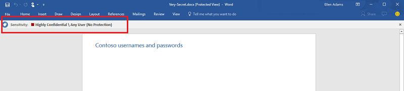
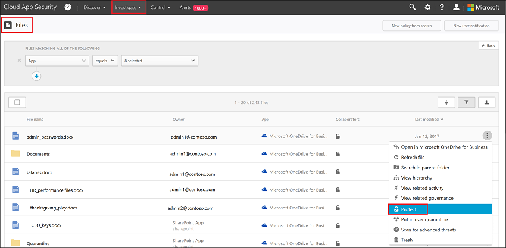

# Integratie van Azure Information Protection

Met Cloud App Security kunt u bestanden onderzoeken en beleid instellen op basis van classificatielabels van Azure Information Protection. Dat zorgt voor meer zichtbaarheid van en controle over uw gevoelige gegevens in de cloud. U hoeft slechts één selectievakje in te schakelen om Azure Information Protection te integreren met Cloud App Security. 

Door Azure Information Protection te integreren met Cloud App Security kunt u gebruikmaken van de kracht van beide services en bestanden beveiligen in de cloud. U beschikt over de volgende mogelijkheden:
- De mogelijkheid om alle geclassificeerde bestanden weer te geven op een centrale locatie.
- De mogelijkheid om onderzoek uit te voeren op basis van classificatieniveau en blootstelling van gevoelige gegevens te kwantificeren via uw cloudtoepassingen.
- De mogelijkheid om beleid te maken om ervoor te zorgen dat geclassificeerde bestanden correct worden verwerkt

> [!NOTE] 
> Als u deze functie wilt inschakelen, moet u beschikken over een licentie voor Cloud App Security en een licentie voor Azure Information Protection Premium P1 of P2. Zodra beide licenties aanwezig zijn, synchroniseert Cloud App Security de labels van de organisatie uit de Azure Information Protection-service.

## Hoe het werkt
U bent waarschijnlijk bekend met classificatielabels voor bestanden in [Azure Information Protection](https://docs.microsoft.com/information-protection/). U kunt de Azure Information Protection-classificatielabels zien in Cloud App Security. Nadat u Cloud App Security hebt geïntegreerd in Azure Information Protection, scant Cloud App Security bestanden als volgt:
1. Cloud App Security haalt de lijst met alle classificatielabels binnen uw tenant op. Dit wordt ieder uur uitgevoerd om te zorgen dat de lijst actueel is.
2. Cloud App Security scant de bestanden dan als volgt op classificatielabels: a. Als u automatisch scannen (zie hieronder) hebt ingeschakeld, worden alle nieuwe of gewijzigde bestanden toegevoegd aan de scanwachtrij.
    b. Als u een bestandsbeleid (zie hieronder) instelt om te zoeken naar classificatielabels, worden deze bestanden toegevoegd aan de scanwachtrij voor classificatielabels.
3. Zoals hierboven vermeld, gelden deze scans voor de classificatielabels die worden gedetecteerd tijdens de initiële scan die Cloud App Security uitvoert om vast te stellen welke classificatielabels in uw tenant worden gebruikt. Externe labels, classificatielabels die zijn ingesteld door iemand buiten uw tenant, worden toegevoegd aan de lijst met classificatielabels. Als u niet op deze labels wilt scannen, schakelt u het selectievakje **Bestanden alleen scannen op Azure Information Protection-classificatielabels van deze tenant** in (zie hieronder).
4. Nadat u Azure Information Protection in Cloud App Security hebt ingeschakeld, worden ook alle nieuwe bestanden die aan Office 365 worden toegevoegd op classificatielabels gescand.

## Azure Information Protection integreren met Cloud App Security
  
### Azure Information Protection inschakelen

Het enige wat u hoeft te doen om Azure Information Protection te integreren met Cloud App Security, is automatisch scannen instellen om te zoeken naar Azure Information Protection-classificatielabels in uw Office 365-bestanden zonder hiervoor een beleid te maken. Nadat u deze mogelijkheid hebt ingeschakeld, worden bestanden in uw cloudomgeving die een Azure Information Protection-classificatielabel hebben, weergegeven Cloud App Security.

U kunt Cloud App Security als volgt instellen om bestanden te scannen met inhoudsinspectie ingeschakeld voor classificatielabels:

1. Selecteer de pagina **Algemene instellingen** onder het tandwiel Instellingen in Cloud App Security.
2. Selecteer onder Azure Information Protection de optie **Bestanden automatisch scannen op classificatielabels van Azure Information Protection**. 

Nadat u Azure Information Protection hebt ingeschakeld, kunt u bestanden met classificatielabels zien en de bestanden op basis van label filteren in Cloud App Security.

 

> [!NOTE] 
> Met automatisch scannen worden bestaande bestanden pas gescand nadat ze opnieuw worden gewijzigd. Als u bestaande bestanden wilt scannen voor classificatielabels van Azure Information Protection, moet u ten minste een **bestandsbeleid voor inhoudsinspectie** hebben. Als u dit nog niet hebt, maakt u een nieuw **bestandsbeleid**, verwijdert u alle vooraf ingestelde filters en schakelt u de optie **Inhoudsinspectie** in. Klik vervolgens onder **Inhoudsinspectie** op **Bestanden opnemen die overeenkomen met een vooraf ingestelde expressie**, selecteer een vooraf gedefinieerde waarde en sla het beleid op. Hiermee wordt de inhoudsinspectie ingeschakeld waarmee classificatielabels van Azure Information Protection automatisch worden gedetecteerd.

### Interne en externe labels instellen
Standaard scant Cloud App Security op classificatielabels die in uw organisatie zijn gedefinieerd en op externe labels die zijn gedefinieerd door andere organisaties. 

Als u wilt dat deze extern ingestelde labels worden genegeerd, gaat u in de Cloud App Security-portal onder **Algemene instellingen** naar **Azure-beveiligingsinstellingen** en selecteert u de optie **Azure Information Protection-classificatielabels van andere tenants negeren**.
 

### Blootstelling van bestanden beheren
- Als dit het document is dat u hebt gelabeld met een Azure Information Protection-classificatielabel:

- U kunt dit bestand op de pagina **Bestanden** van Cloud App Security weergeven door te filteren op het classificatielabel:

- U kunt meer informatie opvragen over deze bestanden en bijbehorende classificatielabels via de bestandslade.

- Klik op de pagina **Bestanden** op het betreffende bestand om te zien of het classificatielabels heeft:

- U kunt klikken op het classificatielabel om meer informatie weer te geven of om de volledige lijst met classificatielabels te bekijken:
 

- Vervolgens kunt u bestandsbeleid maken in Cloud App Security om bestanden te beheren die op de verkeerde manier zijn gedeeld, en om bestanden met een label te vinden die onlangs zijn aangepast.
- Daarnaast kunt u waarschuwingen activeren voor activiteiten met betrekking tot geclassificeerde bestanden.

> ![Opmerking] Wanneer Azure Identity Protection-labels voor een bestand worden uitgeschakeld, worden de uitgeschakelde labels ook als uitgeschakeld weergegeven in Cloud App Security. Verwijderde labels worden niet weergegeven.
> **Beleid 1: vertrouwelijke gegevens die extern worden gedeeld op Box:**

1.    Maak een bestandsbeleid.
2.    Stel de naam, ernst en categorie van het beleid in.
3.    Voeg de volgende bestandsfilters toe om alle vertrouwelijke gegevens te vinden die extern worden gedeeld op Box:

 

**Beleid 2: beperkte gegevens die onlangs zijn gewijzigd buiten de map Financiën van SharePoint:**

1.    Maak een bestandsbeleid.
2.    Stel de naam, ernst en categorie van het beleid in.
3.    Voeg de volgende filters toe om alle beperkte bestanden te zoeken die onlangs zijn gewijzigd, en sluit de map Financiën uit van de zoekactie bij de optie voor het selecteren van mappen: 
 
 

U kunt ook waarschuwingen en meldingen voor gebruikers instellen of direct actie ondernemen op dit beleid.
Meer informatie over [beheeracties](governance-actions.md).

Lees meer informatie over [Azure Information Protection](https://docs.microsoft.com/en-us/information-protection/understand-explore/what-is-information-protection) en volg de zelfstudie [Snel aan de slag](https://docs.microsoft.com/en-us/information-protection/get-started/infoprotect-quick-start-tutorial) voor Azure Information Protection.

## Integratie met Azure Rights Management

Uw organisatie moet Azure Rights Management in licentie en geactiveerd hebben voor integratie tussen Cloud App Security en Azure RMS.  Deze twee afzonderlijke stappen kunt u vinden in [Azure Rights Management activeren](https://docs.microsoft.com/information-protection/deploy-use/activate-service).

Cloud App Security ondersteunt momenteel alleen een algemeen beveiligingsniveau. Systeemeigen beveiliging voor Office-, PDF-en afbeeldingsbestanden is beschikbaar in toekomstige versies. 

Deze functie is momenteel beschikbaar voor bestanden die zijn opgeslagen in SharePoint Online en OneDrive voor Bedrijven. In toekomstige versies worden meer cloud-apps ondersteund.

Nadat Cloud App Security is verbonden met uw Office 365-service, kunt u de Cloud App Security RMS-integratiefuncties gebruiken waarmee u documenten met RMS rechtstreeks in de Cloud App Security-portal als volgt kunt beveiligen:

1. Selecteer in de pagina **Bestanden** het bestand dat u wilt beveiligen, klik dan op de drie puntjes aan het einde van de bestandsrij en kies **Beveiligen**. 

2. U wordt gevraagd om een van uw organisatiesjablonen te kiezen om het bestand te beveiligen en op **Beveiligen** te klikken. 

3. Nadat u een sjabloon hebt gekozen en op Beveiligen hebt geklikt, zal Cloud App Security de sjabloon toepassen en het oorspronkelijke bestand beveiligen. Het beveiligde bestand heeft dezelfde naam als het oorspronkelijke bestand, maar met de nieuwe extensie .pfile.
> [!NOTE]
>     Het wordt aanbevolen bedrijfsbrede RMS-sjablonen toe te passen op bestanden, zodat alle gebruikers in de organisatie toegang kunnen krijgen tot deze bestanden, met inbegrip van de oorspronkelijke eigenaar van het bestand. De eigenaar van het bestand, het beleid voor het delen van het bestand en de lijst met gebruikers die al toegang hebben, veranderen niet wanneer het bestand wordt beveiligd.

4. Als gebruikers toegang willen tot het beveiligde bestand, moeten ze de RMS sharing-app op hun apparaat hebben geïnstalleerd. Zie voor meer informatie [Technisch overzicht en beveiligingsdetails voor de Microsoft Rights Management-toepassing voor delen](https://docs.microsoft.com/information-protection/rms-client/sharing-app-admin-guide-technical).

5. U kunt deze actie op elk gewenst moment terugdraaien in het **Beheerlogboek** door te klikken op de knop **Herstellen** aan het einde van de rij van de eerder genomen beveiligingsactie. 

 
## Zie ook  
[Cloud-apps beheren met beleidsregels](control-cloud-apps-with-policies.md)   
[Ga naar de ondersteuningspagina van Cloud App Security voor technische ondersteuning.](http://support.microsoft.com/oas/default.aspx?prid=16031)   
[Premier-klanten kunnen Cloud App Security ook rechtstreeks vanuit Premier Portal kiezen.](https://premier.microsoft.com/)  
  
