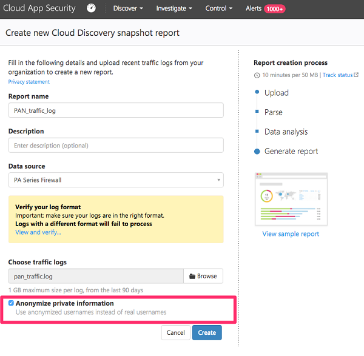
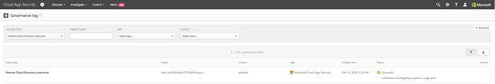

# Cloud Discovery-gegevens anoniem maken

U kunt door Cloud Discovery-gegevens anoniem te maken de privacy van gebruikers beveiligen. Nadat het gegevenslogboek naar de Cloud App Security-portal is geüpload, wordt het logboek opgeschoond en wordt alle informatie over gebruikersnamen vervangen door versleutelde gebruikersnamen. Op deze manier blijven alle cloudactiviteiten anoniem. Beheerders kunnen zo nodig voor een specifiek beveiligingsonderzoek (bijvoorbeeld bij schending van de beveiliging of verdachte gebruikersactiviteiten) de echte gebruikersnaam herleiden. Als een beheerder reden heeft een specifieke gebruiker te verdenken, is het ook mogelijk de versleutelde gebruikersnaam van een bekende gebruikersnaam op te zoeken en vervolgens het onderzoek uit te voeren met behulp van de versleutelde gebruikersnaam. Elke omzetting van een gebruikersnaam wordt gecontroleerd in het **governance-logboek** van de portal.

Belangrijke punten:
-   Er wordt geen persoonlijke informatie opgeslagen of weergegeven. Alleen versleutelde informatie.
-   Persoonlijke gegevens worden versleuteld met AES-128 met een speciale sleutel per tenant.
-   Het omzetten van gebruikersnamen wordt ad-hoc uitgevoerd, per gebruikersnaam door een bepaalde versleutelde gebruikersnaam te decoderen.

Hoe het anoniem maken van gegevens werkt:

1. Er zijn drie manieren om gegevens anoniem te maken: 
    
   - U kunt de gegevens instellen van een specifiek logboekbestand om te worden geanonimiseerde, [maken van een nieuwe van momentopnamerapport](create-snapshot-cloud-discovery-reports.md) en het selecteren van **anoniem te maken van persoonlijke gegevens**.

     

   - U kunt instellen dat de gegevens uit een [geautomatiseerde upload voor een nieuwe gegevensbron](configure-automatic-log-upload-for-continuous-reports.md) anoniem worden gemaakt door **Anonymize private information** (Persoonlijke informatie anoniem maken) te selecteren wanneer u de nieuwe gegevensbron toevoegt.  
  
     

   - U kunt als volgt in Cloud App Security instellen dat standaard alle gegevens van de momentopnamerapporten van geüploade logboekbestanden en doorlopende rapporten van logboekcollectors anoniem worden gemaakt:
     
     1. Selecteer **Instellingen voor Cloud Discovery** onder het tandwiel Instellingen.
     
     2. Op het tabblad Anonymization (Anoniem maken) selecteert u **Anonymize private information by default in new reports and data sources** (Persoonlijke informatie standaard anoniem maken in nieuwe rapporten en gegevensbronnen) om gebruikersnamen standaard anoniem te maken.

     3. Onder Versleutelingssleutel selecteert u of u **de speciale sleutel voor uw portal** of **een aangepaste sleutel** wilt gebruiken. Als u een **aangepaste sleutel** wilt gebruiken, voert u een 16-bytes UTF8-versleutelingssleutel in.
     4. Klik op **Opslaan**.
 
        
  

2. Als u anoniem maken hebt geselecteerd, wordt met Cloud App Security het logboek van het gegevensverkeer geparseerd en worden specifieke gegevenskenmerken geëxtraheerd.
3. Cloud App Security vervangt de gebruikersnaam door een versleutelde gebruikersnaam.
4. Vervolgens worden de cloudgebruiksgegevens geanalyseerd en worden Cloud Discovery-rapporten gegenereerd op basis van de anonieme gegevens.
 
   
 
5. U kunt voor specifiek onderzoek, zoals het onderzoek van een waarschuwing over afwijkend gebruik, de specifieke gebruikersnaam in de portal omzetten en hiervoor een zakelijke reden opgeven. 
   Deze pagina kan ook worden gebruikt om de versleutelde gebruikersnaam van een bekende gebruikersnaam op te zoeken. 

   1. Selecteer **Instellingen voor Cloud Discovery** onder het tandwiel Instellingen.
   2. Voer op het tabblad **Anonymization** (Anoniem maken) onder **Anonymize and resolve usernames** (Anoniem maken en gebruikersnamen omzetten) een reden in waarom u de omzetting uitvoert.
   3. Selecteer onder **Enter username to resolve** (Om te zetten gebruikersnaam invoeren) de optie **From anonymized** (Van anoniem gemaakt) en voer de anoniem gemaakte gebruikersnaam in of selecteer **To anonymized** (Naar anoniem gemaakt) en voer de oorspronkelijke gebruikersnaam in die u wilt omzetten. Klik op **oplossen**. 

   

6. De actie wordt gecontroleerd in het **governance-logboek** van de portal. 

    

  
      
## Zie ook  
[Cloud-apps beheren met beleidsregels](control-cloud-apps-with-policies.md)   

[Premier-klanten kunnen Cloud App Security ook rechtstreeks vanuit Premier Portal kiezen.](https://premier.microsoft.com/)  
    
      
  
