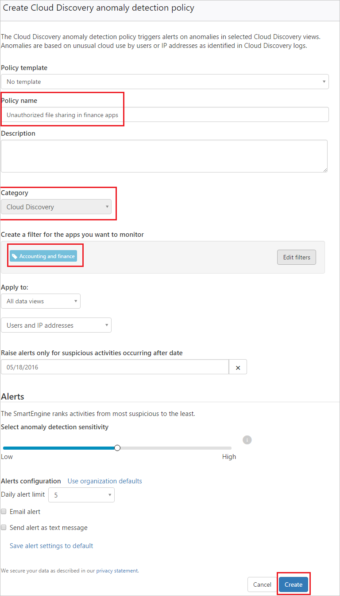

# Beleidsregels voor Cloud Discovery
    
## Beleid voor appdetectie aanmaken  
Beleidsregels voor appdetectie bieden u de mogelijkheid om waarschuwingen in te stellen zodat u op de hoogte bent wanneer er binnen uw organisatie nieuwe apps gedetecteerd worden.  
  
1.  Klik in de console op **Beheer** gevolgd door **Beleidsregels**.  
  
2.  Klik op **Beleid maken** en selecteer **Appdetectie-beleid**.  
  
       
  
3.  Geef uw beleid een naam en beschrijving, wat u indien gewenst kunt baseren op een sjabloon. Voor meer informatie over beleidssjablonen, bekijk [Cloud-apps beheren met beleidsregels](control-cloud-apps-with-policies.md).  
  
4.  Om in te stellen voor welke gedetecteerde apps dit beleid wordt geactiveerd, klikt u op **Filters toevoegen**.  
  
     De filters worden gekozen vanaf de linkerkant van de pagina van de filterpop-up. Het is mogelijk te filteren op **appnaam**, **domein**, **risicofactor**, **risicoscore**, en **categorie**. Aan de rechterkant van de pagina worden de resultaten voor de gekozen filters uit de huidige servicecatalogus weergegeven. Sla de filters op nadat u ze hebt geselecteerd en controleer of de juiste labels worden weergegeven in de filters.  
  
5.  Kies bij **Toepassen voor** of dit geldt voor **gebruikers**, **IP-adressen** of beide.  
  
6.  Stel de **dagelijkse gebruiksdrempel** in waaraan de app moet voldoen om overeen te komen met het beleid.  
  
7.  Stel een **Dagelijkse waarschuwingslimiet** in en selecteer of de waarschuwing wordt verzonden als e-mail, als SMS-bericht of beide en geef indien nodig gegevens op. U kunt klikken op Standaardwaarden waarschuwingsinstellingen opslaan om het mogelijk te maken voor toekomstig beleid om deze waarschuwingsinstellingen op te slaan als de standaardwaarden, waaronder telefoonnummer en e-mailadressen.  
  
8.  Klik op **Maken**.  
  
Bijvoorbeeld, als u geïnteresseerd bent in het detecteren van riskante hostapps in uw cloudomgeving, stelt u uw beleid als volgt in:  
  
Stel de beleidsfilters in om services te detecteren die zijn gevonden in de categorie **hostingservices** en die een lage score hebben, wat aangeeft dat ze riskant zijn.   
Stel de **ernst** van het beleid in op **gemiddeld**.   
Stel de drempelwaarden die een waarschuwing moeten geven voor een bepaalde gedetecteerde app onderaan alleen in als meer dan 100 gebruikers in de omgeving de app gebruiken en als ze een bepaalde hoeveelheid gegevens uit de service hebben gedownload.   
Daarnaast kunt u de dagelijkse waarschuwingslimiet instellen.  
  
  
  
## Afwijkingsdetectie voor Cloud Discovery  
Cloud App Security doorzoekt alle logboeken in uw Cloud Discovery-exemplaar op afwijkingen. Voorbeelden zijn wanneer een gebruiker die nog nooit gebruik heeft gemaakt van Dropbox, plotseling 600 GB uploadt naar Dropbox, of wanneer er veel meer transacties worden uitgevoerd dan gebruikelijk in een bepaalde app. Het beleid voor anomaliedetectie is standaard ingeschakeld. Er hoeft dus geen nieuw beleid geconfigureerd te worden, maar u kunt instellen voor welke afwijkingstypen u gewaarschuwd wilt worden in het standaardbeleid.  
  
1.  Klik in de console op **Beheer** gevolgd door **Beleidsregels**.  
  
2.  Klik op **Beleid maken** en selecteer **Afwijkingsdetectiebeleid Cloud Discovery**.  
  
       
  
3.  Geef uw beleid een naam en beschrijving, wat u indien gewenst kunt baseren op een sjabloon. Voor meer informatie over beleidssjablonen, bekijk [Cloud-apps beheren met beleidsregels](control-cloud-apps-with-policies.md).  
  
4.  Om in te stellen voor welke gedetecteerde apps dit beleid wordt geactiveerd, klikt u op **Filters toevoegen**.  
  
     De filters worden gekozen vanaf de linkerkant van de pagina van de filterpop-up. Het is mogelijk te filteren op servicenaam, domein, risicofactor, risicoscore, en categorie. Aan de rechterkant van de pagina worden de resultaten voor de gekozen filters uit de huidige servicecatalogus weergegeven. Sla de filters op nadat u ze hebt geselecteerd en controleer of de juiste labels worden weergegeven in de filters.  
  
5.  Kies onder **Toepassen voor**of dit van toepassing is voor **alle gegevensweergaven** of **specifieke gegevensweergaven** en of dit van toepassing is op **gebruikers**, **IP-adressen** of beide.  
  
6.  Selecteer de datums gedurende welke de afwijkende activiteit heeft plaatsgevonden voor het activeren van de waarschuwing onder **Waarschuwingen alleen genereren voor verdachte activiteiten na datum.**  
  
7.  Onder **Waarschuwingen** kunt u de gevoeligheid voor anomaliedetectie instellen van laag tot hoog om de waarschuwingsfrequentie te configureren.  
Stel een **Dagelijkse waarschuwingslimiet** in en selecteer of de waarschuwing wordt verzonden als e-mail, als SMS-bericht of beide en geef indien nodig gegevens op. U kunt klikken op Standaardwaarden waarschuwingsinstellingen opslaan om het mogelijk te maken voor toekomstig beleid om deze waarschuwingsinstellingen op te slaan als de standaardwaarden, waaronder telefoonnummer en e-mailadressen. U kunt ook klikken op **Standaardinstellingen organisatie gebruiken** deze instellingen in te stellen op basis van de standaard voor uw organisatie.  
  
9. Klik op **Maken**.  
  
  
  
## Zie ook  
[Beleidsregels voor gebruikersactiviteit](user-activity-policies.md)   
[Ga naar de ondersteuningspagina van Cloud App Security voor technische ondersteuning.](http://support.microsoft.com/oas/default.aspx?prid=16031)   
[Premier-klanten kunnen Cloud App Security ook rechtstreeks vanuit Premier Portal kiezen.](https://premier.microsoft.com/)  
  
  