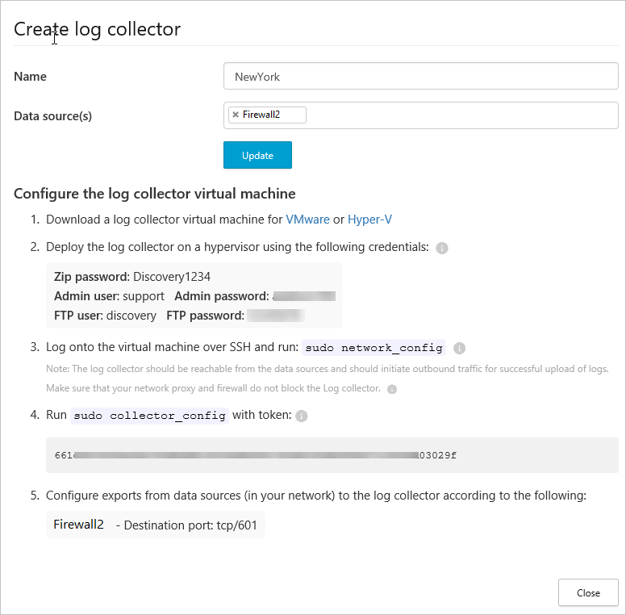

# <a name="configure-automatic-log-upload-for-continuous-reports-on-a-virtual-appliance---deprecated"></a>Logboek automatisch uploaden voor continue rapporten configureren op een virtueel apparaat - afgeschaft

> [!WARNING] 
> Het is raadzaam configureren logboek uploaden met behulp van de [Docker](discovery-docker.md) voor flexibelere implementatie.

## <a name="technical-requirements"></a>Technische vereisten
- Hypervisor: Hyper-v- of VMware
- Schijfruimte: 250 GB
- CPU: 2
- RAM: 4 GB 
- Uw firewall ingesteld zoals beschreven in [vereisten](network-requirements.md#log-collector)


## <a name="log-collector-performance"></a>Prestaties logboekverzamelaar
De logboekverzamelaar kan een logboekcapaciteit van maximaal 50 GB per uur aan.
De belangrijkste knelpunten in het logboekverzamelproces zijn:
- Netwerkbandbreedte - de netwerkbandbreedte bepaalt de uploadsnelheid van het logboek.
- I/O-prestaties van de virtuele machine die door uw IT is toegewezen - bepaalt de snelheid waarmee logboeken naar de schijf van de logboekverzamelaar worden geschreven.
De logboekverzamelaar heeft een ingebouwd beveiligingsmechanisme dat de snelheid waarmee logboeken binnenkomen bewaakt en vergelijkt met de uploadsnelheid. In geval van congestie laat de logboekverzamelaar logboekbestanden vallen. Als uw installatie meestal groter is dan 50 GB per uur, dan is het raadzaam om het verkeer over meerdere logboekverzamelaars te spreiden.

## <a name="set-up-and-configuration"></a>Installatie en configuratie  
  
### <a name="step-1--web-portal-configuration-define-data-sources-and-link-them-to-a-log-collector"></a>Stap 1 - Webportalconfiguratie: gegevensbronnen definiëren en deze koppelen aan een logboekverzamelaar  
  
1. Ga naar de pagina met instellingen voor automatisch uploaden:  
   Klik in de Cloud App Security-portal op het Instellingenpictogram , gevolgd door **Logboekverzamelaars**.  
  
2. Maak voor elke firewall of proxy waaruit u logboeken wilt uploaden een overeenkomende gegevensbron aan:  
  
   a.  Klik op **Gegevensbron toevoegen**.  
  
   b.  Geef uw proxy of firewall een **Naam**.  
  
   c.  Selecteer het apparaat in de lijst **Bron**. Als u selecteert **aangepaste logboekindeling** om te werken met een netwerkapparaat die niet wordt vermeld, Zie [werken met de aangepaste log parser](custom-log-parser.md) voor configuratie-instructies.
  
   d.  Vergelijk uw logboek met het voorbeeld van de verwachte logboekindeling. Als de bestandsindeling van uw logboek niet met dit voorbeeld overeenkomt, moet u uw gegevensbron toevoegen onder **Overig**.  
  
   e.  Stel het **Type ontvanger** in op **FTP** of **Syslog**. Kies **UDP** of **TCP** voor **Syslog**.  
  
   f.  Herhaal dit proces voor elke firewall en proxy waarvan het logboek kan worden gebruikt om verkeer op uw netwerk te detecteren.  
  
3. Ga naar het tabblad **Logboekverzamelaars** bovenaan.  
  
   a.  Klik op **Logboekverzamelaar toevoegen**.  
  
   b.  Geef de logboekverzamelaar een **Naam**.  
  
   c.  Selecteer alle **gegevensbronnen** die u aan de verzamelaar wilt koppelen en klik op **Bijwerken** om de configuratie op te slaan en een toegangstoken te genereren.  
   
  
   > [!NOTE] 
   > - Eén logboekverzamelaar kan meerdere gegevensbronnen verwerken.
   > - Kopieer de inhoud van het scherm omdat deze wordt gebruikt bij het configureren van de Logboekverzamelaar om te communiceren met Cloud App Security. Als u Syslog hebt geselecteerd, bevat deze informatie informatie over de poort die de Syslog-listener luistert op.
4. Als u akkoord gaan met de [licentievoorwaarden voor eindgebruikers](https://go.microsoft.com/fwlink/?linkid=862492), **downloaden** een nieuwe virtuele machine van een logboek-collector door te klikken op de Hyper-V- of VMWare. Vervolgens Decomprimeer het bestand met het wachtwoord die u hebt ontvangen in de portal.  
  
### <a name="step-2--on-premises-deployment-of-the-virtual-machine-and-network-configuration"></a>Stap 2 - On-premises implementatie van de virtuele machine en de netwerkconfiguratie   

> [!NOTE] 
> De volgende stappen beschrijven de implementatie in Hyper-V. De implementatiestappen voor de VM-hypervisor zijn iets anders.  

1. Open Hyper-V-beheer.  
  
2. Selecteer **Nieuw** en vervolgens **Virtuele machine** en klik dan op **Volgende**.  
     
  
3. Geef een **naam** voor de nieuwe virtuele machine op, bijvoorbeeld CloudAppSecurityLogCollector01. Klik vervolgens op **Volgende**.  
  
4. Selecteer **Generatie 1** en klik op **Volgende**.  
  
5. Wijzig het **Opstartgeheugen** naar **4096 MB**.  
        
6. Vink **Dynamisch geheugen gebruiken** aan voor deze virtuele machine en klik op **Volgende**.  
  
7. Kies de **Verbinding** voor het netwerk, indien beschikbaar, en klik op **Volgende**.  
  
8. Kies **gebruik een bestaande virtuele harde schijf** en selecteer de **.vhd** -bestand dat is opgenomen in het Zip-bestand dat u hebt gedownload.  
  
9. Klik op **Volgende** en klik vervolgens op **Voltooien**.  
   De machine is toegevoegd aan uw Hyper-V-omgeving.  
  
10. Klik op de machine in de tabel **Virtuele machines** en klik op **Start**.   
  
11. Maak verbinding met de virtuele machine voor de logboekverzamelaar om te zien of hieraan een DHCP-adres is toegewezen. Hiervoor klikt u op de virtuele machine en selecteert u **Verbinden**. Als het goed is, wordt de aanmeldingsprompt weergegeven. Als u een IP-adres ziet, kunt u verbinding maken met de virtuele machine met behulp van een terminal-/SSH-hulpprogramma.  Als u een IP-adres niet ziet, meld u aan met de hulpprogramma's voor Hyper-V/VMWare connection met de referenties die u hebt gekopieerd naar beneden wanneer u de Logboekverzamelaar eerder hebt gemaakt. U kunt het wachtwoord wijzigen en u kunt de virtuele machine configureren met het netwerkconfiguratiehulpprogramma door de volgende opdracht uit te voeren:
    ```
    sudo network_config
    ```
    > [!NOTE]
    > De virtuele machine is vooraf geconfigureerd voor het ophalen van een IP-adres via een DHCP-server. Als u configureren wilt, een statisch IP-adres, standaardgateway, hostnaam, DNS-servers en NTPS, kunt u de **network_config** hulpprogramma of wijzigingen handmatig uitvoeren.


Uw logboekverzamelaar is nu verbonden met uw netwerk en kan de Cloud App Security-portal bereiken.  

### <a name="step-3--on-premises-configuration-of-the-log-collection"></a>Stap 3 - On-premises configuratie van de logboekverzamelaar 
De eerste keer aanmelden bij de logboekverzamelaar en configuratie van de logboekverzamelaar als volgt importeren vanuit de portal. 

1.  Meld u aan bij de logboekverzamelaar via SSH met behulp van de interactieve beheerdersreferenties die u in de portal. (Als dit de eerste keer aanmelden bij de console, u moet het wachtwoord wijzigen en meld u opnieuw na het wijzigen van het wachtwoord. Als u een terminal-sessie gebruikt, moet u mogelijk de terminal-sessie opnieuw starten. )
2.  Voer het configuratiehulpprogramma van de verzamelaar uit met het toegangstoken dat u tijdens het maken van de logboekverzamelaar hebt gekregen.```sudo collector_config <access token> ```
3. Voer uw consoledomein in, bijvoorbeeld: ```contoso.portal.cloudappsecurity.com``` deze optie is beschikbaar via de URL die u ziet na het aanmelden bij de Cloud App Security-portal. 

4. Voer de naam van de logboekverzamelaar die u configureren wilt, bijvoorbeeld: **CloudAppSecurityLogCollector01** of **NewYork** van de voorgaande afbeelding.

5.  Importeer op de volgende manier de configuratie van de logboekverzamelaar uit de portal:  
  
      a.  Meld u aan bij de logboekverzamelaar via SSH met behulp van de interactieve beheerdersreferenties die u in de portal.  
  
      b.  Voer het configuratiehulpprogramma van de verzamelaar uit met het toegangstoken dat u in de opdracht ```sudo collector_config \<access token>``` hebt gekregen.  
     
      c.  Voer uw consoledomein in, bijvoorbeeld: ``` contoso.portal.cloudappsecurity.com ```
  
      d. Voer de naam in van de logboekverzamelaar die u wilt configureren, bijvoorbeeld: ``` CloudAppSecurityLogCollector01  ```

### <a name="step-4---on-premises-configuration-of-your-network-appliances"></a>Stap 4 - On-premises configuratie van uw netwerkapparaten

Configureer volgens de richtlijnen in het dialoogvenster uw netwerkfirewalls en proxy's, zodat ze periodiek logboeken naar de toegewezen Syslog-poort van de FTP-map exporteren, bijvoorbeeld:  
  
     `London Zscaler - Destination path: 614`  
  
     BlueCoat_HQ - Destination path: \<<machine_name>>\BlueCoat_HQ\  
  
### <a name="step-5---verify-the-successful-deployment-in-the-cloud-app-security-portal"></a>Stap 5 - Controleer of de implementatie is voltooid in de Cloud App Security-portal

Controleer de status van de collector in de **logboekverzamelaar** tabel en zorg ervoor dat de status **verbonden**. Als het **gemaakt**, is het mogelijk dat het logboek collector verbinding en parseren nog niet voltooid.


Gebruik het beheerlogboek om te controleren of de logboeken periodiek naar de portal worden geüpload.  
  
Zie [Problemen met Cloud Discovery oplossen](troubleshooting-cloud-discovery.md) als u tijdens de implementatie problemen ondervindt.

### <a name="optional---create-custom-continuous-reports"></a>Optioneel: aangepaste continue rapporten maken

Nadat u hebt gecontroleerd dat de logboeken worden naar de Cloud App Security wordt geüpload en de rapporten worden gegenereerd, kunt u aangepaste rapporten maken. U kunt nu de detectie van aangepaste rapporten op basis van Azure Active Directory-gebruikersgroepen maken. Bijvoorbeeld, als u wilt zien van de cloud gebruiken van de marketingafdeling kunt u de marketing-groep met de functie importeren groep importeren en maak vervolgens een aangepast rapport voor deze groep. U kunt ook een rapport op basis van IP-adreslabel of IP-adresbereiken aanpassen.

1. Selecteer in de Cloud App Security-portal onder het instellingentandwiel **Cloud Discovery-instellingen**, en selecteer vervolgens **continue rapporten beheren**. 
2. Klik op de **rapport maken** knop en vul de velden in.
3. Onder de **Filters** kunt u gegevens door gegevensbron door filteren [geïmporteerde gebruikersgroep](user-groups.md), of door [IP-adres-tags en bereiken](ip-tags.md). 

> [!NOTE]
> Alle aangepaste rapporten zijn beperkt tot een maximum van 1 GB aan niet-gecomprimeerde gegevens. Als er meer dan 1 GB aan gegevens, wordt de eerste 1 GB aan gegevens geëxporteerd naar het rapport.


## <a name="see-also"></a>Zie ook  
[Werken met Cloud Discovery-gegevens](working-with-cloud-discovery-data.md)   

[Premier-klanten kunnen Cloud App Security ook rechtstreeks vanuit Premier Portal kiezen.](https://premier.microsoft.com/)  