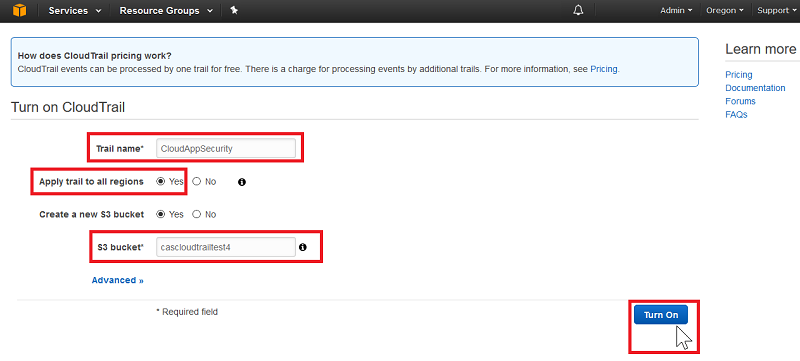

# <a name="connect-aws-to-microsoft-cloud-app-security"></a>Verbinding maken tussen AWS en Microsoft Cloud App Security
In deze sectie vindt u instructies voor het maken van een verbinding tussen Cloud App Security en uw bestaande Amazon Web Services-account met behulp van de connector-API's.  
  
## <a name="how-to-connect-amazon-web-services-to-cloud-app-security"></a>Verbinding maken tussen Amazon Web Services en Cloud App Security  
  
1.  Klik in uw [Amazon Web Services-console](https://console.aws.amazon.com/)onder **Identiteits- en toegangsbeheer** op **IAM**.  
  
       
  
2.  Klik op het tabblad **Gebruikers** en klik vervolgens op **Gebruiker toevoegen**.  
  
           
  
4.  In de **Details** stap, typt u een nieuwe gebruikersnaam voor Cloud App Security. Zorg ervoor dat onder **toegangstype** u **toegang op programmeerniveau** en klik op **volgende machtigingen**.  

     

5. Klik op het tabblad JSON:

     

6. Plak het volgende script in het opgegeven gebied:

    ```     
    {  
      "Version" : "2012-10-17",  
      "Statement" : [{  
          "Action" : [  
            "cloudtrail:DescribeTrails",  
            "cloudtrail:LookupEvents",  
            "cloudtrail:GetTrailStatus",  
            "cloudwatch:Describe*",  
            "cloudwatch:Get*",  
            "cloudwatch:List*",  
            "iam:List*",  
            "iam:Get*"  
          ],  
          "Effect" : "Allow",  
          "Resource" : "*"  
        }  
      ]  
     }  
  
    ```  

     
    
6. Klik op **beleid bekijken**.

7. Geef een **naam** en klik op **beleid maken**.

     

9. Terug in de **gebruiker toevoegen** scherm en vernieuw de lijst met indien nodig, selecteert u de gebruiker hebt gemaakt Klik op **volgende controle**.

   

10. Als alle informatie juist is, klikt u op **Gebruiker toevoegen**.

    

11. Wanneer u het bericht ontvangt, klikt u op **downloaden CSV** een kopie van de referenties van de nieuwe gebruiker wilt opslaan, moet u deze later.  

    
  
10. Klik in de AWS-console op **Services** en klik vervolgens onder **Beheerhulpprogramma's** op **CloudTrail**.  
  
       
  
    Als u CloudTrail nog niet eerder hebt gebruikt, klikt u op **Get Started** (Aan de slag) en stelt u dit in door een naam in te geven, de juiste S3-bucket te kiezen en op **Inschakelen** te klikken. Als u zeker wilt weten dat u volledige dekking hebt, stelt u **Toepassen op alle regio's** in op **Ja**.
  
       
  
    U moet nu de naam van de nieuwe CloudTrail in de **Trails**-lijst zien.
    
      
  
11. Klik in de Cloud App Security-portal op **Onderzoeken** en vervolgens op **Verbonden apps**.  
  
12. Klik op de pagina **App-connectors** op de knop met het plusteken en vervolgens op **AWS**.  
  
       
  
13. Plak in het pop-upvenster de **Toegangssleutel** en **Geheime sleutel** uit het CSV-bestand in de relevante velden en klik op **Verbinden**.  
    
  
14. Controleer of de verbinding tot stand is gekomen door op **Test API** te klikken.  
  
     Het testen kan enkele minuten duren. Als dit is voltooid, krijgt u een melding slagen of mislukken. Na de ontvangst van de melding dat de actie voltooid is, klikt u op **Gereed**.  
  
Nadat u verbinding maakt met AWS, ontvangt u gebeurtenissen voor zeven dagen vóór de verbinding. Als u CloudTrail zojuist hebt ingeschakeld, in dat geval ontvangt u gebeurtenissen van de tijd die u CloudTrail ingeschakeld.
  
## <a name="see-also"></a>Zie ook  
[Cloud-apps beheren met beleidsregels](control-cloud-apps-with-policies.md)   

[Premier-klanten kunnen Cloud App Security ook rechtstreeks vanuit Premier Portal kiezen.](https://premier.microsoft.com/)  
  
  