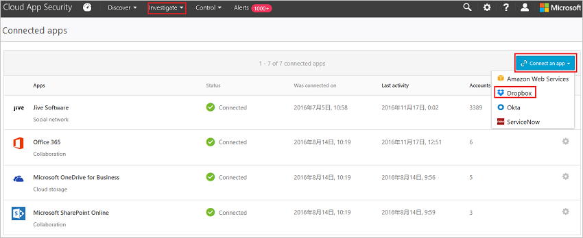

# Verbinding maken tussen Dropbox en Microsoft Cloud App Security
In deze sectie vindt u instructies voor het maken van een verbinding tussen Cloud App Security en uw bestaande Dropbox-account met behulp van de connector-API's voor de app.  
 
 
Omdat met Dropbox toegang tot bestanden via gedeelde koppelingen zonder aanmelden wordt ingeschakeld, worden deze gebruikers in Cloud App Security geregistreerd als niet-geverifieerde gebruikers. Als u niet-geverifieerde Dropbox-gebruikers ziet, kan dit wijzen op gebruikers die niet afkomstig zijn van uw organisatie of herkende gebruikers vanuit uw organisatie die zich niet hebben aangemeld.

## Verbinding maken tussen Dropbox en Microsoft Cloud App Security  
  
1.  Klik in de Cloud App Security-console op **Onderzoeken** en vervolgens op **Verbonden apps**.  
  
2.  In de **App-connectors** pagina, klikt u op de plusknop gevolgd door **Dropbox**.  
  
       
  
3.  Voer in het pop-upvenster het e-mailadres van het beheerdersaccount in.  
  
4.  Klik op **Genereer link**.  
  
5.  Klik op **Volg deze link**.  
  
     Het logboek Dropbox op de pagina wordt geopend. Voer uw referenties in om Cloud App Security toegang te geven tot het Dropbox-exemplaar van uw team.  
  
6.  Dropbox wordt u gevraagd of u wilt toestaan Cloud App Security-toegang tot de teamgegevens van uw, activiteitenlogboek, en activiteiten uitvoeren als teamlid van een. Klik op **Toestaan** om door te gaan.  
  
7.  In de Cloud App Security-console zou u nu een bericht moeten ontvangen waarin staat vermeld dat er verbinding is gemaakt met Dropbox.  
  
8.  Controleer of de verbinding tot stand is gekomen door op **Test API** te klikken.  
  
     Het testen kan enkele minuten duren. Na de ontvangst van de melding dat de actie voltooid is, klikt u op **Sluiten**.  
  
Nadat u verbinding hebt gemaakt met Dropbox, ontvangt u gebeurtenissen tot 60 dagen voorafgaand aan de verbinding.

> [!NOTE] 
> Alle gebeurtenissen Dropbox voor het toevoegen van een bestand worden weergegeven in de Cloud App Security als uploadbestand uitgelijnd naar andere apps die zijn verbonden met Cloud App Security. 
 
## Zie ook  
[Cloud-apps beheren met beleidsregels](control-cloud-apps-with-policies.md)   

[Premier-klanten kunnen Cloud App Security ook rechtstreeks vanuit Premier Portal kiezen.](https://premier.microsoft.com/)  
  
  