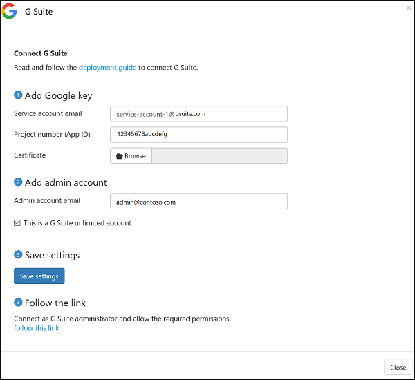

# Verbinding maken tussen G Suite en Microsoft Cloud App Security
In deze sectie vindt u instructies voor het maken van een verbinding tussen Cloud App Security en uw bestaande G Suite-account met behulp van de connector-API's.

  
  
## G Suite configureren  
  
1.  Als een G Suite Super Admin, meld u aan bij [https://cloud.google.com/console/project](https://cloud.google.com/console/project).  
  
2.  Klik op **Create project** (Een project maken) om een nieuw project te starten.  
  
       
  
3.  In de **nieuw project** scherm, Geef uw project als volgt: 
    **Microsoft Cloud App Security** en klik op **maken**.  
             
  
4.  Nadat het project is gemaakt, selecteert u in de werkbalk naast Google Cloud Platform, het project en klikt vervolgens onder **API** op **Go to APIs overview**(Naar API's-overzicht gaan).  
  
       
  
5.  Schakel onder **API** alle vermelde API's uit.  
      
6.  Klik op **Library** (Bibliotheek) en schakel de volgende API's in (gebruik de zoekbalk als de API niet wordt vermeld in de lijst **Popular APIs** (Populaire API's)):  
  
       
  
    > [!NOTE]  
    >  Negeer de waarschuwing over **Credentials** (Referenties) voor nu.  
  
    -   Admin SDK  
  
    -   Audit API  
  
    -   Google Drive API  
  
    -   Google Apps Marketplace SDK  
  
    -   Gmail API  
            
7.  U moet 5 **Enabled APIs** (Ingeschakelde API’s) hebben:  
  
       
  
8.  Klik op **Credentials** (Referenties) gevolgd door **OAuth consent screen** (Scherm toestemming OAuth)  
  
    -   In **productnaam weergegeven voor gebruikers**, type **Microsoft Cloud App Security**.  
  
    -   Alle andere velden zijn optioneel.  
  
    -   Klik op **Opslaan**.  
  
       
  
9. In het scherm **API Credentials** (API-referenties), klikt u op de pijl naast **Create credentials** (Referenties maken).  
  
       

10. Selecteer **Service account key** (Serviceaccountsleutel).

       
  
11. Onder **maken service account key**, kies **nieuwe serviceaccount**, en typ een naam, bijvoorbeeld **serviceaccount 1**. Onder **rol**, kies **Project** en vervolgens **Editor**. Onder **sleuteltype**, kies **P12** en klik op **maken**. Schakel het selectievakje **Enable G Suite Domain-wide Delegation** (Domeinbrede delegatie voor Google Apps inschakelen) in en klik op **Save** (Opslaan).  
  
       
  
12.  Een P12-certificaatbestand wordt opgeslagen op uw computer.  
        
12. In het scherm **Credentials** (Referenties) klikt u aan de rechterkant op **Manage service accounts** (Serviceaccounts beheren).  
         
  
13. Klik op de drie punten rechts van het serviceaccount dat u hebt gemaakt en selecteer **bewerken**.  
  
       
  
15. Kopieer de **Service-account-ID** toegewezen aan uw service - u hebt dit later nodig.  
  
       
  
16. Open het Google-menu door te klikken op de drie horizontale lijnen naast Google Cloud Platform in de titelbalk. Selecteer **API manager** gevolgd door **Dashboard**.  
    
17. Blader omlaag naar de lijst met ingeschakelde API's en klik op het instellingentandwiel naast **Google Drive API**.   
         

18. Vul in de volgende informatie:

    -   **Toepassingsnaam**: Microsoft Cloud App Security.  
  
    -   **Korte beschrijving en lange beschrijving** (optioneel): Microsoft Cloud App Security kunt u inzicht krijgen in cloudtoepassingen, zodat u kunt beheren, onderzoeken en beheren gebruik van cloudtoepassingen; bedrijfsgegevens kunt beveiligen; en detecteren verdachte activiteiten voor alle cloudtoepassingen.  
  
    -   Google vereist dat u ten minste één toepassingspictogram uploadt. Ga naar [https://portal.cloudappsecurity.com/cas/static/files/MSLogos.zip](https://portal.cloudappsecurity.com/cas/static/files/MSLogos.zip) voor het downloaden van een zip-bestand met Cloud App Security-pictogrammen. Vervolgens sleept u onder **Application icon** (Pictogram voor toepassing) de afbeeldingen van 128x128 en 32x32 pixels en zet u die neer.  
  
    -   Onder **station integratie** Typ de volgende URL onder **URL openen:**  
  
         https://portal.cloudappsecurity.com/#/services/11770?tab=files  
     
           
  
19. In de lijst **Enabled APIs** (Ingeschakelde API’s) klikt u op het tandwiel voor instellingen naast **Google Apps Marketplace SDK** . 
           

       >[!NOTE]
       > Als het tandwiel is uitgeschakeld, kunt u klikken op **Google Apps Marketplace SDK** in plaats daarvan. 
20. Selecteer het tabblad **Configuration** (Configuratie). 
  
    -   Kopieer het **projectnummer (app-id)** dat bovenaan wordt weergegeven voor later gebruik.  
  
    -   De **toepassingsnaam** melding **Microsoft Cloud App Security**.
  
         Vul de **toepassingsbeschrijving** veld met het 'Microsoft Cloud App Security kunt u inzicht krijgen in de cloud-apps beter kunt beheren, te onderzoeken en te bepalen van cloud-app-gebruik; bedrijfsgegevens kunt beveiligen; en het detecteren van verdachte activiteiten voor alle cloud-Apps."  
  
    -   Schakel het vakje **Enable individual install** (Afzonderlijke installatie inschakelen) uit.  
  
    -   Configureren van de vier vereiste afbeeldingen onder **toepassingspictogrammen**.  
  
         U kunt de afbeeldingen vinden op: [https://portal.cloudappsecurity.com/cas/static/files/MSLogos.zip](https://portal.cloudappsecurity.com/cas/static/files/MSLogos.zip)  
  
           
  
    -   Vul de volgende **Support URLs** (URL’s voor ondersteuning) in:  
  
        -   **URL gebruiksrechtovereenkomst**: http://go.microsoft.com/fwlink/?LinkID=733268  
  
        -   **URL privacybeleid**: http://go.microsoft.com/fwlink/?LinkId=512132  
  
    -   Onder **OAuth 2.0 scopes**, kopiëren en plakken van de volgende URL's (kopiëren ze op een tijd en druk op Enter na elke opdracht):  
  
           https://www.googleapis.com/auth/admin.reports.audit.readonly  
  
           https://www.googleapis.com/auth/admin.reports.usage.readonly  
  
           https://www.googleapis.com/auth/drive  
  
           https://www.googleapis.com/auth/drive.appdata  
  
           https://www.googleapis.com/auth/drive.apps.readonly  
  
           https://www.googleapis.com/auth/drive.file  
  
           https://www.googleapis.com/auth/drive.metadata.readonly  
  
           https://www.googleapis.com/auth/drive.readonly  
  
           https://www.googleapis.com/auth/drive.scripts  
  
           https://www.googleapis.com/auth/admin.directory.user.readonly  
  
           https://www.googleapis.com/auth/admin.directory.user.security  
  
           https://www.googleapis.com/auth/admin.directory.user.alias  
  
           https://www.googleapis.com/auth/admin.directory.orgunit  
  
           https://www.googleapis.com/auth/admin.directory.notifications  
  
           https://www.googleapis.com/auth/admin.directory.group.member  
  
           https://www.googleapis.com/auth/admin.directory.group  
  
           https://www.googleapis.com/auth/admin.directory.device.mobile.action  
  
           https://www.googleapis.com/auth/admin.directory.device.mobile  
  
           https://www.googleapis.com/auth/admin.directory.user  
  
    -   Klik op **Save Changes** (Wijzigingen opslaan).  
  
18. Ga naar [admin.google.com](https://admin.google.com/) en kies vervolgens **Security** (beveiliging). 
         
 
19. Kies **API reference** (API-verwijzing).  
         
      
20. Selecteer **Enable API Access** (API-toegang inschakelen) en klik op **Save changes** (Wijzigingen opslaan).  
  
      

  
## Cloud App Security configureren  
  
1.  Klik in de Cloud App Security-portal op **Onderzoeken** en vervolgens op **Verbonden apps**.  
  
2.  Klik op de pagina **Connected apps** (Verbonden apps) op de knop met het plusteken en selecteer **G Suite**.  
       
  
3.  Vul in het pop-upvenster in de volgende informatie:  
  
       
  
    1.  **Het e-mailadres van het serviceaccount** dat u hebt gekopieerd in stap 16.  
  
    2.  **Het projectnummer (app-id)** dat u hebt gekopieerd in stap 21.  
  
    3.  Upload het P12-**certificaat** dat u hebt opgeslagen in stap 12. U moet het wachtwoord die u hebt opgeslagen om dit te doen.  
  
    4.  Voer een **admin account email** in van uw G Suite-beheerder.  
  
    5.  Als u een onbeperkt account van G Suite hebt, schakelt u dit selectievakje in. Zie voor informatie over welke functies beschikbaar in de Cloud App Security voor G Suite onbeperkte zijn [Schakel directe zichtbaarheid, bescherming en beheeracties voor uw apps](enable-instant-visibility-protection-and-governance-actions-for-your-apps.md).  
  
    6.  Klik op **Instellingen opslaan**.  
  
    7.  **Klik op de koppeling** om verbinding te maken met G Suite. Hiermee opent u G Suite en u wordt gevraagd om toegang te verlenen voor Cloud App Security.  
         
    8.  Controleer of de verbinding tot stand is gekomen door op **Test now** (Nu testen) te klikken.  
  
         Het testen kan enkele minuten duren.  
  
         Nadat u de melding hebt gekregen dat de test is geslaagd, klikt u op **Done** (Klaar) en sluit u de pagina van G Suite.  
  
  
Nadat u verbinding hebt gemaakt met G Suite, ontvangt u gebeurtenissen tot 60 dagen voorafgaand aan de verbinding.
  
Na de verbinding met G Suite wordt in Cloud App Security een volledige scan uitgevoerd. Afhankelijk van hoeveel bestanden en gebruikers u hebt, kan het voltooien van de volledige scan even duren. Zodat bijna de real-timescans worden waarop de activiteit wordt gedetecteerd verplaatst naar het begin van de wachtrij scan. Bijvoorbeeld, wordt een bestand dat wordt bewerkt, bijgewerkt of gedeeld meteen gescand. Dit geldt niet voor bestanden die inherent niet zijn gewijzigd. Bijvoorbeeld worden bestanden die worden weergegeven, bekeken, afgedrukt of geëxporteerd gescand tijdens de reguliere scan.
  
  
## Zie ook  
[Cloud-apps beheren met beleidsregels](control-cloud-apps-with-policies.md)   
[Ga naar de ondersteuningspagina van Cloud App Security voor technische ondersteuning.](http://support.microsoft.com/oas/default.aspx?prid=16031)   
[Premier-klanten kunnen Cloud App Security ook rechtstreeks vanuit Premier Portal kiezen.](https://premier.microsoft.com/)  
  
  