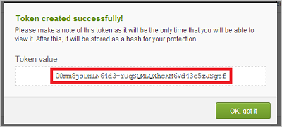

# Verbinding maken tussen Okta en Microsoft Cloud App Security
In deze sectie vindt u instructies voor het maken van een verbinding tussen Cloud App Security en uw bestaande Okta-account met behulp van de connector-API's voor de app.  
  
## De verbinding maken tussen Okta en Microsoft Cloud App Security  
  
1.  U wordt aangeraden in Okta een beheerdersserviceaccount te maken voor Cloud App Security.  
  
     Zorg ervoor dat u een account gebruikt met superbeheerdersmachtigingen.  
  
     Zorg ervoor dat uw Okta-account is geverifieerd.  
  
2.  Klik in de Okta-console op **Beheerder**.  
  
    -   Klik op **Beveiliging** en vervolgens op **API**.  
  
           
  
    -   Klik op **Token aanmaken**.  
  
           
  
    -   Voer in het pop-upvenster **Token aanmaken** uw Cloud App Security-token in en klik op **Token aanmaken**.  
  
           
  
    -   In het **pop-upvenster Token aangemaakt**, kopieert u de**Tokenwaarde**.  
  
           
  
3.  Klik in de Cloud App Security-console op **Onderzoeken** en vervolgens op **Goedgekeurde apps**.  
  
4.  Klik in de rij Okta op **Verbinden** in de kolom **App Connector-status**, of klik op de knop **Verbinding maken met een app** en vervolgens op **Okta**.  
  
       
  
5.  Voer op API-pagina in het veld **Domein** uw Okta-domein in en plak uw token in het veld **Token**.  
  
6.  Klik op **Verbinden** om het token voor Okta te maken in Cloud App Security.  
  
7.  Controleer of de verbinding tot stand is gekomen door op **Test API** te klikken.  
  
     Het testen kan enkele minuten duren. Na de ontvangst van de melding dat de actie voltooid is, klikt u op **Sluiten**.  
  
Nadat u verbinding hebt gemaakt met Okta, ontvangt u gebeurtenissen tot 60 dagen voorafgaand aan de verbinding.
  
## Zie ook  
[Cloud-apps beheren met beleidsregels](control-cloud-apps-with-policies.md)   
[Ga naar de ondersteuningspagina van Cloud App Security voor technische ondersteuning.](http://support.microsoft.com/oas/default.aspx?prid=16031)   
[Premier-klanten kunnen Cloud App Security ook rechtstreeks vanuit Premier Portal kiezen.](https://premier.microsoft.com/)  
  
  

<!--HONumber=Oct16_HO5-->

