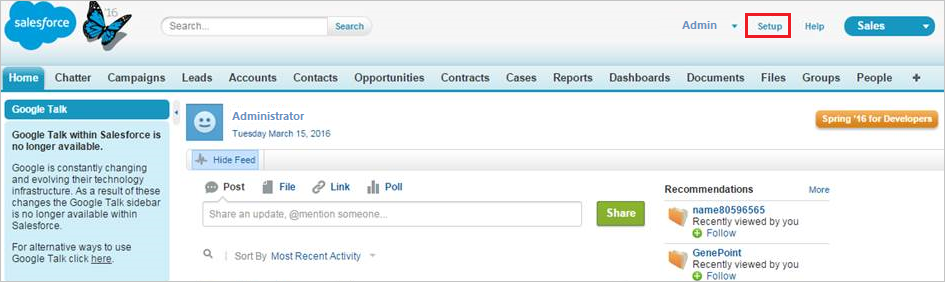

# Verbinding maken tussen Salesforce en Microsoft Cloud App Security
In deze sectie vindt u instructies voor het maken van een verbinding tussen Cloud App Security en uw bestaande Salesforce-account met behulp van de connector-API voor de app.  
  
## Verbinding maken tussen Salesforce en Microsoft Cloud App Security  
  
1.  U wordt aangeraden een specifiek servicebeheerdersaccount te hebben voor Cloud App Security.  
  
2.  Valideer dat de REST API is ingeschakeld in Salesforce.  
  
     Uw Salesforce-account moet een van de volgende edities zijn met REST API-ondersteuning:  
  
     **Performance**, **Enterprise**, **Unlimited** of **Developer**.  
  
     De **Professional**-editie heeft standaards geen REST API, maar deze kan op aanvraag worden toegevoegd.  
  
     Controleer als volgt of REST API beschikbaar is op uw editie en is ingeschakeld:  
  
    -   Meld u aan bij uw SalesForce-account en ga naar de **instellingspagina**.  
  
    -   Ga onder **Gebruikers beheren** naar de pagina **Profielen**.  
  
           
  
    -   Kies het profiel dat u gebruikt voor het implementeren van Cloud App Security en klik op **Bewerken**.  
  
           
  
    -   Zorg ervoor dat het selectievakje **API ingeschakeld** is geselecteerd. Als deze niet is geselecteerd, moet u mogelijk contact opnemen met Salesforce om deze toe voegen aan uw account.  
  
           
  
3.  Als **Salesforce CRM-inhoud** is ingeschakeld voor uw organisatie, zorg er dan voor dat dit ook is ingeschakeld voor het huidige beheerdersaccount.  
  
    1.  Ga naar uw Salesforce-instellingspagina.  
  
           
  
    2.  Selecteer in het menu aan de zijkant **Gebruikers beheren** en klik vervolgens op **Gebruikers**.  
  
           
  
    3.  Selecteer de huidige gebruiker met beheerdersrechten voor uw specifieke Cloud App Security-gebruiker.  
  
    4.  Zorg ervoor dat het selectievakje **Salesforce CRM-inhoud gebruiker** is geselecteerd.  
  
         Als dit niet is geselecteerd, klikt u op **Bewerken** en het selecteert u selectievakje.  
  
           
  
    5.  Klik op **Opslaan**.  
  
4.  Klik in de Cloud App Security-console op **Onderzoeken** en vervolgens op **Goedgekeurde apps**.  
  
5.  Klik in de rij Box op **Verbinden** in de kolom **App Connector-status**, of klik op de knop **Verbinding maken met een app** en vervolgens op **Salesforce**.  
  
       
  
6.  Klik op de instellingspagina van Salesforce op het tabblad API en klik vervolgens op **Deze link volgen**, afhankelijk van welk exemplaar u wilt installeren.  
  
7.  Hiermee wordt de aanmeldingspagina van Salesforce geopend. Voer uw referenties in om Cloud App Security toegang te geven tot de Salesforce-app van uw team.  
  
       
  
8.  Salesforce geeft een melding weer om u te vragen of u Cloud App Security toegang wilt geven tot de gegevens van uw team en het activiteitenlogboek en toestemming wilt geven om willekeurige activiteiten uit te voeren als een willekeurig teamlid. Klik op **Toestaan** om door te gaan.  
  
9. Op dit moment ontvangt u een melding dat de implementatie is gelukt of mislukt. Cloud App Security is nu gemachtigd in Salesforce.com.  
  
10. In de Cloud App Security-console zou u moeten zien dat er verbinding is gemaakt met Salesforce.  
  
11. Controleer of de verbinding tot stand is gekomen door op **Test API** te klikken.  
  
     Het testen kan enkele minuten duren. Na de ontvangst van de melding dat de actie voltooid is, klikt u op **Gereed**.  
  
  
Nadat u verbinding hebt gemaakt met SalesForce, ontvangt u gebeurtenissen als volgt: triggers vanaf het moment van de verbinding, aanmeldingsgebeurtenissen en instellen van audittrail tot 60 dagen voorafgaand aan de verbinding, gebeurtenisbewaking tot 30 dagen of 1 dag terug (afhankelijk van uw licentie voor SalesForce EventMonitoring).
  
## Zie ook  
[Cloud-apps beheren met beleidsregels](control-cloud-apps-with-policies.md)   
[Ga naar de ondersteuningspagina van Cloud App Security voor technische ondersteuning.](http://support.microsoft.com/oas/default.aspx?prid=16031)   
[Premier-klanten kunnen Cloud App Security ook rechtstreeks vanuit Premier Portal kiezen.](https://premier.microsoft.com/)  
  
  

<!--HONumber=Nov16_HO3-->

