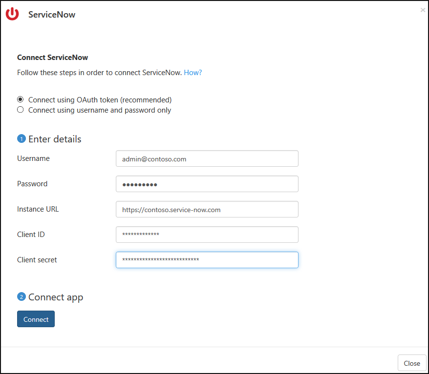

# Verbinding maken tussen ServiceNow en Microsoft Cloud App Security

In deze sectie vindt u instructies voor het maken van een verbinding tussen Cloud App Security en uw bestaande ServiceNow-account met behulp van de connector-API voor de app. 

 >  [!NOTE]
>  Het is raadzaam ServiceNow te implementeren met OAuth-app-tokens, die beschikbaar zijn voor Fuji en latere versies (zie de relevante [ServiceNow-documentatie](http://wiki.servicenow.com/index.php?title=OAuth_Applications#gsc.tab=0). Voor eerdere versies is er een [verouderde verbindingsmodus](#legacy-servicenow-connection) beschikbaar op basis van gebruiker en wachtwoord.

 > [!NOTE]  
>  Cloud App Security ondersteunt ServiceNow-versies van Eureka, Fiji Geneva, Helsinki en Istanboel. Als u verbinding wilt maken tussen ServiceNow en Cloud App Security, moet u de rol **Beheerder** hebben en er zeker van zijn dat het ServiceNow-exemplaar API-toegang ondersteunt.  Raadpleeg voor meer informatie de [ServiceNow-productdocumentatie](http://wiki.servicenow.com/index.php?title=Base_System_Roles#gsc.tab=0).
  
## Een verbinding maken tussen ServiceNow en Cloud App Security met behulp van OAuth
  
  
1.  Meld u met een beheerdersaccount aan bij uw ServiceNow-account.  
  
2.  In de zoekbalk **Filter navigator** typt u **OAuth** en selecteert u **Toepassingsregister**.

3. In de menubalk **Toepassingsregisters** klikt u op **Nieuw** om een nieuw OAuth-profiel te maken.

   

4. Onder **Wat voor soort OAuth-toepassing?**, klikt u op **Een OAuth-API-eindpunt maken voor externe clients**.

   

5. Onder **toepassing registers nieuwe record** Vul de volgende velden:
    
    - **Naam**-veld, de naam van het nieuwe OAuth-profiel, bijvoorbeeld CloudAppSecurity. 
    
    - De **Client-ID** automatisch wordt gegenereerd. Deze ID kopiëren, moet u plak deze in de Cloud App Security om verbinding te voltooien.
    
    - In het veld **Clientgeheim** voert u een tekenreeks in. Als deze leeg wordt gelaten, wordt een willekeurige geheim automatisch gegenereerd. Kopieer en bewaar het voor later. 
    
    - Verleng de **Levensduur van het toegangstoken** tot ten minste 3600.
    
    - Klik op **Indienen**.

   

6.  Klik in de Cloud App Security-portal op **Onderzoeken** en vervolgens op **Verbonden apps**.  
  
7.  Klik op de pagina **App-connectors** op de knop met het plusteken en vervolgens op **ServiceNow**.  
  
       
  
8.  Voeg in de pop-up van uw ServiceNow-gebruikersnaam, wachtwoord, exemplaar-URL, Client-ID en clientgeheim in de desbetreffende vakken. Als u wilt uw ServiceNow-gebruikersnaam niet in de portal ServiceNow vinden, gaat u naar **gebruikers** en zoek vervolgens uw naam in de tabel - deze wordt weergegeven naast uw gebruikers-ID.

    
  
9.  Klik op **Verbinden**.  
  
       
  
10.  Controleer of de verbinding tot stand is gekomen door op **Test now** (Nu testen) te klikken.  
  
     Het testen kan enkele minuten duren. Na de ontvangst van de melding dat de actie voltooid is, klikt u op **Sluiten**.  
  
Nadat u verbinding hebt gemaakt met ServiceNow, ontvangt u gebeurtenissen tot 60 dagen voorafgaand aan de verbinding.
  
## Verouderde ServiceNow-verbinding

Als u verbinding wilt maken tussen ServiceNow en Cloud App Security, moet u machtigingen hebben op beheerdersniveau en er zeker van zijn dat het ServiceNow-exemplaar API-toegang ondersteunt.   

1.  Meld u met een beheerdersaccount aan bij uw ServiceNow-account.   

2.  Maak een nieuw serviceaccount voor Cloud App Security en wijs de beheerdersrol aan het nieuwe account toe.   

3.  Zorg ervoor dat de REST API-plugin is ingeschakeld.   

       

4.  Klik in de Cloud App Security-portal op **Onderzoeken** en vervolgens op **Erkende apps**.   

5.  Klik in de rij ServiceNow op **Verbinden** in de kolom **App Connector-status**, of klik op de knop **Verbinding maken met een app** en vervolgens op **ServiceNow**.   

       

6.  Voeg in de pagina ServiceNow-instellingen op het tabblad API uw ServiceNow-gebruikersnaam, het wachtwoord en de exemplaar-URL in de desbetreffende vakken.   

7.  Klik op **Verbinden**.   

      

8.  Controleer of de verbinding tot stand is gekomen door op **Test API** te klikken.   
  
   Het testen kan enkele minuten duren. Na de ontvangst van de melding dat de actie voltooid is, klikt u op **Sluiten**.    
 Nadat u verbinding hebt gemaakt met ServiceNow, ontvangt u gebeurtenissen tot 60 dagen voorafgaand aan de verbinding. 

## Zie ook  
[Cloud-apps beheren met beleidsregels](control-cloud-apps-with-policies.md)   

[Premier-klanten kunnen Cloud App Security ook rechtstreeks vanuit Premier Portal kiezen.](https://premier.microsoft.com/)  
  
