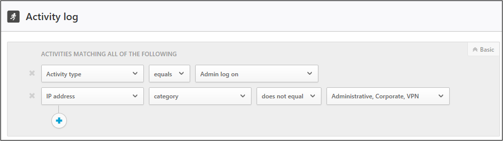
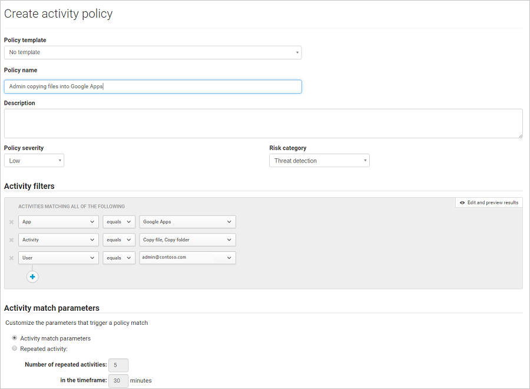
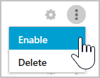

# Cloud-apps beheren met beleidsregels

Met beleidsregels kunt u de manier vastleggen waarop u wilt dat uw gebruikers zich gedragen in de cloud. Beleidsregels helpen u risicovol gedrag, schendingen of verdachte datapunten en -activiteiten binnen uw cloudomgeving te detecteren en, indien vereist, herstelwerkstromen te integreren om een optimale risicobeperking te behalen. Er zijn meerdere typen beleidsregels die samenhangen met de verschillende typen gegevens die u wilt verzamelen over uw cloudomgeving en de soorten herstelacties die u zou willen ondernemen.  
  
Als er bijvoorbeeld een gegevensschendingsbedreiging is die u in quarantaine wilt zetten, heeft u een ander stoort beleid nodig dan wanneer u een risicovolle cloud-app wilt blokkeren voor gebruik binnen uw organisatie.  
  
## Beleidstypen  
Wanneer u kijkt naar de pagina **Beleid**, kunt u de verschillende beleidsregels en sjablonen onderscheiden aan de hand van het type en pictogram, om te zien welke beleidsregels beschikbaar zijn. De beschikbare beleidsregels zijn afhankelijk van de gegevensbron en wat u hebt ingeschakeld in Cloud App Security voor uw organisatie. Als u bijvoorbeeld Cloud Discovery-logboeken hebt geüpload, worden de beleidsregels met betrekking tot Cloud Discovery weergegeven.

De volgende soorten beleidsregels kunnen worden gemaakt:  
  
|pictogram beleidstype|Beleidstypen|Gebruik|  
|-----|-----------------|---------|  
||Beleid voor activiteiten|Beleidsregels voor activiteiten zorgen ervoor dat u een breed scala aan geautomatiseerde processen kunt controleren waarbij u gebruikmaakt van de API’s van de app-provider. Met deze beleidsregels kunt u specifieke activiteiten volgen die worden uitgevoerd door verschillende gebruikers of onverwacht hoge frequenties van een bepaald type activiteit volgen.|  
||Beleid voor afwijkingsdetectie|De beleidsregels voor afwijkingsdetectie biedt u de mogelijkheid om ongebruikelijke activiteiten op uw cloud op te sporen op basis van de risicofactoren die u hier instelt, zodat u op de hoogte wordt gebracht wanneer iets afwijkt van de basislijn binnen uw organisatie of de standaardactiviteiten van de gebruiker.|  
||Beleid voor appdetectie|Beleidsregels voor appdetectie bieden u de mogelijkheid om waarschuwingen in te stellen zodat u op de hoogte bent wanneer er binnen uw organisatie nieuwe apps gedetecteerd worden.|  
||Beleid voor afwijkingsdetectie voor Cloud Discovery|De beleidsregels voor afwijkingsdetectie voor Cloud Discovery kijken naar de logboeken die u voor het detecteren van cloud-apps en het zoeken naar ongebruikelijke voorvallen gebruikt. Voorbeelden zijn wanneer een gebruiker die nog nooit gebruik heeft gemaakt van Dropbox, plotseling 600 GB upload naar Dropbox, of wanneer er veel meer transacties worden uitgevoerd dan gebruikelijk in een bepaalde app.|  
||Bestandsbeleid|Met beleidsregels voor bestanden kunt u uw cloud-apps scannen op specifieke bestanden of bestandstypen (gedeeld, gedeeld met externe domeinen) en gegevens (vertrouwelijke, PII-, creditcardgegevens, enzovoort). Ook kunt u beheeracties uitvoeren op bestanden. Beheeracties zijn specifiek per cloud-app.|  
  
## Het identificeren van risico’s  
Cloud App Security helpt u bij het beperken van verschillende risico's in de cloud. U kunt elk beleidsregel en waarschuwing zo configureren dat deze bij een van de volgende risico’s hoort:  
  
-   **Toegangsbeheer:** wie heeft toegang tot wat vanaf waar?  
  
     Houd continu gedrag in de gaten en detecteer afwijkende activiteiten, inclusief interne en externe aanvallen met een hoog risico. Pas een beleid toe om voor een app of voor specifieke acties in een app een waarschuwing, blokkade of identiteitsverificatie in te stellen. Maakt beleidsregels mogelijk voor het beheren van on-premises en mobiele toegang op basis van gebruiker, apparaat en locatie met behulp van abrupte blokkering en gedetailleerde weergave, bewerking en blokkering. Detecteer verdachte aanmeldgebeurtenissen, waaronder mislukte meervoudige verificatiepogingen, mislukte aanmeldpogingen bij passieve accounts en imitatiegebeurtenissen.  
  
-   **Naleving:** worden uw nalevingsvereisten geschonden?  
  
     Rangschik en identificeer gevoelige of gereglementeerde gegevens, waaronder machtigingen voor het delen van elk afzonderlijk bestand, opgeslagen in bestandssynchronisatieservices zodat u voldoet aan regelgeving zoals PCI, SOX en HIPAA.  
  
-   **Configuratiebeheer:** worden er niet-geautoriseerde wijzigingen doorgevoerd in uw configuratie?  
  
     Monitor configuratiewijzigingen met inbegrip van configuratiebewerking op afstand.  
  
-   **Cloud Discovery:** worden er nieuwe apps gebruikt binnen uw organisatie? Hebt u een probleem met schaduw IT-apps die zonder uw weten worden gebruikt?  
  
     Breng de algemene risico’s van elke cloud-app in kaart op basis van regelgevings- en branchecertificeringen, en  
    aanbevolen procedures. Dit biedt u de mogelijkheid om het aantal gebruikers, activiteiten, omvang van het verkeer en de gemiddelde gebruiksduur in uren vast te stellen voor  
    elke cloud-app.  
  
-   **DLP:** worden vertrouwelijke bestanden openbaar gedeeld? Moet u de bestanden in quarantaine plaatsen?  
  
     On-premises DLP-integratie zorgt voor integratie en gesloten herstel met bestaande on-premises DLP-oplossingen.  
  
-   **Accounts met bevoegdheden:** is het nodig dat u beheeraccounts monitort?  
  
     Realtimeactiviteitenbewaking en -rapportage voor gebruikers met bevoegdheden en beheerders.  
  
-   **Beheer van deelgedrag:** hoe worden gegevens gedeeld binnen uw cloudomgeving?  
  
     Bekijk de inhoud van bestanden en inhoud in de cloud, en leg beleidsregels voor het intern en extern delen van inhoud op. Houd samenwerkverbanden in de gaten en stel beleidsregels voor het delen op, zoals een blokkade voor het delen buiten uw organisatie.  
  
-   **Bedreigingendetectie:** bedreigen verdachte activiteiten uw cloudomgeving?  
  
     Ontvang realtimemeldingen via sms of e-mail voor iedere beleidsschending of activiteitsdrempel die wordt overschreden. Door machine learning-algoritmen toe te passen, biedt Cloud App Security u de mogelijkheid om gedrag van een gebruiker te detecteren dat mogelijk wijst op misbruik van gegevens.  
  
## Het beheren van risico’s  
Ga als volgt te werk om met beleidsregels risico’s te beheren:  
  
1.  Maak een beleid via een sjabloon of een query.  
  
2.  Stel het beleid af zodat de gewenste resultaten worden behaald.  
  
3.  Voeg automatische acties toe om te reageren op risico’s en deze automatisch te herstellen.  
  
### Een beleid maken  
U kunt als basis voor al uw beleidsregels gebruikmaken van een van de beleidssjablonen van Cloud App Security of uw beleidsregels maken met behulp van een query.  
  
Beleidssjablonen helpen u bij het instellen van de juiste filters en configuraties die nodig zijn voor het detecteren van specifieke gebeurtenissen die van belang zijn binnen uw omgeving. De sjablonen omvatten alle typen beleidsregels en kunnen toegepast worden op diverse services.  
  
Volg de volgende stappen wanneer u een beleid wilt maken met behulp van een **beleidssjabloon**:  
  
1.  Klik in de console op **Besturingselement** gevolgd door **Sjablonen**.  
  
       
  
2.  Klik op de **+** aan de rechterkant van de rij van de sjabloon die u wilt gebruiken. Een pagina voor het maken van beleid wordt geopend, met daarin de vooraf gedefinieerde configuratie van de sjabloon.  
  
3.  Pas de sjabloon aan op uw op maat gemaakte beleid. Elke eigenschap en elk veld van dit nieuwe beleid dat op een sjabloon is gebaseerd, kan aan uw wensen worden aangepast.  
> [!NOTE] 
>Wanneer u de beleidsfilters gebruikt, zoekt **Bevat** alleen naar volledige woorden die zijn gescheiden door komma’s, punten, spaties of onderstrepingstekens. Als u bijvoorbeeld zoekt op **malware** of **virus**, wordt virus_malware_file.exe wel gevonden maar malwarevirusfile.exe niet. Als u zoekt op **malware.exe** vindt u ALLE bestanden met ‘malware’ of ‘exe’ in de bestandsnaam, maar als u zoekt op **”malware.exe”** (met aanhalingstekens) vindt u alleen bestanden die precies “malware.exe” bevatten. 
     **Is gelijk aan** zoekt alleen naar de volledige tekenreeks. Als u bijvoorbeeld zoekt naar **malware.exe** wordt malware.exe wel gevonden maar malware.exe.txt niet.  
4.  Nadat u het nieuwe beleid maakt op basis van een sjabloon, wordt een koppeling naar het nieuwe beleid weergegeven in de kolom **Gekoppelde beleidsregels** in de beleidssjabloontabel naast de sjabloon waarmee het beleid is gemaakt.  
     U kunt vanuit elke sjabloon zoveel beleidsregels maken als u wilt en deze zullen allemaal gekoppeld zijn aan de oorspronkelijke sjabloon. Hierdoor kunt u alle gemaakte beleidsregels volgen met behulp van dezelfde sjabloon.  
  
U kunt ook **een beleid maken tijdens een onderzoek**. Als u **Activiteitenlogboek**, **Bestanden** of **Accounts** onderzoekt, en u zoekt verder naar iets specifieks, kunt u op elk gewenst moment een nieuw beleid maken op basis van de resultaten van uw onderzoek.  
  
Als u bijvoorbeeld in het **Activiteitenlogboek** een beheerdersactiviteit vanaf een IP-adres buiten uw kantoor ziet staan.

  
Volg de volgende stappen voor het maken van een beleid gebaseerd op onderzoeksresultaten:  
  
1.  Klik in de console op **Onderzoeken** gevolgd door **Activiteitenlogboek**, **Bestanden** of **Accounts**.  
  
2.  Gebruik de filters bovenaan de pagina om het aantal resultaten te beperken tot het verdachte gebied. Klik bijvoorbeeld in de pagina Activiteitenlogboek op **Activiteit** en selecteer **Aanmelding beheerder**. Selecteer vervolgens onder **IP-adres** de optie **Categorie** en stel in dat de weergegeven waarde niet de IP-adrescategorieën omvat die u hebt gemaakt voor uw herkende domeinen, zoals de IP-adressen van beheerders, zakelijke gebruikers en VPN’s.  
  
       
  
3.  Klik in de rechterbovenhoek van de console op **Nieuw beleid op basis van zoekbewerking**.  
  
4.  Een pagina voor het maken van beleid opent en bevat de filters die u gebruikt hebt voor uw onderzoek.  
  
5.  Pas de sjabloon aan op uw op maat gemaakte beleid. Elke eigenschap en elk veld van dit nieuwe beleid dat op een onderzoek is gebaseerd, kan aan uw wensen worden aangepast.  
   
> [!NOTE] 
> Wanneer u de beleidsfilters gebruikt, zoekt **Bevat** alleen naar volledige woorden die zijn gescheiden door komma’s, punten, spaties of onderstrepingstekens. Als u bijvoorbeeld zoekt op **malware** of **virus**, wordt virus_malware_file.exe wel gevonden maar malwarevirusfile.exe niet.  
     **Is gelijk aan** zoekt alleen naar de volledige tekenreeks. Als u bijvoorbeeld zoekt naar **malware.exe** wordt malware.exe wel gevonden maar malware.exe.txt niet.  
  
 
 

 
 
  
> [!NOTE]  
>  Raadpleeg de bijbehorende documentatie over beleid voor meer informatie over het instellen van de beleidsvelden:  
>   
>  [Beleidsregels voor gebruikersactiviteit](user-activity-policies.md)  
>   
>  [Beleidsregels voor gegevensbescherming](data-protection-policies.md)  
>   
>  [Beleidsregels voor Cloud Discovery](cloud-discovery-policies.md)  
  
## Beleid in- en uitschakelen

Nadat u een beleid hebt gemaakt, kunt u dat in- of uitschakelen. Daardoor hoeft u een beleid nadat u het hebt gemaakt niet te verwijderen om het te kunnen stopzetten. Als u om enigerlei reden het beleid wilt stopzetten, kunt u het tijdelijk uitschakelen.

- Als u een beleid wilt inschakelen, klikt u op de pagina **Beleid** op de drie punten aan het einde van de rij van het beleid dat u wilt inschakelen en selecteert u **Inschakelen**. 

- Als u een beleid wilt uitschakelen, klikt u op de pagina **Beleid** op de drie punten aan het einde van de rij van het beleid dat u wilt uitschakelen en selecteert u **Uitschakelen**.

Nadat u een nieuw beleid hebt gemaakt, is dat standaard ingeschakeld.

## Zie ook  
[Dagelijkse activiteiten ter bescherming van uw cloudomgeving](daily-activities-to-protect-your-cloud-environment.md)   
[Ga naar de ondersteuningspagina van Cloud App Security voor technische ondersteuning.](http://support.microsoft.com/oas/default.aspx?prid=16031)   
[Premier-klanten kunnen Cloud App Security ook rechtstreeks vanuit Premier Portal kiezen.](https://premier.microsoft.com/)  
  

<!--HONumber=Dec16_HO2-->

