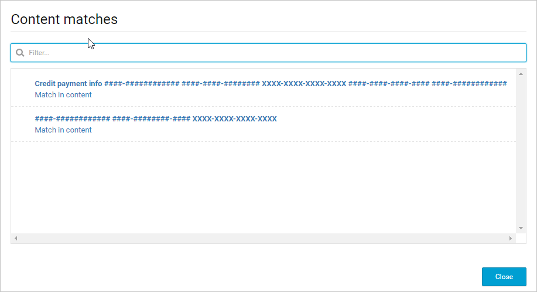

# Dagelijkse activiteiten ter bescherming van uw cloudomgeving
Nadat u Cloud App Security hebt gestart, de gegevensstromen hebt geconfigureerd, alle apps hebt goedgekeurd die personen mogen gebruiken en beleidsregels hebt ingesteld om uw cloudomgeving te controleren, is het tijd Cloud App Security te gebruiken om uw cloud te controleren en te beveiligen en om risico's te beheren.  
  
In dit onderwerp wordt beschreven wat u dagelijks moet doen.  
  
## Het Dashboard raadplegen  
Wanneer u de Cloud App Security-portal opent, ziet u een overzicht met openstaande waarschuwingen, activiteitschendingen, inhoudsschendingen, een activiteitenkaart waarop wordt aangegeven waar gebruikersactiviteit geografisch gezien vandaan komt, en gebruikstrends van verbonden apps in uw cloudomgeving.  
  
Het is raadzaam het dashboard dagelijks te raadplegen om te zien welke nieuwe waarschuwingen zijn gegenereerd en deze te verwerken. Het is ook een goede plaats om de gezondheid van uw cloudomgeving in de gaten te houden, zodat u een beeld krijgt van wat er op hoog niveau binnen uw gehele cloudomgeving gebeurt.  
  
  
  
## Uw waarschuwingen verwerken  
Waarschuwingen zijn het uitgangspunt van waaruit u meer inzicht in uw cloudomgeving krijgt. Mogelijk wilt u nieuwe beleidsregels maken naar aanleiding van uw bevindingen. Misschien ziet u bijvoorbeeld dat een beheerder zich aanmeldt vanuit Groenland en besluit u dat u een beleidsregel wilt maken waardoor een beheeraccount voortaan automatisch wordt geblokkeerd als deze wordt gebruikt om vanuit Groenland aan te melden.  
  
Het is een goed idee om alle waarschuwingen te bekijken en ze te gebruiken om uw beleid aan te passen. Als een onschuldige gebeurtenis wordt beschouwd als een schending van het bestaande beleid, moet u uw beleid verfijnen zodat u minder onnodige waarschuwingen ontvangt.  
  
-   Klik onder **Waarschuwingen openen** op **Alle waarschuwingen bekijken**.  
  
     Hiermee ziet u alle verdachte activiteiten of schendingen van uw bestaande beleid en kunt u de beveiligingspostuur waarborgen die u voor uw cloudomgeving heeft gedefinieerd.  
  
       
  
-   Bij elke waarschuwing dient u de aard van de schending te onderzoeken en de vereiste actie te bepalen.  
  
     U kunt de waarschuwingen filteren op **Type waarschuwing** of **Ernst**, zodat u de belangrijkste het eerst kunt verwerken.  
  
     Klik op een specifieke waarschuwing. Afhankelijk van het type waarschuwing krijgt u verschillende acties te zien die kunnen worden uitgevoerd voordat de waarschuwing wordt opgelost.  
  
     U heeft te maken met drie soorten schendingen wanneer u waarschuwingen onderzoekt:  
  
    -   **Ernstige schendingen** waarbij onmiddellijke actie nodig is  
  
         Voorbeelden:  
  
         Bij een waarschuwing wegens verdachte activiteiten kunt u het account blokkeren totdat de gebruiker het wachtwoord wijzigt.  
  
         Bij een gegevenslek kunt u de machtigingen beperken of het bestand in quarantaine plaatsen.  
  
         Als een nieuwe, niet-erkende service wordt ontdekt, kunt u de toegang tot de service op uw proxy of firewall blokkeren.  
  
    -   **Verdachte schendingen** die verder onderzocht moeten worden  
  
         U kunt contact opnemen met de gebruiker of de manager van de gebruiker over de aard van de activiteit.  
  
         Laat de activiteit open totdat u meer informatie heeft.  
  
    -   **Geautoriseerde schendingen of afwijkend gedrag** die het resultaat zijn van legitiem gebruik.  
  
         Negeer de waarschuwing.  
  
-   Markeer de waarschuwing als opgelost wanneer u klaar bent.  
  
De volgende tabel geeft een lijst van de typen waarschuwingen die kunnen worden geactiveerd en de aanbevolen manier om ze op te lossen.  
  
|Waarschuwingstype|Beschrijving|Aanbevolen oplossing|  
|----------------|-----------------|----------------------------|  
|Schending van activiteitenbeleid|Dit type waarschuwing is het resultaat van een beleid dat u hebt gemaakt.|- Als u groepsgewijs met dit type waarschuwingen wilt werken, wordt u aangeraden om rechtstreeks in het beleidscentrum te werken om deze te verhelpen. - Verfijn het beleid om ruisentiteiten uit te sluiten door meer filters en gedetailleerdere besturingselementen toe te voegen. - Als het beleid zeer nauwkeurig is en de waarschuwing gerechtvaardigd was en een schending is die u onmiddellijk wilt stoppen, overweeg dan om over te gaan op een geautomatiseerd antwoord door automatisch herstel aan het beleid toe te voegen.|  
|Schending van bestandsbeleid|Dit type waarschuwing is het resultaat van een beleid dat u hebt gemaakt.|- Als u groepsgewijs met dit type waarschuwingen wilt werken, wordt u aangeraden om rechtstreeks in het beleidscentrum te werken om deze te verhelpen. - Verfijn het beleid om ruisentiteiten uit te sluiten door meer filters en gedetailleerdere besturingselementen toe te voegen. - Als het beleid zeer nauwkeurig is en de waarschuwing gerechtvaardigd was en een schending is die u onmiddellijk wilt stoppen, overweeg dan om over te gaan op een geautomatiseerd antwoord door automatisch herstel aan het beleid toe te voegen.|  
|Verdacht account|Dit type waarschuwing wordt geactiveerd wanneer Cloud App Security een account identificeert dat is aangetast (zeer hoge kans dat het account op niet-toegestane wijze is gebruikt).|Het is raadzaam het account te blokkeren totdat u de gebruiker kunt bereiken en ervoor kunt zorgen dat deze zijn wachtwoord wijzigt.|  
|Inactieve account|Deze waarschuwing wordt geactiveerd wanneer een account niet meer wordt gebruikt in een van de gekoppelde cloud-apps.|Neem contact op met de gebruiker en de manager van de gebruiker om te bepalen of het account nog steeds actief is. Als dat niet het geval is, blokkeer dan de gebruiker en beëindig de licentie voor de app.|  
|Nieuwe gebruiker met beheerdersrechten|Hiermee wordt u gewaarschuwd voor wijzigingen in uw beschermde accounts voor verbonden apps.|Stel vast of de nieuwe beheerdersmachtigingen echt vereist zijn voor de gebruiker en als dat niet het geval is, kunt u het beste de beheerdersbevoegdheden intrekken om de blootstelling te beperken.|  
|Nieuwe locatie beheerder|Hiermee wordt u gewaarschuwd voor wijzigingen in uw beschermde accounts voor verbonden apps.|Stel vast of de aanmelding vanaf deze afwijkende locatie legitiem was, en als dat niet het geval is, kunt u het beste de beheerdersmachtigingen intrekken of het account blokkeren om blootstelling te beperken.|  
|Nieuwe locatie|Dit is een informatieve waarschuwing over de toegang tot een verbonden app vanaf een nieuwe locatie, die slechts één keer per land wordt geactiveerd.|Onderzoek de activiteit van de specifieke gebruiker.|  
|Nieuwe gedetecteerde service|Dit is een waarschuwing over Shadow IT - er is een nieuwe app gedetecteerd door Cloud Discovery.|<ul><li>Bepaal het risico van de service op basis van de App-catalogus.</li><li>Zoom in op de activiteit om inzicht te krijgen in gebruikspatronen en invloed.</li><li>Bepaal of u de app wel of niet wilt toestaan.       Voor niet-toegestane apps:   <ul><li>U kunt het gebruik blokkeren in uw proxy of firewall.</li><li>Als de app niet is toegestaan en u hebt een toegestane app in dezelfde categorie, dan kunt u inzoomen, een lijst met gebruikers van de niet-toegestane app exporteren en vervolgens contact met hen opnemen om ze naar de toegestane app te migreren.</li></ul></li></ul>|  
|Verdachte activiteiten|Deze waarschuwing laat u weten dat er afwijkende activiteit is aangetroffen die niet overeenkomt met de verwachte activiteiten of gebruikers in uw organisatie.|Onderzoek het gedrag en bevestig het met de gebruiker.   Dit type waarschuwing is een goed uitgangspunt om meer over uw omgeving te weten te komen en deze waarschuwingen te gebruiken om nieuw beleid te maken. Als iemand bijvoorbeeld plotseling een grote hoeveelheid gegevens naar een van uw verbonden apps uploadt, kunt u een regel instellen voor dat type afwijkend gedrag.|  
|Verdacht cloudgebruik|Deze waarschuwing laat u weten dat er afwijkende activiteit is aangetroffen die niet overeenkomt met de verwachte activiteiten of gebruikers in uw organisatie.|Onderzoek het gedrag en bevestig het met de gebruiker.   Dit type waarschuwing is een goed uitgangspunt om meer over uw omgeving te weten te komen en deze waarschuwingen te gebruiken om nieuw beleid te maken. Als iemand bijvoorbeeld plotseling een grote hoeveelheid gegevens naar een van uw verbonden apps uploadt, kunt u een regel instellen voor dat type afwijkend gedrag.|  
|Gebruik van persoonlijk account|Deze waarschuwing laat u weten dat een nieuw persoonlijk account toegang heeft tot bronnen in uw verbonden apps.|Verwijder de samenwerkingen van de gebruiker in het externe account.|  
  
## Beleid gebruiken voor het beoordelen van risico  
Ga, nadat u uw openstaande waarschuwingen heeft bekeken, naar het **Beleidscentrum** om beleidsschendingen te bekijken waarvoor geen waarschuwing is geactiveerd.  
  
-   Klik in de Cloud App Security-portal op **Controle** en vervolgens op **Beleidsregels**.  
  
-   Klik op een specifiek beleid om de lijst **Nu in overtreding** te zien met overeenkomsten met het beleid waarvoor geen waarschuwing is geactiveerd.  
  
-   Klik één voor één op de schendingen en bepaal bij elke schending wat u moet doen. Zie hieronder voor meer informatie over beheeracties.  
  
     Als het beleid bijvoorbeeld is ingesteld op het vinden van nalevingsproblemen en iemand slaat creditcardnummers op in bestanden op OneDrive, dan heeft u een overeenkomst met het beleid.  
  
       
  
-   Klik op de overeenkomst om de bestanden te zien die het beleid schenden.  
  
       
  
     U kunt op het bestand zelf klikken voor informatie over de bestanden.  
  
     U kunt op **Deelnemers** klikken om te zien wie toegang tot dit bestand heeft.  
  
     U kunt op de **Overeenkomsten** klikken om de creditcardnummers zelf te zien.  
  
       
  
## Zie ook  
[Onderzoeken](investigate.md)   
[Ga naar de ondersteuningspagina van Cloud App Security voor technische ondersteuning.](http://support.microsoft.com/oas/default.aspx?prid=16031)   
[Premier-klanten kunnen Cloud App Security ook rechtstreeks vanuit Premier Portal kiezen.](https://premier.microsoft.com/)  
  
  

<!--HONumber=Oct16_HO4-->

