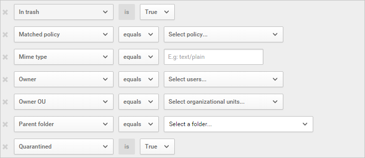

# Bestanden

Ter beveiliging van uw gegevens maakt Cloud App Security alle bestanden van uw verbonden apps voor u zichtbaar. Nadat u Cloud App Security hebt verbonden met een app met behulp van de App-connector, scant Cloud App Security alle bestanden, bijvoorbeeld alle bestanden die zijn opgeslagen in OneDrive en Salesforce. Cloud App Security scant elk bestand opnieuw wanneer het bestand wordt gewijzigd: de wijziging kan betrekking hebben op inhoud, metagegevens of machtigingen voor delen. Scantijden zijn afhankelijk van het aantal bestanden dat is opgeslagen in uw app. U kunt de pagina **Bestanden** ook gebruiken voor het filteren van bestanden om te onderzoeken wat voor soort gegevens er in uw cloud-apps worden opgeslagen. 

U kunt de pagina **Bestanden** bijvoorbeeld gebruiken om extern gedeelde bestanden met het label **vertrouwelijk** als volgt te beveiligen: nadat u een app hebt verbonden met Cloud App Security, kunt u een integratie tot stand brengen met Azure Information Protection. Vervolgens filtert u op de pagina **Bestanden** op bestanden met het label **vertrouwelijk**. Als u ziet dat er **vertrouwelijke** bestanden zijn die buiten uw organisatie worden gedeeld door het filter **Deelnemers** te filteren om uw domein uit te sluiten, kunt u een bestandsbeleid maken voor het detecteren van **vertrouwelijke** bestanden waarvoor verkeerde toegangsniveaus zijn toegepast en daar vervolgens automatische governance-acties voor instellen, zoals **Remove external collaborators** (Externe deelnemers verwijderen) en **Send policy-match digest to file owner** (Samenvatting van beleidsovereenkomst naar bestandseigenaar verzenden) om verlies van gegevens voor uw organisatie te voorkomen.

 

Hier volgt een voorbeeld van hoe u de pagina **Bestanden** kunt gebruiken. Ga als volgt te werk om ervoor te zorgen dat niemand in uw organisatie openbaar of extern bestanden deelt die niet zijn gewijzigd in de laatste zes maanden: nadat u een app hebt verbonden met Cloud App Security, filtert u op de pagina **Bestanden** op bestanden waarvan het toegangsniveau **Extern** of **Openbaar** is en stelt u de datum **Laatst gewijzigd** in op zes maanden geleden. U kunt een bestandsbeleid maken waarmee verlopen openbare bestanden worden gedetecteerd door te klikken op **Nieuw beleid op basis van zoekbewerking** en automatische governance-acties hierop toe te passen, zoals **Externe gebruikers verwijderen** om gegevensverlies voor uw organisatie te voorkomen.

 

Met het basisfilter kunt u snel aan de slag met het filteren van uw activiteiten.

 

Om in te zoomen op meer specifieke bestanden, kunt u het basisfilter uitbreiden door te klikken op Geavanceerd.

 
 
###   Bestandsfilters 
 
Met Cloud App Security kunt u elk bestandstype controleren op basis van meer dan twintig metagegevensfilters (bijvoorbeeld toegangsniveau, bestandstype). 
 
Met de ingebouwde DLP-engines van Cloud App Security worden inhoudsinspecties uitgevoerd door tekst te extraheren uit algemene bestandstypen (PDF-, Office-, RTF-, HTML-, codebestanden, enzovoort).

Hieronder volgt een lijst met de bestandsfilters die kunnen worden toegepast. De meeste filters bieden ondersteuning voor meerdere waarden en voor NOT (niet), zodat u over een zeer krachtig hulpprogramma beschikt voor het maken van een beleid.  
> [!NOTE] 
> Wanneer u de beleidsfilters voor bestanden gebruikt, zoekt **Bevat** alleen naar **volledige woorden** die zijn gescheiden door komma's, punten, spaties of onderstrepingstekens. 
> - Spaties tussen woorden hebben hetzelfde resultaat als het gebruik van OR; als u bijvoorbeeld zoekt op **malware** **virus**, worden alle bestanden gevonden met malware of virus in de naam, dus zowel malware-virus.exe als virus.exe.  
> - Als u wilt zoeken naar een tekenreeks, plaatst u de woorden tussen aanhalingstekens. Daarmee krijgt u hetzelfde resultaat als wanneer u AND zou gebruiken; als u bijvoorbeeld zoekt op **"malware"****"virus"**, wordt het bestand virus_malware_file.exe gevonden, maar niet malwarevirusfile.exe of malware.exe. Hiermee wordt echter naar de exacte tekenreeks gezocht. Als u zoekt naar **"malware virus"**, wordt **"virus"** of **"virus_malware"** niet gevonden.

>**Is gelijk aan** zoekt alleen naar de volledige tekenreeks. Als u bijvoorbeeld zoekt naar **malware.exe** wordt malware.exe wel gevonden maar malware.exe.txt niet. 

-   Toegangsniveau – toegangsniveau delen; openbaar, extern, intern of privé.  Zie voor meer informatie over externe bestanden [algemene instellingen van de portal instellen](getting-started-with-cloud-app-security.md)
    - Interne zijn alle bestanden in de interne domeinen die u instelt in [algemene instellingen](General-setup.md). 
    - Externe bestanden zijn de bestanden die zijn opgeslagen op locaties die zich niet binnen de ingestelde interne domeinen bevinden. 
    - Gedeelde bestanden zijn bestanden met een hoger niveau voor delen dan Privé, inclusief intern gedeelde bestanden (bestanden die binnen uw interne domeinen worden gedeeld), extern gedeelde bestanden (bestanden die worden gedeeld in domeinen die niet in uw interne domeinen worden weergegeven), openbare bestanden met een koppeling (bestanden die met anderen kunnen worden gedeeld via een koppeling) en openbare bestanden (bestanden die kunnen worden gevonden door te zoeken op internet). 

> [!NOTE]
>  Bestanden die door externe gebruikers zijn gedeeld in uw gekoppelde opslag-apps worden als volgt verwerkt door Cloud App Security:
> - **OneDrive:** OneDrive wijst een interne gebruiker toe als eigenaar van ieder bestand dat door een externe gebruiker in uw OneDrive wordt geplaatst. Omdat de bestanden vervolgens worden gezien als eigendom van uw organisatie, worden deze bestanden gescand met Cloud App Security en worden beleidsregels op deze bestanden toegepast, zoals voor alle bestanden in OneDrive gebeurt.
> - **Google Drive:** in Google Drive worden deze bestanden gezien als eigendom van de externe gebruiker en vanwege de juridische beperkingen voor bestanden en gegevens die geen eigendom van uw organisatie zijn, heeft Cloud App Security geen toegang tot deze bestanden.
> - **Box:** Omdat bestanden die eigendom zijn van een externe gebruiker in Box worden gezien als privégegevens, kunnen globale beheerders van Box de inhoud van deze bestanden niet bekijken. Om deze reden heeft Cloud App Security geen toegang tot deze bestanden. 
> - **Dropbox:** Omdat bestanden die eigendom zijn van een externe gebruiker in Dropbox worden gezien als privégegevens, kunnen globale beheerders van Dropbox de inhoud van deze bestanden niet bekijken. Om deze reden heeft Cloud App Security geen toegang tot deze bestanden.

-   App – alleen bestanden binnen deze apps zoeken.  
  
-   Samenwerkers – specifieke groepen met samenwerkers opnemen/uitsluiten.  
  
    -   Elke uit domein – als elke willekeurige gebruiker uit dit domein toegang tot het bestand heeft.  
  
    -   Gehele domein – als het gehele domein toegang tot het bestand heeft.  
  
    -   Groepen – als een specifieke groep toegang tot het bestand heeft. Groepen kunnen worden geïmporteerd vanuit Active Directory of cloud-apps. Ook kunnen ze handmatig worden gemaakt in de service.  
  
    -   Gebruikers – een bepaalde reeks gebruikers die mogelijk toegang tot het bestand hebben.  
  
-   Gemaakt – de tijd waarop het bestand is gemaakt. Het filter ondersteunt datums ervoor en erna, evenals een datumbereik.  
  
-   Extensie – gericht op specifieke bestandsextensies, bijvoorbeeld alle bestanden die uitvoerbare bestanden zijn (exe).  
  
-   Bestands-id – zoeken naar specifieke bestands-id's. Dit is een geavanceerde functie waarmee u bepaalde bestanden met een hoge waarde kunt bijhouden zonder afhankelijk te zijn van de eigenaar/locatie/naam.  
  
-   Bestandsnaam – de bestandsnaam of subtekenreeks van de naam zoals deze is gedefinieerd in de cloud-app, bijvoorbeeld Alle bestanden met een wachtwoord in hun naam.   
  
-   Classificatie label - zoeken naar bestanden met specifieke labels ingesteld. Dit zijn beide:
    - Azure Information Protection labels. Hiervoor is integratie met Azure Information Protection vereist.
    - Cloud App Security-tags. biedt nu meer inzicht in de bestanden dat wordt gescand. Voor elk bestand dat wordt gescand met Cloud App Security DLP, kunt u nu weet als de bestanden zijn geblokkeerd worden geïnspecteerd omdat ze zijn versleuteld of beschadigd. Bijvoorbeeld: u kunt beleidsregels instellen om te waarschuwen en quarantaine wachtwoord beveiligde bestanden die worden gedeeld extern, als volgt: 
        - Azure RMS versleuteld – bestanden waarvan de inhoud is niet gecontroleerd omdat ze een Azure RMS-versleuteling-set hebben.
        - Wachtwoord versleuteld – bestanden waarvan de inhoud is niet gecontroleerd omdat ze een wachtwoord beveiligd door de gebruiker zijn.
        - Beschadigd bestand – bestanden waarvan de inhoud is niet gecontroleerd omdat hun inhoud kan niet worden gelezen.

-   Bestandstype – Cloud App Security houdt rekening met het MIME-type dat van de service is ontvangen en scant het bestand om het daadwerkelijke bestandstype te bepalen. Deze scan is van toepassing op bestanden die relevant zijn voor een gegevensscan (documenten, afbeeldingen, presentaties, spreadsheets, tekst- en zipbestanden). Het filter werkt per type bestand/map, bijvoorbeeld Alle mappen die... of Alle spreadsheetbestanden die...

   

  
-   In de Prullenbak – uitsluiten/opnemen van bestanden in de map Prullenbak. Deze bestanden kunnen nog steeds zijn gedeeld en vormen mogelijk een risico.  
  
-   Laatst gewijzigd – de tijd waarop het bestand is gewijzigd. Het filter ondersteunt datums ervoor en erna, een datumbereik en relatieve tijdsexpressies, bijvoorbeeld alle bestanden die niet zijn aangepast in de afgelopen zes maanden.  

-   Overeenkomend beleid - bestanden die overeenkomen met een actief beleid van Cloud App Security.

-   MIME-type – controle van het MIME-type van een bestand, kan vrije tekst bevatten.  
  
-   Eigenaar - opnemen/uitsluiten van specifieke eigenaren van bestanden, bijvoorbeeld Alle bestanden bijhouden die worden gedeeld door malafide_werknemer_100.  
  
-   Eigenaar van de organisatie-eenheid – opnemen/uitsluiten van bestandseigenaren die deel uitmaken van een bepaalde organisatie-eenheid, bijvoorbeeld Alle openbare bestanden met uitzondering van bestanden die worden gedeeld door EMEA_marketing.  
  
-   Bovenliggende map – opnemen/uitsluiten op basis van de bovenliggende map, bijvoorbeeld Alle openbaar gedeelde bestanden met uitzondering van bestanden in deze map.  
  
-   In quarantaine – is het bestand in quarantaine geplaatst door de service, bijvoorbeeld Weergeven van alle bestanden die in quarantaine zijn geplaatst.  
  
U kunt ook instellen dat het beleid wordt uitgevoerd op specifieke bestanden door het filter **Van toepassing op** in te stellen op Alle bestanden, Geselecteerde mappen of Alle bestanden met uitzondering van geselecteerde mappen, en vervolgens de relevante bestanden of mappen te selecteren.  
  
  
  
>[!NOTE]
> Als op elk moment dat u wilt wissen van de filters, u doen kunt door te klikken op het pictogram filters wissen .

## Werken met de bestandslade

U kunt meer informatie bekijken over elk bestand door te klikken op het bestand in het bestandslogboek. Daarmee opent u de bestandslade, die de volgende acties bevat die u met het bestand kunt uitvoeren:

- URL: hiermee gaat u naar de bestandslocatie.
- Bestands-id's: als u klikt op Bestands-id's, wordt er een pop-up geopend met onbewerkte details over het bestand, waaronder de bestands-id en versleutelingssleutels.
- Eigenaar: klik op de eigenaar om de gebruikerspagina van de eigenaar van dit bestand weer te geven.
- Overeenkomend beleid: klik op de koppeling Overeenkomend beleid om een lijst met beleidsregels te zien waarmee dit bestand overeenkomt.
- Classificatielabel: klik op het classificatielabel om de lijst met Azure Information Protection-classificatielabels te zien die in het bestand zijn gevonden. U kunt vervolgens filteren op alle bestanden die overeenkomen met dit label.    

De velden in de Activiteitenlade bieden contextuele koppelingen naar aanvullende bestanden en meer details die u rechtstreeks vanuit de lade kunt uitvoeren. Als u bijvoorbeeld de cursor naast het veld **Eigenaar** verplaatst, kunt u het pictogram  gebruiken om de eigenaar rechtstreeks toe te voegen aan het filter van de huidige pagina. U kunt ook het tandwielpictogram  dat wordt weergegeven gebruiken om rechtstreeks naar de instellingenpagina te gaan die nodig is om de configuratie van een van de velden, zoals **Classificatielabels**, aan te passen.

  
  
Zie [Bestandsbeheeracties](governance-actions.md#file-governance-actions) voor een lijst met beschikbare beheeracties.

## Zie ook  
[Dagelijkse activiteiten ter bescherming van uw cloudomgeving](daily-activities-to-protect-your-cloud-environment.md)   

[Premier-klanten kunnen Cloud App Security ook rechtstreeks vanuit Premier Portal kiezen.](https://premier.microsoft.com/)  
  
  
