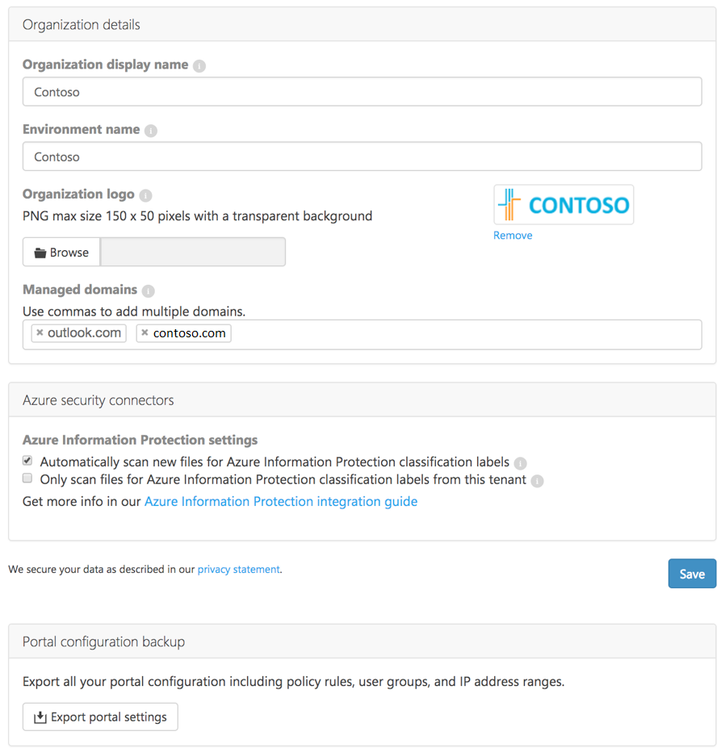

# <a name="customize-the-portal"></a>De portal aanpassen
De volgende procedure bevat instructies voor het aanpassen van de Cloud App Security-portal.
  
## <a name="set-up-the-portal"></a>De portal instellen  
  
1.  In de Cloud App Security-portal klikt u op het pictogram Instellingen  in de menubalk en selecteert u **Algemene instellingen** om het volgende te configureren:  
  
3.  **Organisatiegegevens**  
  
     Het is belangrijk dat u een **Weergavenaam organisatie** opgeeft voor uw organisatie. Deze wordt weergegeven op de e-mailberichten en webpagina's die vanuit het systeem worden verzonden.  
  
     Geef een **omgevingsnaam** (tenant) op. Dit is vooral belangrijk als u meerdere tenants beheert.  
  
4. Het is ook mogelijk om een **Logo** op te geven dat wordt weergegeven in e-mailmeldingen en webpagina’s die vanuit het systeem worden verzonden. Het logo moet een PNG-bestand zijn met een maximale grootte van 150 x 50 pixels op een transparante achtergrond.  

4.  Voeg een lijst met uw **Beheerde domeinen** toe. De beheerde domeinen worden gebruikt om Cloud App Security te helpen bepalen welke gebruikers intern en extern zijn en welke bestanden al dan niet mogen worden gedeeld. Dit wordt gebruikt voor rapporten en waarschuwingen.  
> [!NOTE] 
> - Gebruikers in domeinen die niet zijn geconfigureerd als interne gebruikers, worden gemarkeerd als externe gebruikers en voor deze gebruikers worden de activiteiten of bestanden niet gescand.
> - Zie [Integratie van Azure Information Protection](azip-integration.md) voor informatie als u integreert met behulp van Azure Information Protection-integratie. 
  
4.  **Privacyinstellingen voor het e-mailen van het activiteitenlogboek**  
  
     Als er e-mailberichten worden gedetecteerd vanuit Exchange Online, is het mogelijk om in te stellen hoe deze worden weergegeven, ter bescherming van de privacy. Het is mogelijk om in te stellen dat het e-mailbericht moet worden weergegeven met een **Gemaskeerde onderwerpregel**, met de **Volledige onderwerpregel** of met **Alleen ID**.  
  
       
  
5.  **Instellingen voor land/regio en taal**  
  
     De standaardinstelling **Taal** moet worden gebruikt voor de portal. Als u de taal wilt wijzigen voor een specifieke beheerder, gaat u naar **Gebruikersinstellingen** > **Accountinstellingen**.  
  
       
  
     Stel de **Hoofdtijdzone** in. In Cloud App Security worden uw gegevens continu geanalyseerd en verzameld. De tijdzone voor de Cloud App Security-portal is standaard ingesteld op UTC. Het is belangrijk om de hoofdtijdzone in te stellen, zodat Cloud App Security de incidenten in uw systeem nauwkeurig kan dateren. Een voorbeeld: de gegevens in de grafiek Activiteit worden georganiseerd op datum. Deze datums worden beïnvloed door de tijdzone van uw systeem. Als u de standaardtijdzone niet hebt gewijzigd, worden uw gegevens georganiseerd in 24-uurs dagen volgens de UTC-tijdzone, wat een afwijking van vele uren kan veroorzaken.  
  
       
  
6.  Als u op enig moment een back-up wilt maken van uw portal-instellingen, biedt dit scherm hiervoor de mogelijkheid. Klik op Portal-instellingen exporteren om een json-bestand te maken van al uw portal-instellingen, zoals beleidsregels, gebruikersgroepen en IP-adresbereiken.  
  
       
  
7.  Als u extra beheerders wilt toevoegen aan Cloud App Security, klikt u op het tandwiel Instellingen  en vervolgens op **Beheerderstoegang beheren**. Voeg de beheerders toe die toegang moeten hebben tot Cloud App Security en klik op **Sluiten**.  
>[!NOTE]
>Elke niet-uitgenodigde gebruiker (met een juiste rol: globale beheerder, beveiligingsbeheerder of compliancebeheerder) kan andere gebruikers uitnodigen voor Cloud App Security.
  
  
  
##  <a name="Adminsettings"></a> Uw beheerinstellingen aanpassen  
Als u uw voorkeuren als beheerder van Cloud App Security wilt instellen, klikt u op uw naam in de menubalk van de portal en selecteert u **Gebruikersinstellingen** om het volgende in te stellen:  
  
1.  Klik op **Accountinstellingen**. Hier kunt u de taal van de portal voor uw eigen weergave aanpassen. U kunt de taal instellen om de portal weer te geven in ofwel de standaardtaal of u kunt een andere taal instellen voor uzelf.  
  
       
  
2.  Klik op **Meldingen** en stel de voorkeuren voor e-mail- en sms-berichten in die u van het systeem ontvangt.  U kunt het ernstniveau instellen voor de waarschuwingen en schendingen waarvoor u e-mails wilt ontvangen. Het ernstniveau wordt per beleid ingesteld, zodat u bij activering van een schending een e-mailmelding ontvangt, afhankelijk van deze instelling en de ernstinstelling in het beleid dat is geschonden. E-mailberichten worden verzonden naar de alias die is gekoppeld aan het beheerdersaccount dat u hebt gebruikt voor aanmelding bij Cloud App Security. Voer een telefoonnummer in zodat Cloud App Security u sms-berichten kan sturen wanneer waarschuwingen en meldingen worden verzonden, en stel het ernstniveau in waarvoor u meldingen wilt ontvangen via een sms-bericht.  
  
> [!NOTE] 
> Het maximum aantal waarschuwingen dat via een sms-bericht kan worden verzonden, is 10 per telefoonnummer per dag. Houd er rekening mee dat de dag wordt bepaald op basis van de UTC-tijdzone. 
  
    
  
3. Wanneer u klaar bent, klikt u op **Opslaan**.  
  
##  <a name="IPtagsandRanges"></a> IP-adresbereiken instellen  
Om bekende IP-adressen, zoals uw fysieke IP-adressen van kantoor, eenvoudig te kunnen herkennen, moet u IP-adresbereiken instellen waarmee u ze op de juiste wijze kunt taggen en indelen en de manier waarop logboeken en waarschuwingen worden weergegeven, kunt aanpassen.   
Zie [IP-tags](ip-tags.md) voor meer informatie.
  
## <a name="import-user-groups"></a>Gebruikersgroepen importeren

Wanneer u apps verbindt met behulp van API-connectors, kunt u met Cloud App Security gebruikersgroepen importeren, bijvoorbeeld uit Office 365 en Azure Active Directory.

Zie [Gebruikersgroepen](user-groups.md) voor meer informatie.

##  <a name="Adallom_mailsettings"></a> Uw ervaring aanpassen  
Klik in de menubalk op het pictogram Instellingen  en selecteer **E‑mailinstellingen** om de parameters in te stellen voor e‑mailmeldingen die vanuit Cloud App Security worden verzonden naar beheerders die om waarschuwingen vragen, en voor meldingen die naar eindgebruikers worden verzonden over schendingen waarbij zij betrokken zijn.  
  
  
  
Configureer het volgende:  
  
1.  **Van e-mailadres**: het e-mailaccount dat u wilt gebruiken om de melding te verzenden.  
  
     **Van weergavenaam**: de naam die u wilt weergeven in het veld **Van** van het e-mailbericht.  
  
     **E-mailadres voor beantwoording**: het e-mailaccount dat moet worden gebruikt voor antwoorden op het bericht.  
  
       
  
2.  U kunt een HTML-bestand gebruiken voor het aanpassen en ontwerpen van de e-mailberichten die vanuit het systeem worden verzonden. Het HTML-bestand dat wordt gebruikt voor de sjabloon moet het volgende omvatten:  
  
    -   Alle sjabloon-CSS moet inline in de sjabloon zitten.  
  
    -   De sjabloon moet drie niet-bewerkbare tijdelijke aanduidingen hebben:  
  
         %%logo%% - een URL naar uw bedrijfslogo, dat is geüpload naar de pagina met algemene instellingen.  
  
         %%title%% - een tijdelijke aanduiding voor de titel van het e‑mailbericht, zoals ingesteld door het beleid.  
  
         %%content%% - een tijdelijke aanduiding voor de inhoud die wordt opgenomen voor eindgebruikers, zoals ingesteld door het beleid.  
  
     Hier volgt een voorbeeld e-mailsjabloon: 
```html
<!DOCTYPE html PUBLIC "-//W3C//DTD XHTML 1.0 Transitional//EN" "http://www.w3.org/TR/xhtml1/DTD/xhtml1-transitional.dtd">
  <html>  
       <head>  
            <meta http-equiv="Content-Type" content="text/html; charset=UTF-8"/>  
            <meta name="viewport" content="width=device-width, initial-scale=1.0"/>  
          </head>  
          <body class="end-user">  
          <table border="0" cellpadding="20%" cellspacing="0" width="100%" id="background-table">  
            <tr>  
              <td align="center">  
                <!--[if (gte mso 9)|(IE)]>  
                <table width="600" align="center" cellpadding="0" cellspacing="0" border="0">  
                  <tr>  
                    <td>  
                <![endif]-->  
                <table bgcolor="#ffffff" align="center" border="0" cellpadding="0" cellspacing="0" style="padding-bottom: 40px;" id="container-table">  
                  <tr>  
                    <td align="right" id="header-table-cell">  
                        
                    </td>  
                  </tr>  
                  <tr>  
                    <td style="padding-top: 58px;" align="center" valign="top">  
                      <table width="100%" cellpadding="12">  
                        <tr>  
                          <td align="center" class="round-title">  
                            %%title%%  
                          </td>  
                        </tr>  
                      </table>  
                    </td>  
                  </tr>  
                  <tr>  
                    <td style="padding: 0 40px 79px 40px;" class="content-table-cell" align="left" valign="top">  
                        %%content%%  
                    </td>  
                  </tr>  
                  <tr>  
                    <td class="last-row"></td>  
                  </tr>  
                </table>  
                <!--[if (gte mso 9)|(IE)]>  
                </td>  
                </tr>  
                </table>  
                  <![endif]-->  
              </td>  
              </tr>  
          </table>  
            </body>  
          </html>  
    ```

  
3.  Click **Upload a template...** and select the file you created.  
  
     Then, click **Send a test email** to send yourself a test email to see an example of the template you created.  
     The email will be sent to the account you used to log into the portal. In the test email you will be able to see the metadata fields, the template, the email subject, the title in the email body and the content.  
  
## Single sign-on  
Cloud App Security is coupled with Azure Active Directory for authentication, provisioning, and licensing related activities. For information on how to manage single sign-on, see [Azure Active Directory federation compatibility list: third-party identity providers that can be used to implement single sign-on](https://msdn.microsoft.com/library/azure/jj679342.aspx).  


> [!NOTE] 
> If you use ExpressRoute, Cloud App Security is deployed in Azure and fully integrated with [ExpressRoute](https://azure.microsoft.com/documentation/articles/expressroute-introduction/). All interactions with the Cloud App Security apps and traffic sent to Cloud App Security, including upload of discovery logs, is routed via ExpressRoute **public peering** for improved latency, performance and security. There are no configuration steps required from the customer side.  
    For more information about  Public Peering, see [ExpressRoute circuits and routing domains](https://azure.microsoft.com/documentation/articles/expressroute-circuit-peerings/).  
    
## See Also  
[Set up Cloud Discovery](set-up-cloud-discovery.md)   
[For technical support, please visit the Cloud App Security assisted support page.](http://support.microsoft.com/oas/default.aspx?prid=16031)   
[Premier customers can also choose Cloud App Security directly from the Premier Portal.](https://premier.microsoft.com/)  
  
  