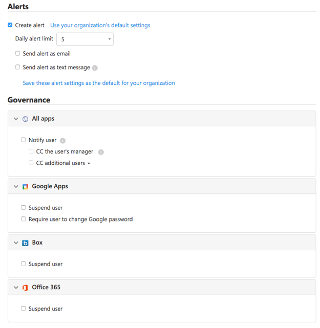

# Verbonden apps beheren
Met governance kunt u beheren wat gebruikers doen, in realtime en in verschillende apps. Voor verbonden apps kunt u beheeracties toepassen op bestanden of activiteiten.
Beheeracties zijn geïntegreerde acties die u rechtstreeks vanuit Cloud App Security kunt uitvoeren op bestanden of activiteiten om te beheren wat uw gebruikers doen, in realtime en in verschillende apps. 

### Beheeracties voor bestanden  

De volgende beheeracties kunnen voor verbonden apps worden uitgevoerd op een specifiek bestand, voor een specifieke gebruiker of vanuit een specifiek beleid.
  
-   Meldingen  
  
    -   Waarschuwingen – waarschuwingen kunnen in het systeem worden geactiveerd en worden doorgegeven via e-mail en SMS op basis van de ernst.  
  
    -   E-mailmeldingen voor gebruikers – e-mailberichten kunnen worden aangepast en worden verzonden naar alle eigenaren van bestanden die het beleid schenden.  
  
    -   CC naar manager – op basis van directory-integratie voor gebruikers kunnen e-mailmeldingen ook worden verzonden naar de manager van de persoon die een beleid schendt.  
  
-   Meldingen verzenden naar specifieke gebruikers – specifieke lijst met e-mailadressen die deze meldingen ontvangen.  
  
-   De laatste editor van het bestand informeren – meldingen verzenden naar de laatste persoon die het bestand heeft gewijzigd.  
  
-   Beheeracties in apps  
  
     Gedetailleerde acties kunnen per app worden afgedwongen, specifieke acties zijn afhankelijk van de terminologie in de app.  
  
    -   Delen wijzigen  
  
        -   Openbaar delen verwijderen – alleen toegang geven aan samenwerkers met een naam, bijvoorbeeld: Openbare toegang voor G Suite verwijderen en Rechtstreekse gedeelde koppeling voor Box verwijderen.  
  
        -   Externe gebruikers verwijderen – alleen toegang tot bedrijfsgebruikers toestaan.  
  
        -   Privé maken – alleen de eigenaar heeft toegang tot het bestand, alle shares worden verwijderd.  
  
        -   Een samenwerker verwijderen – een specifieke samenwerker verwijderen uit het bestand.  
  
    -   Quarantaine  
  
        -   In quarantaine geplaatst door gebruiker – selfservice toestaan door het bestand te verplaatsen naar een door de gebruiker beheerde map voor quarantaine  
  
        -   In quarantaine geplaatst door administrator – het bestand wordt in quarantaine geplaatst op het administrator-station en de administrator moet dit goedkeuren.  
  
-   Machtigingen overnemen van bovenliggende map - met deze governance-actie kunt u specifieke machtigingen verwijderen die zijn ingesteld voor een bestand of map in Office 365, en deze wijzigen in de machtigingen die zijn ingesteld voor de bovenliggende map.
-   Prullenbak – het bestand naar de map Prullenbak verplaatsen.
  
  
  
 
### Governance-acties voor activiteiten  

- Meldingen  
  
    -   Waarschuwingen – waarschuwingen kunnen in het systeem worden geactiveerd en worden doorgegeven via e-mail en SMS op basis van de ernst.  
  
    -   E-mailmeldingen voor gebruikers – e-mailberichten kunnen worden aangepast en worden verzonden naar alle eigenaren van bestanden die het beleid schenden.  
  
    -   CC naar manager – op basis van directory-integratie voor gebruikers kunnen e-mailmeldingen ook worden verzonden naar de manager van de persoon die een beleid schendt.  
  
    -   Meldingen verzenden naar aanvullende gebruikers – specifieke lijst met e-mailadressen die deze meldingen ontvangen.  
  
- Beheeracties in apps  
  
    -   Gedetailleerde acties kunnen per app worden afgedwongen, specifieke acties zijn afhankelijk van de terminologie in de app.  
  
    -   Gebruiker blokkeren – de gebruiker blokkeren in de toepassing.  
  
    -   Wachtwoord intrekken – het gebruikerswachtwoord intrekken en afdwingen dat de gebruiker een nieuw wachtwoord instelt bij de volgende aanmelding.  
  
       
  

### Beheerconflicten

Als u meerdere beleidsregels hebt gemaakt, kan er een situatie ontstaan waarin de beheeractiviteiten in meerdere beleidsregels elkaar overlappen. In dit geval worden de beheeracties als volgt verwerkt in Cloud App Security:

- Als twee beleidsregels acties bevatten die in elkaar zijn opgenomen (bijvoorbeeld wanneer **Externe shares verwijderen** is opgenomen in **Privé maken**), wordt het conflict in Cloud App Security opgelost en wordt de sterkere actie afgedwongen.
- Als de acties volledig onafhankelijk van elkaar zijn (bijvoorbeeld **De eigenaar een melding sturen** en **Privé maken**), worden beide acties uitgevoerd.
- Als de acties conflicteren (bijvoorbeeld **Eigenaar wijzigen in gebruiker A** en **Eigenaar wijzigen in gebruiker B**), kan elke overeenkomst tot andere resultaten leiden. Het is belangrijk uw beleidsregels te wijzigen om conflicten te voorkomen, omdat ze kunnen leiden tot ongewenste wijzigingen in het station die moeilijk te detecteren zijn.

### Beheerlogboek
Het beheerlogboek biedt een statusrecord voor elke taak die met Cloud App Security moet worden uitgevoerd, waaronder zowel handmatige als automatische taken. Deze taken omvatten taken die u in beleidsregels instelt, beheeracties die u voor bestanden en gebruikers instelt en andere acties die met Cloud App Security moeten worden uitgevoerd. Het beheerlogboek bevat ook informatie over het slagen of mislukken van deze acties. U kunt bepaalde beheeracties in het beheerlogboek opnieuw uitvoeren of ongedaan maken. 

Hieronder vindt u de volledige lijst met acties die u via de Cloud App Security-portal kunt uitvoeren. Deze worden ingeschakeld op verschillende locaties in de console, zoals aangegeven in de kolom **Locatie**. Elke uitgevoerde beheeractie wordt vermeld in het beheerlogboek.
Zie [Beleidsconflicten](control-cloud-apps-with-policies.md) voor informatie over hoe de governance-acties worden behandeld in het geval van beleidsconflicten.

**Locatie**|**Doelobjecttype**|**Beheeractie**|**Beschrijving**|**Verwante connectors** 
---------|---------|---------|---------|---------
|Accounts|Bestand|Samenwerkingen van gebruiker verwijderen|Hiermee worden alle samenwerkingen van een specifieke gebruiker verwijderd voor alle bestanden. Dit is handig voor mensen die het bedrijf verlaten.|Box, G Suite|
|Accounts|Account|De toegang van de gebruiker herstellen|Hiermee wordt de toegang van de gebruiker hersteld.|G Suite, Box, Office, Salesforce|
|Accounts|Account|Accountinstellingen|Hiermee gaat u naar de pagina met accountinstellingen in de specifieke app (bijvoorbeeld in Salesforce).|Alle apps: voor OneDrive en SharePoint worden de instellingen geconfigureerd in Office.|
|Accounts |Bestand|Eigendom van alle bestanden overdragen|In een account brengt u het eigendom van de bestanden van een gebruiker over naar een nieuwe persoon, die u selecteert. De vorige eigenaar wordt editor en kan de instellingen voor delen niet meer wijzigen. De nieuwe eigenaar ontvangt een e-mailmelding over het gewijzigde eigendom.|G Suite|
|Accounts, activiteitenbeleid|Account|De gebruiker blokkeren|Hiermee wordt ingesteld dat de gebruiker geen toegang heeft en zich niet kan aanmelden. Als de gebruiker is aangemeld wanneer u dit instelt, wordt deze gebruiker onmiddellijk vergrendeld.|G Suite, Box, Office, Salesforce|
|Activiteitenbeleid, accounts|Account|Het wachtwoord intrekken|Hiermee wordt het wachtwoord voor een gebruikersaccount ingetrokken. U kunt bijvoorbeeld een activiteitenbeleid instellen dat een wachtwoord intrekt na tien mislukte aanmeldingspogingen.|G Suite|
|Activiteitenbeleid, accounts|Account|De beheerdersmachtigingen intrekken|Hiermee wordt het wachtwoord voor een beheerdersaccount ingetrokken. U kunt bijvoorbeeld een activiteitenbeleid instellen dat de beheerdersmachtigingen intrekt na tien mislukte aanmeldingspogingen.|G Suite|
|App-dashboard > App-machtigingen|Machtigingen|Uitsluiten van apps ongedaan maken|In Google en Salesforce: de uitsluiting van apps ongedaan maken en toestaan dat gebruikers apps van derden kunnen machtigen voor Google of Salesforce. In Office 365: de machtigingen van apps van derden voor Office herstellen.|G Suite, Salesforce, Office|
|App-dashboard > App-machtigingen|Machtigingen|App-machtigingen uitschakelen|De machtigingen voor een app van derden intrekken voor Google, Salesforce of Office. Dit is een eenmalige actie die wordt uitgevoerd voor alle bestaande machtigingen, maar waarmee toekomstige verbindingen niet worden voorkomen. |G Suite, Salesforce, Office|
|App-dashboard > App-machtigingen|Machtigingen|App-machtigingen inschakelen|De machtigingen voor een app van derden verlenen voor Google, Salesforce of Office. Dit is een eenmalige actie die wordt uitgevoerd voor alle bestaande machtigingen, maar waarmee toekomstige verbindingen niet worden voorkomen. |G Suite, Salesforce, Office|
|App-dashboard > App-machtigingen|Machtigingen|Apps uitsluiten|In Google en Salesforce: de machtigingen voor apps van derden voor Google of Salesforce intrekken en de apps uitsluiten van toekomstige machtigingen. In Office 365: de machtigingen voor toegang van apps van derden tot Office niet toestaan, maar de machtigingen niet intrekken.|G Suite, Salesforce, Office|Bestandsbeleid|Bestand|Beperken tot uitsluitend de medewerkers|Hiermee hebben alleen benoemde medewerkers toegang tot het bestand.|Box|
|App-dashboard > App-machtigingen|Machtigingen|De app intrekken|De machtigingen voor een app van derden intrekken voor Google of Salesforce. Dit is een eenmalige actie die wordt uitgevoerd voor alle bestaande machtigingen, maar waarmee toekomstige verbindingen niet worden voorkomen.|G Suite, Salesforce|
|App-dashboard > App-machtigingen|Account|De machtiging van de gebruiker voor de app intrekken|Hiermee kunt u machtigingen voor specifieke gebruikers intrekken door op het aantal onder Gebruikers te klikken. De specifieke gebruikers worden weergegeven en u kunt de X gebruiken om machtigingen voor de afzonderlijke gebruikers te verwijderen.|G Suite, Salesforce|
|Detecteren > Gedetecteerde apps/IP-adressen/gebruikers|Cloud Discovery|Detectiegegevens exporteren|Hiermee wordt een CSV-gemaakt van de detectiegegevens.|Detectie|
|Bestandsbeleid|Bestand|Prullenbak|Hiermee wordt het bestand in de prullenbak van de gebruiker geplaatst.|OneDrive, SharePoint|
|Bestandsbeleid|Bestand|De laatste editor van het bestand informeren|Hiermee wordt een e-mail verzonden om de laatste persoon die het bestand heeft bewerkt, te laten weten dat het een beleid schendt.|G Suite, Box|
|Bestandsbeleid|Bestand|De bestandseigenaar een melding sturen|Hiermee wordt een e-mail naar de eigenaar van het bestand verzonden met de optie de beheerder in de CC-regel te zetten wanneer een bestand een beleid schendt. Als in Dropbox geen eigenaar aan een bestand is gekoppeld, wordt de melding verzonden naar de gebruiker die u instelt.|Alle apps|
|Bestandsbeleid, activiteitenbeleid|Bestand, activiteit|cc naar de manager van de eigenaar/gebruiker|Wanneer de eigenaar van het bestand een e-mailmelding ontvangt dat het bestand een beleid schendt, wordt hiermee ook de manager van de eigenaar/gebruiker van het bestand op de hoogte gebracht (optioneel).|Alle apps behalve ServiceNow|
|Bestandsbeleid, activiteitenbeleid|Bestand, activiteit|Specifieke gebruikers informeren|Hiermee wordt een e-mail naar specifieke gebruikers verzonden over een bestand dat een beleid schendt.|Alle apps|
|Bestandsbeleid en activiteitenbeleid|Bestand, activiteit|De gebruiker een melding sturen|Hiermee wordt een e-mail naar gebruikers verzonden om hen te melden dat ze iets hebben gedaan of een bestand hebben dat een beleid schendt. U kunt een aangepaste melding toevoegen om gebruikers te laten weten wat de schending is.|Alles|
|Bestandsbeleid en bestanden|Bestand|De machtiging van de editor om te delen intrekken|In Google Drive staan de standaardmachtigingen van de editor het delen van een bestand ook toe. Deze beheeractie beperkt deze optie en zorgt ervoor dat alleen de eigenaar de bestanden kan delen.|G Suite|
|Bestandsbeleid en bestanden|Bestand|In beheerquarantaine plaatsen|Hiermee worden machtigingen uit het bestand verwijderd en wordt het bestand verplaatst naar een quarantainemap onder de hoofdmap van de gebruiker. Hierdoor kan de beheerder het bestand controleren en verplaatsen.|Box|
|Bestanden|Bestand|Terugplaatsen uit gebruikersquarantaine|Hiermee wordt u een gebruiker teruggeplaatst uit quarantaine.|Box|
|Bestanden|Bestand|Leesmachtiging verlenen aan mijzelf|Hiermee worden leesmachtigingen voor het bestand verleend aan uzelf, zodat u toegang hebt tot het bestand en overtredingen kunt zien.|G Suite|
|Bestanden|Bestand|Editors toestaan om te delen|In Google Drive is het delen van een bestand ook toegestaan voor de standaardmachtigingen van de editor. Deze beheeractie is het tegenovergestelde van De machtiging van de editor om te delen intrekken. Hiermee stelt u in dat de editor het bestand kan delen.|G Suite|
|Bestanden|Bestand|Beschermen|Beveilig een bestand met Microsoft Rights Management door een organisatiesjabloon toe te passen.|Office 365|
|Bestanden|Bestand|De leesmachtigingen intrekken voor mijzelf|Hiermee worden de leesmachtigingen voor het bestand ingetrokken voor uzelf. Dit is handig wanneer u uzelf een machtiging hebt verleend om te zien of een bestand een beleid schendt.|G Suite|
|Bestanden, bestandsbeleid|Bestand|Eigendom van het bestand overdragen|Hiermee wordt de eigenaar gewijzigd. U kiest een specifieke eigenaar in het beleid.|G Suite|
|Bestanden, bestandsbeleid|Bestand|Een samenwerker verwijderen|Hiermee wordt een specifieke samenwerker uit een bestand verwijderd.|G Suite, Box, OneDrive, SharePoint|
|Bestanden, bestandsbeleid|Bestand|Privé maken|Hiermee wordt het bestand privé gemaakt: er zijn geen samenwerkers of openbare koppelingen meer en het bestand wordt met niemand gedeeld.|G Suite, OneDrive, SharePoint|
|Bestanden, bestandsbeleid|Bestand|Externe gebruikers verwijderen|Hiermee worden alle externe deelnemers verwijderd (buiten de domeinen die als intern zijn geconfigureerd in Instellingen).|G Suite, Box |
|Bestanden, bestandsbeleid|Bestand|Leesmachtiging verlenen voor domein|Hiermee worden leesmachtigingen voor het bestand verleend aan het opgegeven domein voor uw hele domein of een specifiek domein. Dit is handig als u openbare toegang wilt verwijderen nadat u toegang hebt verleend aan het domein van mensen die eraan moeten werken.|G Suite|
|Bestanden, bestandsbeleid|Bestand|In gebruikersquarantaine plaatsen|Hiermee worden alle machtigingen uit het bestand verwijderd en wordt het bestand verplaatst naar een quarantainemap onder de hoofdmap van de gebruiker. Hierdoor kan de gebruiker het bestand controleren en verplaatsen. Als het bestand handmatig is teruggeplaatst, wordt de bestandsdeling niet hersteld.|Box, OneDrive, SharePoint|
|Bestanden, bestandsbeleid|Bestand|Openbare toegang verwijderen|Als een bestand van u is en u het openbaar toegankelijk maakt, wordt het uitsluitend toegankelijk voor anderen voor wie toegang tot het bestand is geconfigureerd (afhankelijk van wat voor soort toegang er is ingesteld voor het bestand). |G Suite|
|Bestanden, bestandsbeleid|Bestand|De rechtstreeks gedeelde koppeling verwijderen|Hiermee wordt een koppeling voor het bestand verwijderd die openbaar is, maar alleen wordt gedeeld met specifieke personen.|Box|
|Instellingen > Cloud Discovery-instellingen |Cloud Discovery|Cloud Discovery-scores opnieuw berekenen|Hiermee worden de scores in de catalogus met cloud-apps opnieuw berekend nadat de metrische gegevens voor de score zijn gewijzigd.|Detectie|
|Instellingen > Cloud Discovery-instellingen > Gegevensweergaven beheren|Cloud Discovery|Een aangepaste Cloud Discovery-filtergegevensweergave maken|Hiermee wordt een nieuwe gegevensweergave gemaakt voor een meer gedetailleerd overzicht van de detectieresultaten. Bijvoorbeeld een weergave met specifieke IP-bereiken.|Detectie|
|Instellingen > Cloud Discovery-instellingen > Gegevens verwijderen|Cloud Discovery|Cloud Discovery-gegevens verwijderen|Hiermee worden alle gegevens verwijderd die worden verzameld vanuit detectiebronnen.|Detectie|
|Instellingen > Cloud Discovery-instellingen > Logboeken handmatig uploaden/Logboeken automatisch uploaden|Cloud Discovery|Cloud Discovery-gegevens parseren|Melding dat alle logboekgegevens zijn geparseerd.|Detectie|

## Zie ook  
[Dagelijkse activiteiten ter bescherming van uw cloudomgeving](daily-activities-to-protect-your-cloud-environment.md)   
[Ga naar de ondersteuningspagina van Cloud App Security voor technische ondersteuning.](http://support.microsoft.com/oas/default.aspx?prid=16031)   
[Premier-klanten kunnen Cloud App Security ook rechtstreeks vanuit Premier Portal kiezen.](https://premier.microsoft.com/)  
  
  