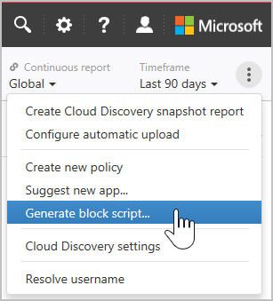
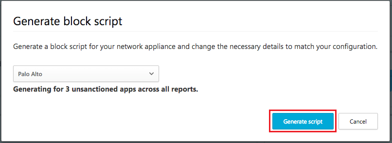

## Gedetecteerde apps bepalen

Nadat u de lijst met gedetecteerde apps hebt doorgenomen in uw omgeving, kunt u uw omgeving tegen ongewenste app-gebruik op de volgende manieren kunt beveiligen.

### Bestraffing/goedkeuring ervan intrekken een app 

U kunt een specifieke riskant app goed op de drie punten aan het einde van de rij en selecteer **Unsanction**.
Goedkeuring ervan intrekken een app gebruik niet wordt geblokkeerd, maar u kunt het gebruik ervan eenvoudiger controleren met de Cloud Discovery-filters. U kunt meldingen verzenden naar gebruikers van de app is niet-toegestane en stelt voor een alternatieve en veilige app voor het gebruik ervan.

  

Als u een lijst met apps die u wilt wel of niet erkennen hebt, kunt u gebruik de selectievakjes om Selecteer de apps die u wilt beheren en selecteer vervolgens de actie.

## Een blokkeerscript exporteren om gedetecteerde apps te beheren

Met Cloud App Security kunt u toegang tot niet-goedgekeurde apps blokkeren door gebruik te maken van uw bestaande on-premises beveiligingsapparaten. Genereer een toegewezen blokkeerscript en importeer dit naar uw apparaat.
Deze oplossing vereist geen omleiding van alle webverkeer van de organisatie naar een proxy.

1. Label alle apps die u wilt blokkeren, in het Cloud Discovery-dashboard als **Niet-goedgekeurd**.

     

2. Klik op de drie punten in de titelbalk en selecteer **Blokkeerscript genereren...**. 

     

3. Selecteer in **Blokkeerscript genereren** het apparaat waarvoor u het blokkeerscript wilt genereren. 

     

4. Klik vervolgens op de knop Script genereren. Er wordt nu een blokkeerscript gemaakt voor al uw niet-goedgekeurde apps. In de naam van het bestand worden standaard de datum verwerkt waarop het bestand is geëxporteerd en het apparaattype dat u hebt geselecteerd. Bijvoorbeeld: *2017-02-19_CAS_Fortigate_block_script.txt* 

     

5. Importeer het gemaakte bestand naar uw apparaat.

## Zie ook  
[Dagelijkse activiteiten ter bescherming van uw cloudomgeving](daily-activities-to-protect-your-cloud-environment.md)   
[Ga naar de ondersteuningspagina van Cloud App Security voor technische ondersteuning.](http://support.microsoft.com/oas/default.aspx?prid=16031)   
[Premier-klanten kunnen Cloud App Security ook rechtstreeks vanuit Premier Portal kiezen.](https://premier.microsoft.com/)  
  
  