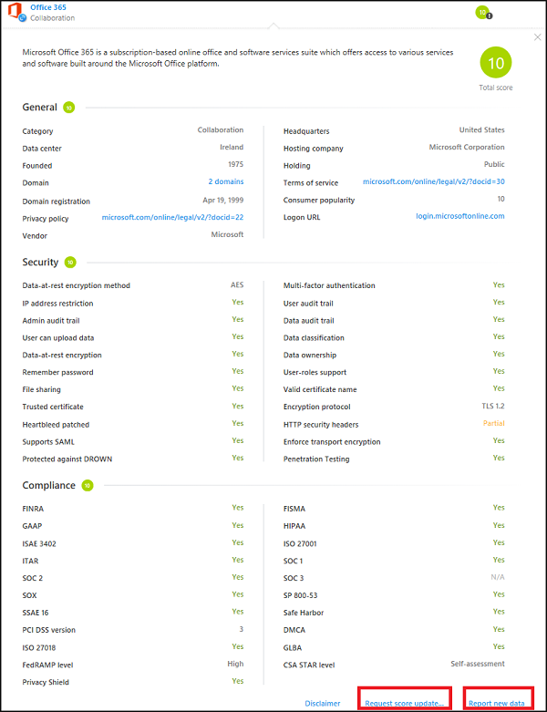

# Werken met de risicoscore  

## De Cloud App-catalogus

Gebruik de Cloud App-catalogus om beter te begrijpen welke cloud-apps kunnen worden ontdekt door de Cloud Discovery van Cloud App Security.

De Cloud App-catalogus bevat meer dan 14.000 SaaS-toepassingen die kunnen worden weergegeven (gefilterd) op basis van naam, domein, risicoscore, categorie of beschikbare beveiligingsfuncties.

## Detectieaanvragen

Informatie en risicoscores in de Cloud-appcatalogus zijn gebaseerd op een groot aantal bronnen. Microsoft spant zich in om de gegevens actueel te houden, maar kan de nauwkeurigheid van de gegevensbronnen niet garanderen. 

Neem contact met ons op als u denkt dat de informatie over een app is verouderd.

-    Score-update aanvragen – als u wenst dat ons team deze cloud-app opnieuw beoordeelt.
-    Nieuwe gegevens doorgeven (per specifiek veld of algemeen) – als u denkt dat de informatie over de app is verouderd.

Bovendien nodigen we u uit voorstellen in te dienen voor de toevoeging van cloud-apps die uw organisatie gebruikt die op dit moment niet kunnen worden gedetecteerd door Cloud Discovery.

## De risicoscore aanpassen

Cloud Discovery biedt u belangrijke gegevens over de geloofwaardigheid en betrouwbaarheid van de cloud-apps die in de omgeving worden gebruikt. In de portal wordt elke gedetecteerde app weergegeven met een totale score, die weergeeft hoe Cloud App Security de vervaldatum van gebruik voor ondernemingen evalueert van de desbetreffende app. De totale score van een app is een gewogen gemiddelde van drie subscores voor de drie subcategorieën waarmee Cloud App Security rekening houdt bij het beoordelen van betrouwbaarheid:  
  
-   **Algemeen** - Deze categorie heeft betrekking op de algemene informatie over het bedrijf dat de app produceert, waaronder het domein, jaar van oprichting en de populariteit. Deze velden zijn bedoeld om de stabiliteit van het bedrijf op het meest basale niveau weer te geven.  
  
-   **Beveiliging** - De beveiligingscategorie omvat alle standaarden die gaan over de fysieke beveiliging van de gegevens die door de gedetecteerde app worden gebruikt. Hieronder vallen velden als meervoudige verificatie, versleuteling, gegevensclassificatie en gegevenseigendom.  
  
-   **Naleving** - In deze categorie wordt weergegeven welke algemene best practice-nalevingsstandaarden worden gehandhaafd door het bedrijf dat de app produceert. De lijst met specificaties bevat standaarden als HIPAA, CSA en PCI-DSS.  
  
Elke categorie bevat veel specifieke eigenschappen. Volgens ons score-algoritme krijgt elke eigenschap een voorlopige score tussen 0 en 10, afhankelijk van de waarde. Waarden die waar/onwaar zijn krijgen een 10 of een 0 naar gelang hun waarde, terwijl doorlopende eigenschappen, bijvoorbeeld domeinleeftijd, een bepaalde waarde binnen het spectrum krijgen. De score van elke eigenschap wordt tegen alle andere bestaande velden in de categorie afgewogen om de subscore van de categorie te berekenen. Als u een app zonder score tegenkomt, duidt dit meestal op een app met onbekende eigenschappen, die daarom geen score heeft.  
  
Het is belangrijk dat u even de tijd neemt om de standaardgewichten van de scoreconfiguratie van Cloud Discovery te bekijken en wijzigen. Standaard krijgen alle geëvalueerde parameters een gelijk gewicht. Als bepaalde parameters meer of minder belangrijk voor uw organisatie zijn, is het belangrijk dat u ze als volgt wijzigt:  
  
1.  Selecteer in de portal onder het pictogram Instellingen **Instellingen voor Cloud Discovery**.  
  
2.  Verschuif de knop **Belang** onder **Metrische gegevens voor de score configureren** om het gewicht van het veld of de risicocategorie te wijzigen naar **Genegeerd**, **Laag**, **Gemiddeld**, **Hoog** of **Zeer hoog**.  
  
3.  Daarnaast kunt u instellen of bepaalde waarden niet beschikbaar voor of niet van toepassing op de scoreberekening zijn. Wanneer ze zijn opgenomen, dragen n.v.t.-waarden negatief bij aan de berekende score.  
  
       

Alle informatie die nodig is om te begrijpen hoe onze risicoscores worden samengesteld, is beschikbaar in de Cloud App Security-portal.
Gebruik de knop 'i' aan de rechterkant van elke veldnaam in het profiel van de app voor een beter begrip van het gewicht van een risicofactor in een specifieke risicocategorie. Dit biedt informatie over hoe Cloud App Security precies een specifieke risicofactor bepaalt. De score is de waarde van de risicofactor op een schaal van 1-10 + het gewicht in de risicocategorie:

  
Beweeg de muisaanwijzer over de risicocategoriescore om het gewicht van een risicocategorie in de totale score van een app te begrijpen:

 
## Zie ook  
[Dagelijkse activiteiten ter bescherming van uw cloudomgeving](daily-activities-to-protect-your-cloud-environment.md)   
[Ga naar de ondersteuningspagina van Cloud App Security voor technische ondersteuning.](http://support.microsoft.com/oas/default.aspx?prid=16031)   
[Premier-klanten kunnen Cloud App Security ook rechtstreeks vanuit Premier Portal kiezen.](https://premier.microsoft.com/)  
  
  