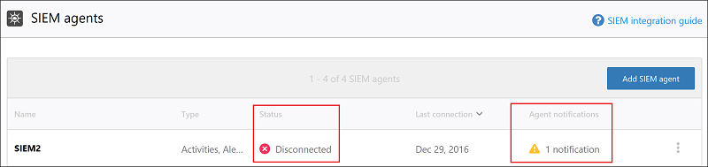
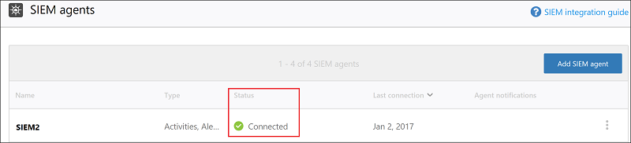
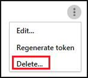

# <a name="siem-integration"></a>Integratie van SIEM
    
Nu kunt u Cloud App Security integreren met uw SIEM-server gecentraliseerde bewaking van Office 365-waarschuwingen en activiteiten wilt inschakelen. Als nieuwe activiteiten en gebeurtenissen worden ondersteund door Office 365, wordt inzicht in deze vervolgens in de Cloud App Security uitgerold. Door de integratie met een SIEM-service kunt u uw cloudtoepassingen beter beveiligen terwijl uw gebruikelijke beveiligingswerkstroom blijft behouden, beveiligingsprocedures worden geautomatiseerd en gebeurtenissen in de cloud en on-premises aan elkaar worden gekoppeld. De Cloud App Security SIEM-agent wordt uitgevoerd op uw server. De agent haalt waarschuwingen en activiteiten op uit Cloud App Security en verzendt deze naar de SIEM-server.

Wanneer u uw SIEM voor het eerst integreert met Cloud App Security, worden activiteiten en waarschuwingen van de laatste twee dagen doorgestuurd naar de SIEM, plus alle activiteiten en waarschuwingen (op basis van het filter dat u selecteert) die daarna volgen. Als u deze functie voor een langere periode uitschakelt en de functie vervolgens weer inschakelt, worden bovendien waarschuwingen en activiteiten van de laatste twee dagen doorgestuurd en vervolgens alle waarschuwingen en activiteiten die daarna volgen.

## <a name="siem-integration-architecture"></a>Architectuur van SIEM-integratie

De SIEM-agent wordt geïmplementeerd in het netwerk van uw organisatie. Wanneer geïmplementeerd en geconfigureerd, wordt de gegevens ophaalt typen die zijn geconfigureerd (waarschuwingen en activiteiten) met Cloud App Security RESTful-API's.
Het verkeer wordt verzonden via een gecodeerd HTTPS-kanaal op poort 443.

Wanneer de SIEM-agent de gegevens van Cloud App Security ophaalt, stuurt de Syslog berichten naar uw lokale SIEM met behulp van de netwerkconfiguraties die u hebt opgegeven tijdens de installatie (TCP of UDP met een aangepaste poort). 


## <a name="how-to-integrate"></a>Het integreren van

De integratie met uw SIEM vindt in drie stappen plaats:
1. De integratie instellen in de Cloud App Security-portal. 
2. Het JAR-bestand downloaden en uitvoeren op uw server.
3. Valideren of de SIEM-agent werkt.

### <a name="prerequisites"></a>Vereisten

- Een standaard-Windows- of -Linux-server (kan een virtuele machine zijn).
- Op de server moet Java 8 worden uitgevoerd; eerdere versies worden niet ondersteund.

## <a name="integrating-with-your-siem"></a>Integratie met uw SIEM

### <a name="step-1-set-it-up-in-the-cloud-app-security-portal"></a>Stap 1: De integratie instellen in de Cloud App Security-portal

1. Klik in de Cloud App Security-portal onder het instellingentandwiel **Security extensions** en klik vervolgens op de **SIEM agents** tabblad.

2. Klik op het plusteken om start de **toevoegen SIEM-agent** wizard.
3. Klik in de wizard op **SIEM-agent toevoegen**. 
4. Vul in de wizard een naam in, **selecteer uw SIEM-indeling** en stel **geavanceerde instellingen** in die relevant zijn voor deze indeling. Klik op **Volgende**.

   

5. Typ het IP-adres of de hostnaam van de **externe Syslog-host** en het **Syslog-poortnummer**. Selecteer TCP of UDP als het externe Syslog-protocol.
Vraag indien nodig uw beveiligingsbeheerder om deze informatie.
Klik op **Volgende**.
  

6. Selecteer welke gegevenstypen, **waarschuwingen** en **activiteiten** u wilt exporteren naar uw SIEM-server. Gebruik de schuifregelaar om deze in en uit te schakelen. Standaard is alles geselecteerd. U kunt de vervolgkeuzelijst **Toepassen op** gebruiken om filters zo in te stellen dat alleen bepaalde waarschuwingen en activiteiten naar uw SIEM-server worden verzonden.
U kunt op **Resultaten bewerken en bekijken** klikken om te controleren of het filter goed werkt. Klik op **Volgende**. 

  

7. Kopieer het token en bewaar het voor later. Nadat u op Voltooien hebt geklikt en de wizard hebt afgesloten, wordt de SIEM-pagina opnieuw weergegeven en ziet u in de tabel de SIEM-agent die u hebt toegevoegd. Er wordt nu weergegeven dat deze is **gemaakt** totdat deze later wordt verbonden.

### <a name="step-2-download-the-jar-file-and-run-it-on-your-server"></a>Stap 2: Het JAR-bestand downloaden en uitvoeren op uw server

1. In de [Microsoft Download Center](https://go.microsoft.com/fwlink/?linkid=838596) lezen de [gebruiksrechtovereenkomst](https://go.microsoft.com/fwlink/?linkid=862491) en downloaden van het ZIP-bestand en pak deze.

2. Pak het JAR-bestand van het ZIP-bestand uit en voer het uit op uw server.
 Nadat u het bestand hebt uitgevoerd, voert u het volgende uit:
    
      java -jar mcas-siemagent-0.87.20-signed.jar [--logsDirectory MAPNAAM] [--proxy ADRES[:POORT]] --token TOKEN
> [!NOTE]
> - De bestandsnaam kan verschillen afhankelijk van de versie van de SIEM-agent.
> - Parameters vierkante haakjes [] zijn optioneel en moeten alleen worden gebruikt als relevant.
> - Het is raadzaam de JAR tijdens het opstarten van de server uitgevoerd.
>   - Windows: Als een geplande taak uitvoeren en zorg ervoor dat u configureert u de taak voor **uitvoeren of de gebruiker is aangemeld of niet** en of u schakelt de **de taak stoppen als deze wordt uitgevoerd logner dan** selectievakje.
>   - Linux: Voeg de opdracht uitvoeren met een  **&**  naar het bestand rc.local. Bijvoorbeeld: `java -jar mcas-siemagent-0.87.20-signed.jar [--logsDirectory DIRNAME] [--proxy ADDRESS[:PORT]] --token TOKEN &`

Hierbij worden de volgende variabelen gebruikt:
- MAPNAAM is het pad naar de map die u wilt gebruiken voor lokale agent-logboeken voor foutopsporing.
- ADRES[: POORT] is het proxyserveradres en de poort die door de server wordt gebruikt om verbinding met internet te maken.
- TOKEN is het SIEM-agenttoken dat u in de vorige stap hebt gekopieerd.

U kunt op elk gewenst moment -h typen om hulp te krijgen.

Het volgende zijn voorbeeld activiteitenlogboeken verzonden naar uw SIEM:
```
    2017-07-11T19:14:55.895Z CEF:0|MCAS|SIEM_Agent|0.102.17|EVENT_CATEGORY_LOGIN|Log on|0|externalId=1499800495894_e453bc33-a7c1-48f7-8397-8ae8e2758183 start=1499800495895 end=1499800495895 msg=Log on suser=admin@contoso.com destinationServiceName=Microsoft Exchange Online dvc=13.82.149.151 requestClientApplication=Mozilla/5.0 (Windows NT 10.0; Win64; x64) AppleWebKit/537.36 (KHTML, like Gecko) Chrome/59.0.3071.115 Safari/537.36 machine_id_149980022970038514 cs1Label=portalURL cs1=https://cloud-app-security.com/#/audits?activity.id\=eq(1499800495894_e453bc33-a7c1-48f7-8397-8ae8e2758183,) cs2Label=uniqueServiceAppIds cs2=APPID_OUTLOOK cs3Label=targetObjects cs3=admin@contoso.com c6a1Label="Device IPv6 Address" c6a1=
    2017-07-11T19:14:56.781Z CEF:0|MCAS|SIEM_Agent|0.102.17|EVENT_CATEGORY_DOWNLOAD_FILE|Download file|0|externalId=1499800496781_2e50118e-dee7-40d7-b912-b81a10feed28 start=1499800496781 end=1499800496781 msg=Download file: file name50280117yyct6t.xlsx suser=roy@adallom.com.test destinationServiceName=Salesforce dvc=13.82.149.151 requestClientApplication=Mozilla/5.0 (Windows NT 10.0; Win64; x64) AppleWebKit/537.36 (KHTML, like Gecko) Chrome/59.0.3071.115 Safari/537.36 machine_id_149979855250880034 cs1Label=portalURL cs1=https://cloud-app-security/#/audits?activity.id\=eq(1499800496781_2e50118e-dee7-40d7-b912-b81a10feed28,) cs2Label=uniqueServiceAppIds cs2=APPID_SALESFORCE cs3Label=targetObjects cs3=name50280117yyct6t.xlsx c6a1Label="Device IPv6 Address" c6a1=
    2017-07-11T19:16:04.666Z CEF:0|MCAS|SIEM_Agent|0.102.17|EVENT_CATEGORY_SSO_LOGIN|Single sign-on log on|0|externalId=1499800564666_06496600-edde-4d81-a995-7632e70fb24f start=1499800564666 end=1499800564666 msg=Single sign-on log on suser=admin@contoso.com destinationServiceName=Microsoft Online Services dvc=13.82.149.151 requestClientApplication=Mozilla/5.0 (Windows NT 10.0; Win64; x64) AppleWebKit/537.36 (KHTML, like Gecko) Chrome/59.0.3071.115 Safari/537.36 machine_id_149980039637481908 cs1Label=portalURL cs1=https://cloud-app-security.com/#/audits?activity.id\=eq(1499800564666_06496600-edde-4d81-a995-7632e70fb24f,) cs2Label=uniqueServiceAppIds cs2=APPID_11394 cs3Label=targetObjects cs3=admin@contoso.com c6a1Label="Device IPv6 Address" c6a1=
    2017-07-12T13:28:29.067Z CEF:0|MCAS|SIEM_Agent|0.102.17|EVENT_CATEGORY_DOWNLOAD_FILE|Download file|0|externalId=1499866109067_8e3fae2c-ca5b-4163-84b6-fb9a03c4d052 start=1499866109067 end=1499866109067 msg=Download file: file CC004.txt suser=admin@box-contoso.com destinationServiceName=Box dvc=194.69.102.134 requestClientApplication=Mozilla/5.0 (Linux; Android 7.0; SAMSUNG SM-G930F Build/NRD90M) AppleWebKit/537.36 (KHTML, like Gecko) SamsungBrowser/5.0 Chrome/51.0.2704.106 Mobile Safari/537.36 cs1Label=portalURL cs1=https://cloud-app-security.com/#/audits?activity.id\=eq(1499866109067_8e3fae2c-ca5b-4163-84b6-fb9a03c4d052,) cs2Label=uniqueServiceAppIds cs2=APPID_BOX cs3Label=targetObjects cs3=CC004.txt c6a1Label="Device IPv6 Address" c6a1=
    2017-07-12T14:15:33.901Z CEF:0|MCAS|SIEM_Agent|0.102.17|EVENT_CATEGORY_UPLOAD_FILE|Upload file|0|externalId=1499868933901_72c21ebe-c206-4d8c-a41b-224035868d09 start=1499868933901 end=1499868933901 msg=Upload file: file response.txt suser=user1@test15-adallom.com destinationServiceName=Google Drive dvc=194.69.102.134 requestClientApplication=Mozilla/5.0 (Windows NT 10.0; WOW64; Trident/7.0; Touch; rv:11.0) like Gecko cs1Label=portalURL cs1=https://cloud-app-security.com/#/audits?activity.id\=eq(1499868933901_72c21ebe-c206-4d8c-a41b-224035868d09,) cs2Label=uniqueServiceAppIds cs2=APPID_26069 cs3Label=targetObjects cs3=response.txt c6a1Label="Device IPv6 Address" c6a1=
    2017-07-12T18:53:16.519Z CEF:0|MCAS|SIEM_Agent|0.102.17|EVENT_CATEGORY_LOGIN|Log on|0|externalId=1499885596519_ed261269-9b07-4418-9ded-8cad464d677f start=1499885596519 end=1499885596519 msg=Log on suser=admin@contoso.com destinationServiceName=Office 365 dvc=13.82.149.151 requestClientApplication=Mozilla/5.0 (Windows NT 10.0; Win64; x64) AppleWebKit/537.36 (KHTML, like Gecko) Chrome/59.0.3071.115 Safari/537.36 machine_id_149988543613557447 cs1Label=portalURL cs1=https://cloud-app-security.com/#/audits?activity.id\=eq(1499885596519_ed261269-9b07-4418-9ded-8cad464d677f,) cs2Label=uniqueServiceAppIds cs2=APPID_O365 cs3Label=targetObjects cs3=admin@contoso.com c6a1Label="Device IPv6 Address" c6a1=
```
Evenals de volgende waarschuwingen logfile voorbeeld:
```
  2017-07-15T20:42:30.531Z CEF:0|MCAS|SIEM_Agent|0.102.17|ALERT_CABINET_EVENT_MATCH_AUDIT|myPolicy|3|externalId=596a7e360c204203a335a3fb start=1500151350531 end=1500151350531 msg=Activity policy ''myPolicy'' was triggered by ''admin@box-contoso.com'' suser=admin@box-contoso.com destinationServiceName=Box cn1Label=riskScore cn1= cs1Label=portalURL cs1=https://cloud-app-security.com/#/alerts/596a7e360c204203a335a3fb cs2Label=uniqueServiceAppIds cs2=APPID_BOX cs3Label=relatedAudits cs3=1500151288183_acc891bf-33e1-424b-a021-0d4370789660
  2017-07-16T09:36:26.550Z CEF:0|MCAS|SIEM_Agent|0.102.17|ALERT_CABINET_EVENT_MATCH_AUDIT|test-activity-policy|3|externalId=596b339b0c204203a33a51ae start=1500197786550 end=1500197786550 msg=Activity policy ''test-activity-policy'' was triggered by ''user@contoso.com'' suser=user@contoso.com destinationServiceName=Salesforce cn1Label=riskScore cn1= cs1Label=portalURL cs1=https://cloud-app-security.com/#/alerts/596b339b0c204203a33a51ae cs2Label=uniqueServiceAppIds cs2=APPID_SALESFORCE cs3Label=relatedAudits cs3=1500197720691_b7f6317c-b8de-476a-bc8f-dfa570e00349
  2017-07-16T09:17:03.361Z CEF:0|MCAS|SIEM_Agent|0.102.17|ALERT_CABINET_EVENT_MATCH_AUDIT|test-activity-policy3|3|externalId=596b2fd70c204203a33a3eeb start=1500196623361 end=1500196623361 msg=Activity policy ''test-activity-policy3'' was triggered by ''admin@contoso.com'' suser=admin@contoso.com destinationServiceName=Office 365 cn1Label=riskScore cn1= cs1Label=portalURL cs1=https://cloud-app-security.com/#/alerts/596b2fd70c204203a33a3eeb cs2Label=uniqueServiceAppIds cs2=APPID_O365 cs3Label=relatedAudits cs3=1500196549157_a0e01f8a-e29a-43ae-8599-783c1c11597d
  2017-07-16T09:17:15.426Z CEF:0|MCAS|SIEM_Agent|0.102.17|ALERT_CABINET_EVENT_MATCH_AUDIT|test-activity-policy|3|externalId=596b2fd70c204203a33a3eec start=1500196635426 end=1500196635426 msg=Activity policy ''test-activity-policy'' was triggered by ''admin@contoso.com'' suser=admin@contoso.com destinationServiceName=Microsoft Office 365 admin center cn1Label=riskScore cn1= cs1Label=portalURL cs1=https://cloud-app-security.com/#/alerts/596b2fd70c204203a33a3eec cs2Label=uniqueServiceAppIds cs2=APPID_O365_PORTAL cs3Label=relatedAudits cs3=1500196557398_3e102b20-d9fa-4f66-b550-8c7a403bb4d8
  2017-07-16T09:17:46.290Z CEF:0|MCAS|SIEM_Agent|0.102.17|ALERT_CABINET_EVENT_MATCH_AUDIT|test-activity-policy4|3|externalId=596b30200c204203a33a4765 start=1500196666290 end=1500196666290 msg=Activity policy ''test-activity-policy4'' was triggered by ''admin@contoso.com'' suser=admin@contoso.com destinationServiceName=Microsoft Exchange Online cn1Label=riskScore cn1= cs1Label=portalURL cs1=https://cloud-app-security.com/#/alerts/596b30200c204203a33a4765 cs2Label=uniqueServiceAppIds cs2=APPID_OUTLOOK cs3Label=relatedAudits cs3=1500196587034_a8673602-7e95-46d6-a1fe-c156c4709c5d
  2017-07-16T09:41:04.369Z CEF:0|MCAS|SIEM_Agent|0.102.17|ALERT_CABINET_EVENT_MATCH_AUDIT|test-activity-policy2|3|externalId=596b34b10c204203a33a5240 start=1500198064369 end=1500198064369 msg=Activity policy ''test-activity-policy2'' was triggered by ''user2@test15-adallom.com'' suser=user2@test15-adallom.com destinationServiceName=Google cn1Label=riskScore cn1= cs1Label=portalURL cs1=https://cloud-app-security.com/#/alerts/596b34b10c204203a33a5240 cs2Label=uniqueServiceAppIds cs2=APPID_33626 cs3Label=relatedAudits cs3=1500197996117_fd71f265-1e46-4f04-b372-2e32ec874cd3
```

### <a name="step-3-validate-that-the-siem-agent-is-working"></a>Stap 3: Valideren dat de SIEM-agent werkt

1. Controleer of de SIEM-agent in de Cloud App Security-portal niet de status **Verbindingsfout** of **Verbroken** heeft en of er geen agentmeldingen zijn. Deze wordt weergegeven als **Verbindingsfout** als de verbinding meer dan twee uur niet beschikbaar is en als **Verbroken** als de verbinding gedurende meer dan 12 uur niet beschikbaar is.
 
 
   In plaats daarvan de status moet worden verbonden, zoals hier: 

2. Zorg ervoor dat u in uw Syslog/SIEM-server activiteiten en waarschuwingen ziet die afkomstig zijn van Cloud App Security.


## <a name="regenerating-your-token"></a>Uw token opnieuw genereren
Als u het token verliest, kunt u het altijd opnieuw genereren door in de tabel op de drie punten aan het einde van de rij voor de SIEM-agent te klikken en **Token opnieuw genereren** te selecteren.

 

## <a name="editing-your-siem-agent"></a>Uw SIEM-agent bewerken 
Als u de SIEM-agent op een later tijdstip moet bewerken, kunt u in de tabel op de drie punten aan het einde van de rij voor de SIEM-agent klikken en **Bewerken** selecteren. Als u de SIEM-agent bewerkt, hoeft u het JAR-bestand niet opnieuw uit te voeren, omdat het automatisch wordt bijgewerkt.


## <a name="deleting-your-siem-agent"></a>Uw SIEM-agent verwijderen
Als u de SIEM-agent op een later tijdstip wilt verwijderen, kunt u in de tabel op de drie punten aan het einde van de rij voor de SIEM-agent klikken en **Verwijderen** selecteren.



> [!NOTE]
> Deze functie is beschikbaar voor openbare preview.

## <a name="high-availability-options"></a>Opties voor hoge beschikbaarheid

De SIEM-agent is één eindpunt die ondersteuning biedt voor herstel van maximaal twee dagen uitvaltijd. Extra beveiligingsmaatregel van maximale beschikbaarheid kan worden bereikt door een load balancer als het eindpunt van de klant.

## <a name="see-also"></a>Zie ook  
[Problemen met SIEM-integratie oplossen](troubleshooting-siem.md)   
[Ga naar de ondersteuningspagina van Cloud App Security voor technische ondersteuning.](http://support.microsoft.com/oas/default.aspx?prid=16031)   
[Premier-klanten kunnen Cloud App Security ook rechtstreeks vanuit Premier Portal kiezen.](https://premier.microsoft.com/)  
  
  