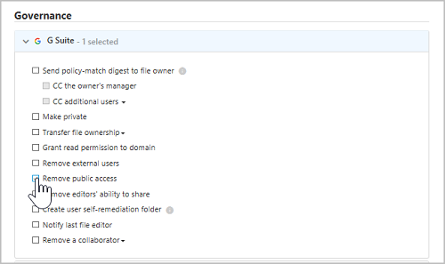

# Uw bestanden beheren en beveiligen  

In de zakenwereld van tegenwoordig waar veel gegevens en veel apparaten worden gebruikt, kan het moeilijk zijn om bij te houden waar de gegevens zich bevinden en wie toegang heeft. Met Cloud App Security kunt u de controle over uw gegevens behouden door bestandsbeveiliging over de cloud in te schakelen. Cloud App Security biedt u hulpmiddelen om beleid te maken voor wat u wel en niet wilt toestaan over uw bedrijfscloud en uiteenlopende geautomatiseerde processen voor de uitvoering van continue compliancescans, juridische eDiscovery-taken, DLP voor gevoelige inhoud die is opgeslagen in uw cloud of extern of openbaar is gedeeld en veel meer use cases.  
Met Cloud App Security kunt u elk bestandstype controleren op basis van meer dan twintig metagegevensfilters (bijvoorbeeld toegangsniveau, bestandstype). Zie [Bestanden](file-filters.md) voor meer informatie. Hieronder vindt u twee voorbeelden van dreigingen gerelateerd aan gegevens waarmee alle organisaties worden geconfronteerd, met procedures voor het beveiligen van uw bestanden in de cloud.
 
## Bestanden die gevoelige gegevens bevatten worden extern gedeeld 

Deze use case is van toepassing op Office 365, G Suite, Box, Dropbox en Salesforce.

### DE BEDREIGING
Een van de grootste voordelen van cloudtechnologie is de mogelijkheid om alles met iedereen te delen. Maar grote voordelen brengen ook grote verantwoordelijkheden met zich mee, en om te verzekeren dat gevoelige gegevens niet extern worden gedeeld, moet u weten welke bestanden gevoelige gegevens bevatten en met wie ze worden gedeeld. Met de hulpprogramma’s die worden meegeleverd bij uw cloud-apps kunt u niet zien wat er wordt opgeslagen in de cloud-app of wie er toegang heeft, zodat u zich niet bewust bent van mogelijke gegevenslekken.

### DE OPLOSSING
Door deze twee parameters (niveau van gevoeligheid en deling) te vinden en elkaar te laten kruisen, kunt u deze mogelijke inbreuken identificeren. Cloud App Security scant alle bestanden die in uw cloud-apps zijn opgeslagen en classificeert ze automatisch op hun niveau van deling. Vervolgens kunt u in Cloud App Security een bestandsbeleid configureren om te zoeken naar alle gevoelige gegevens die in uw cloud-apps zijn opgeslagen. Zodra u een gevoelig bestand hebt gevonden dat extern is gedeeld, kunt u handmatig herstelacties uitvoeren of kunt u Cloud App Security instellen om dit automatisch voor u te doen. Zo kunt u met één klik het risico van gegevenslekken elimineren.

#### Vereisten

[Verbind](enable-instant-visibility-protection-and-governance-actions-for-your-apps.md) ten minste een cloud-app met de Cloud App Security.

#### Controle instellen

1.    Begin uw app te controleren door een beleid in te stellen dat alle extern gedeelde bestanden op gevoelige inhoud scant:

    1. Op de pagina **Beleid**, klikt u op [ **Bestandsbeleid maken**](data-protection-policies.md). 
    

    2. Kies in het veld [ **Beleidssjabloon** ](policy-template-reference.md)  **Bestand aangetroffen met PII in de cloud (ingebouwde DLP-engine)** en klik op **Sjabloon toepassen**. 
    
    3. Als u het ongepast delen van deze bestanden met persoonlijke gegevens wilt bewaken, voeg dan een filter toe met het toegangsniveau dat u probeert te blokkeren - bijvoorbeeld **Toegangsniveau is gelijk aan extern, openbaar, openbaar (internet)**. 
     

2. Uw overeenkomsten onderzoeken
    
    1. Klik in de pagina **Beleid** op de naam van het beleid om naar het **Beleidsrapport** te gaan en bekijk de resultaten die zijn geactiveerd door het beleid.

    2. U kunt de overeenkomende reeks onderzoeken door te klikken op een specifieke overeenkomst om de bestandslade te openen. In de lade ziet u de andere beleidsregels voor dit bestand, de status van de inhoudsscan en als u daarop klikt, kunt u de inhoudsovereenkomsten zien, u kunt klikken op de **Deelnemers** om de lijst met collega's te zien en u kunt zien of er classificatielabels op het bestand rusten. U kunt ook het **Pad** bekijken om te zien waar het bestand is opgeslagen om meer context over het bestand zelf te krijgen.
    
    3. Als u vals-positieven vindt, markeer ze dan met een vinkje om ze uit te sluiten van het rapport en live-matches. U kunt de feedbackfunctie gebruiken om het Cloud App Security-team verbeteringen die u wilt toevoegen door te geven. 

#### Uw beleid valideren

1. Maak een nieuw Word-document met de volgende tekst: 078-05-1120.
2. Sla het bestand dan op als *testbestand.docx*  en deel het met iemand buiten uw domein of met een openbare URL. 
3. Ga naar het beleidsrapport. Binnen enkele ogenblikken zou een bestandsbeleidovereenkomst moeten worden weergegeven. 
4. U kunt op de overeenkomst klikken om de context van het bestand te zien. De overeenkomst zelf wordt gemaskeerd ter bescherming van gevoelige gegevens. 

#### Het risico verwijderen

Nadat u het hebt gevalideerd en het beleid op uw wensen hebt afgestemd, verwijdert u mogelijke valse positieven die overeenkomen met uw beleid. Ga als volgt verder: 
  1. U kunt onmiddellijk [bestuursacties](governance-actions.md) ondernemen door op de drie puntjes aan het einde van de rij te klikken en de relevante bestuursactie te selecteren, bijvoorbeeld **Gebruiker in quarantaine plaatsen**.

 

   2. Nadat deze volledig is gevalideerd, kunt u deze automatische bestuursacties uit laten voeren. In SharePoint en OneDrive kunt u bijvoorbeeld **Externe gebruikers verwijderen** of **Gebruiker in quarantaine plaatsen** en voor G Suite en Box kunt u **Externe gebruikers verwijderen** en **Publieke toegang verwijderen**.

  

## Openbaar gedeelde bestanden met het label vertrouwelijk

Deze use case is van toepassing op Office 365, G Suite, Box, Dropbox en Salesforce.

Deze use case maakt gebruik van de integratie tussen Cloud App Security en Azure Information Protection. Als u Azure Information Protection uitvoert in uw organisatie en de tijd hebt genomen om uw bestanden te labelen met Azure Information Protection-labels, kunt u met Cloud App Security bewaken en bepalen wat er met die bestanden gebeurt nadat ze zijn gelabeld.

### DE BEDREIGING

U weet dat u uw gegevens moet beveiligen, u hebt al de moeite genomen uw bestanden te classificeren in Azure Information Protection. Maar als u ze hebt geclassificeerd, hoe weet u dan waar ze zijn en wie ernaar kijkt? 

### DE OPLOSSING
 U kunt deze geclassificeerde bestanden controleren in de cloud met Cloud App Security. Zo kunt u ervoor zorgen dat de gegevens die u als **vertrouwelijk** (of als een ander soort gevoelige gegevens) hebt geclassificeerd, niet ongepast worden gedeeld. Laat Cloud App Security de bestanden controleren en beheren die u in Azure Information Protection hebt geclassificeerd, door de volgende beleids- en beheeracties te implementeren.

#### Vereisten

- [Verbind](enable-instant-visibility-protection-and-governance-actions-for-your-apps.md) ten minste één cloud-app met Cloud App Security.
- Volg de [Azure Information Protection integratie-instructies](azip-integration.md) om de automatische scan in te schakelen.

#### Controle instellen

1. Controleer alle bestanden met de gewenste classificatielabels die openbaar worden gedeeld:    
    
    1. Op de pagina **Beleid**, klikt u op [ **Bestandsbeleid maken**](data-protection-policies.md). 

    2.    In de sectie filteren kunt u de filters voor **Toegangsniveau** en **Laatst gewijzigd** verwijderen om dit beleid op alle bestanden in uw cloud uit te laten voeren. Deze filters zijn alleen van toepassing op bestanden die vanaf nu worden gewijzigd. Voeg het filter **Classificatielabel** toe en vervolgens **is gelijk aan** en selecteer het classificatielabel van uw organisatie. 
    
    

    3.    Voeg een filter toe met het toegangsniveau dat u probeert te blokkeren om het ongepast delen van deze geclassificeerde bestanden te bewaken, bijvoorbeeld **Toegangsniveau is gelijk aan openbaar, openbaar (internet)**.  Nadat u het beleid hebt gestart, doet Cloud App Security er even over om bestaande bestanden en ook nieuwe bestanden die u toevoegt te scannen. Afhankelijk van de hoeveelheid gegevens die u in uw cloud hebt, kan het even duren om de scan te voltooien.

    

2. Uw overeenkomsten onderzoeken

    1. Klik op de naam van het beleid om naar het **Beleidsrapport** te gaan en bekijk de resultaten die zijn geactiveerd door het beleid.
    
    2. U kunt de overeenkomende reeks onderzoeken door te klikken op een specifieke overeenkomst om de bestandslade te openen. In de lade ziet u de classificatielabels die zijn ingesteld voor dit bestand en andere beleidsregels die voor dit bestand gelden, en kunt u klikken op de **Deelnemers** om de lijst met deelnemers te zien. U kunt ook het **Pad** bekijken om te zien waar het bestand is opgeslagen om meer context over het bestand zelf te krijgen.
      
    3. Als u vals-positieven vindt, markeer ze dan met een vinkje om ze uit te sluiten van het rapport en live-matches. U kunt de feedbackfunctie gebruiken om het Cloud App Security-team verbeteringen die u wilt toevoegen door te geven. 

#### Uw beleid valideren

1. Maak een nieuw Word-document en gebruik de werkbalk van Azure Information Protection om eventuele gevoeligheidslabels als **Vertrouwelijk** in te stellen. 

2. Upload het bestand naar uw cloud-app en deel het vervolgens met een openbare URL. 

3. Ga naar het **Beleidsrapport**. Binnen enkele ogenblikken zou een bestandsbeleidovereenkomst moeten worden weergegeven. 

4. U ziet het classificatielabel door op het bestand te klikken en de **Bestandslade** te openen. 

#### Het risico verwijderen

Nadat u het hebt gevalideerd en het beleid op uw wensen hebt afgestemd om mogelijke valse positieven te verwijderen die overeenkomen met uw beleid, doet u het volgende: 

1. U kunt onmiddellijk [Bestuursacties](governance-actions.md) ondernemen door op de drie puntjes aan het einde van de rij te klikken en de relevante bestuursactie te selecteren, bijvoorbeeld **Gebruiker in quarantaine plaatsen**.
    
2. Nadat deze volledig is gevalideerd, kunt u deze automatische bestuursacties uit laten voeren. In SharePoint en OneDrive kunt u bijvoorbeeld **Gebruiker in quarantaine plaatsen** en voor G Suite en Box kunt u **Publieke toegang verwijderen**.
 
 

## Zie ook  
[Dagelijkse activiteiten ter bescherming van uw cloudomgeving](daily-activities-to-protect-your-cloud-environment.md)   
[Ga naar de ondersteuningspagina van Cloud App Security voor technische ondersteuning.](http://support.microsoft.com/oas/default.aspx?prid=16031)   
[Premier-klanten kunnen Cloud App Security ook rechtstreeks vanuit Premier Portal kiezen.](https://premier.microsoft.com/)  
  
  