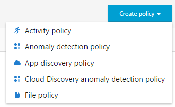
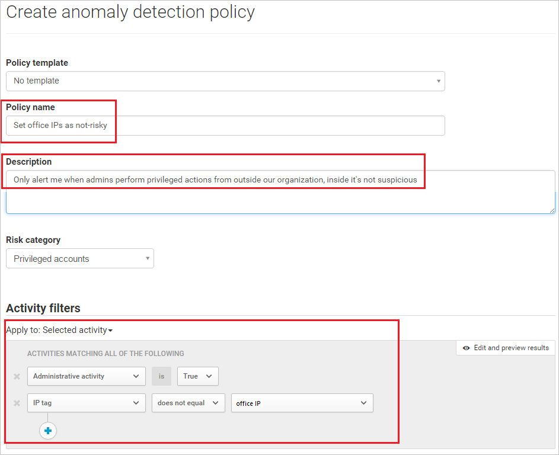

# Beleid gebruikersactiviteit
Activiteit-beleid zorgt ervoor dat u een breed scala aan geautomatiseerde processen kunt uitvoeren terwijl u gebruikmaakt van de API’s van de app-provider Met dit beleid kunt u specifieke activiteiten volgen die worden uitgevoerd door verschillende gebruikers of onverwacht hoge frequenties van een bepaald type activiteit volgen.  
  
Nadat u een beleid voor activiteitdetectie hebt ingesteld, worden op basis van het beleid waarschuwingen gegenereerd. Waarschuwingen worden alleen gegenereerd voor activiteiten die plaatsvinden nadat u het beleid hebt gemaakt.
  
  
## Aangepaste waarschuwingen  
Beleidsregels voor activiteiten zorgen ervoor dat u een breed scala aan geautomatiseerde processen kunt controleren waarbij u gebruikmaakt van de API’s van de app-provider. Bijvoorbeeld als u een bericht wilt ontvangen elke keer als een gebruiker zich probeert aan te melden en dit 70 keer in één minuut mislukt, als een gebruiker 7000 bestanden downloadt of als een gebruiker aangemeld is vanuit Afghanistan, dan kunt u activiteitswaarschuwingen instellen die naar uzelf of naar de gebruiker verstuurd worden op het moment dat deze situaties voorkomen. U kunt zelfs de gebruiker toegang ontzeggen totdat u tijd heeft te onderzoeken wat er gebeurd is.  
  
Voor de volgende procedure uit om nieuwe beleidsregels voor activiteiten te maken:  
  
1.  Klik in de console op **Beheer** gevolgd door **Beleidsregels**.  
  
2.  Klik op **Beleid maken** en selecteer **Beleidsregel voor activiteiten**.  
  
       
  
3.  Geef uw beleid een naam en beschrijving, wat u indien gewenst kunt baseren op een sjabloon. Voor meer informatie over beleidssjablonen, bekijk [Cloud-apps beheren met beleidsregels](control-cloud-apps-with-policies.md).  
  
4.  Om in te stellen welke acties of andere meetwaarden dit beleid activeren, werkt u met **Activiteitsfilters**.  
  
5.  Onder **Activiteit overeenkomstig de parameters**, selecteert u of een beleidsovertreding wordt ingesteld als een enkele activiteit voldoet aan de filters of dat een schending alleen wordt gedetecteerd als er een opgegeven aantal **Herhaalde activiteiten** wordt gedetecteerd.  
    Als u **Herhaalde activiteiten** kiest, kunt u **Overeenkomende activiteiten groeperen per app** instellen. Hiermee wordt alleen overeenkomend beleid aangegeven wanneer de herhaalde activiteiten voorkomen in dezelfde app (bijvoorbeeld 5 downloads van Box).  
  
6.  Configureer de **Acties** die moeten worden uitgevoerd wanneer een overeenkomst is gevonden.  
  
Bekijk deze voorbeelden:  
  
-   Meerdere mislukte aanmeldingen  
  
     U kunt het beleid zo instellen dat u een waarschuwing ontvangt als er een groot aantal mislukte aanmeldingspogingen binnen een bepaalde relatief korte periode is. Om een beleid zoals dit te configureren, kiest u het betreffende activiteitfilter op de pagina **Nieuw activiteit-beleid**.  
  
     Onder het veld **Activiteitfilters**, stelt u de parameters in waarbij de waarschuwing geactiveerd wordt.  
  
       
  
-   Hoge downloadsnelheid  
  
     U kunt het beleid zo instellen dat u een waarschuwing ontvangt als er een onverwacht of ongebruikelijk niveau van downloadactiviteit is. Om een beleid zoals dit te configureren, kiest u onder **Tarief**parameters de parameters die de waarschuwing activeren.  
  
       
  
## Afwijkingsdetectie  
Als uw organisatie wordt beveiligd door Cloud App Security, worden alle cloudactiviteiten beoordeeld volgens verschillende vooraf ingestelde risicofactoren. Cloud App Security analyseert elke gebruikerssessie in uw cloud en vergelijkt deze vervolgens met de risicofactoren die u hier instelt om u op de hoogte te stellen als er een activiteit plaatsvindt die afwijkt van de gebruikelijke activiteiten voor uw organisatie of van de gangbare gebruikersactiviteiten. De beleidspagina afwijkingsdetectie laat u de risicofactoren instellen en aanpassen die meegenomen worden in het risicoanalyseproces. Het beleid kan anders worden afgedwongen voor verschillende gebruikers, locaties en organisatiesectoren. U kunt bijvoorbeeld een beleid instellen waarbij u geïnformeerd wordt als leden van uw IT-team buiten kantoor actief zijn.   
  
Een afwijkingsdetectiebeleid configureren:  
  
1.  Klik in de console op **Beheer** gevolgd door **Beleidsregels**.  
  
2.  Klik op **Beleid maken** en selecteer **Afwijkingsdetectie**beleid.  
  
       
  
3.  Vul de naam en beschrijving van het beleid in en ga naar het veld **Activiteitfilters** om de activiteit te kiezen waarop het beleid van toepassing moet zijn.  
  
4.  Geef uw beleid een naam en beschrijving, wat u indien gewenst kunt baseren op een sjabloon. Voor meer informatie over beleidssjablonen, bekijk [Cloud-apps beheren met beleidsregels](control-cloud-apps-with-policies.md).  
  
5.  Om het beleid van toepassing te laten zijn op alle activiteiten in uw cloudomgeving, selecteert u **Alle gevolgde activiteiten**. Als u het beleid tot specifieke typen activiteit wilt beperken, kiest u **Specifieke activiteiten**. Klik op **Filters toevoegen** en stel de juiste parameters in waarmee u de activiteit wilt filteren. Bijvoorbeeld, als u het beleid alleen op de activiteiten uitgevoerd door Salesforce-beheerders wilt toepassen, kiest u deze gebruikerstag.  
  
6.  In dit veld stelt u de **Risicofactoren** in. U kunt kiezen welke risicogroepen u wilt meenemen in de berekening van de risicoscore. Aan de rechterkant van de rij kunt u de aan/uit-knop en de verschillende risico's uitschakelen. Daarnaast kunt u, voor een grotere mate van granulatie, de activiteit kiezen die voor elke specifieke risicogroep ingesteld moet worden.  
  
     We hanteren de volgende risicofactoren:  
  
    -   **Aanmeldfouten**: proberen gebruikers zich aan te melden en mislukt dit meerdere malen in een korte tijdsspanne?  
  
    -   **Beheerdersactiviteit**: Gebruiken beheerders hun beheerdersaccounts om in te loggen vanaf ongebruikelijke locaties of op vreemde tijden?  
  
    -   **Inactieve accounts**: Is er plotseling activiteit op een account dat al enige tijd niet meer in gebruik is?  
  
    -   **Locatie**: Is er activiteit afkomstig uit een ongebruikelijke, verdachte of nieuwe locatie?  
  
    -   **Onmogelijk traject**: Is een gebruiker aangemeld vanuit Denver en tien minuten later vanuit Parijs?  
  
    -   **Apparaat en gebruikersagent**: Is er activiteit vanuit een niet-herkend of niet-beheerd apparaat?  
  
     U kunt deze parameters gebruiken voor het definiëren van complexe scenario's, bijvoorbeeld om het IP-adresbereik van uw kantoor uit te sluiten van de risicofactoren voor afwijkingsdetectie, om een 'kantoor-IP'-tag te maken en het bereik uit te sluiten van de ingestelde parameters. Om het bereik dat u hebt gemaakt uit te sluiten van de afwijkingsdectectie voor beheerdersaccounts:  
  
    -   Onder **Risicotype** gaat u naar **Admin-activiteit**.  
  
    -   Wijzig **Van toepassing op** naar **Specifieke activiteiten**.  
  
    -   Onder **Activiteitfilters** stelt u **Van toepassing op** in op **Specifieke activiteiten** en onder **Activiteiten die overeenkomen met al het onderstaande** kiest u **Administratieve activiteiten** is **True**.  
  
    -   Klik op de **+** pictogram en selecteer **IP-tag is niet gelijk aan** en selecteer de kantoor-IP-tag.  
  
7.  Onder **Gevoeligheid**, selecteert u hoe vaak u waarschuwingen wilt ontvangen.  
  
     De gevoeligheidswaarde bepaalt per 1000 gebruikers hoeveel waarschuwingen er wekelijks gemiddeld geactiveerd worden.  
  
       
  
8.  Klik op **Maken**.  
 
  
## Verwijzing naar het activiteitenbeleid  
In deze sectie vindt u naslaginformatie over beleidsregels, met een uitleg van elk beleidstype en de velden die voor elk beleid kunnen worden geconfigureerd.  
  
Een **activiteitenbeleid** is een op API’s gebaseerd beleid waarmee u de cloudactiviteiten van uw organisatie kunt controleren, waarbij rekening wordt gehouden met meer dan twintig filters voor bestanden met metagegevens (inclusief apparaattype en locatie). Op basis van de beleidsresultaten kunnen meldingen worden gegenereerd en kunnen gebruikers worden geblokkeerd vanuit de cloud-app.   
Elk beleid bestaat uit de volgende onderdelen:  
  
-   Activiteitfilters – hiermee kunt u zeer gedetailleerde voorwaarden op basis van metagegevens maken.  
  
-   Activiteit overeenkomstig de parameters – hiermee kunt u een drempel instellen voor het aantal keren dat een activiteit wordt herhaald voordat de activiteit wordt beschouwd als overeenkomstig het beleid.  
  
-   Acties – het beleid bevat een reeks beheeracties die automatisch kunnen worden toegepast wanneer schendingen worden gedetecteerd.  
## Zie ook  
[Beleidsregels voor gegevensbescherming](data-protection-policies.md)   
[Ga naar de ondersteuningspagina van Cloud App Security voor technische ondersteuning.](http://support.microsoft.com/oas/default.aspx?prid=16031)   
[Premier-klanten kunnen Cloud App Security ook rechtstreeks vanuit Premier Portal kiezen.](https://premier.microsoft.com/)  
  
  

<!--HONumber=Nov16_HO2-->

