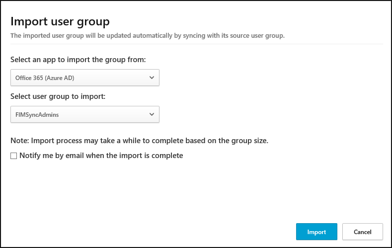

# Gebruikersgroepen importeren

Wanneer u apps verbindt met behulp van API-connectors, kunt u met Cloud App Security gebruikersgroepen importeren, bijvoorbeeld uit Office 365 en Azure Active Directory.
Er zijn twee typen gebruikersgroepen: 
- Automatische groepen  Automatische groepen worden standaard gemaakt door Cloud App Security. Er is bijvoorbeeld een automatische groep **Extern** die alle gebruikers combineert van alle apps van buiten uw organisatie die toegang hebben tot bestanden of betrokken waren bij gebruikersactiviteiten in uw tenant.
 De volgende automatische groepen bestaan in de Cloud App Security:
  - Extern
  - Dropbox-beheerder
  - Office 365-beheerder
  - G Suite-beheerder
  - Box-beheerder
  - Alle standaard en aangepaste Salesforce-profielen, bijvoorbeeld Salesforce-systeembeheerder. Zie [hier](https://help.salesforce.com/articleView?id=standard_profiles.htm&language=en&type=0) de volledige lijst.

- Geïmporteerde groepen U kunt alle groepen uit uw verbonden apps importeren. U kunt bijvoorbeeld gebruikersgroepen importeren uit Office 365 (Active Directory) en andere verbonden apps. Hiermee kunt u zoeken naar bedreigingen in uw organisatie, niet door naar de hele organisatie of een specifieke gebruiker te kijken, maar door te kijken naar een specifieke groep. 

Typische scenario's die gebruikmaken van geïmporteerde gebruikersgroepen zijn: u kunt onderzoeken welke documenten de HR-mensen bekijken of controleren of er iets vreemds gebeurt in de managementgroep of dat er iemand uit de beheergroep een activiteit buiten de Verenigde Staten heeft uitgevoerd. Gebruikersgroepen importeren:

1. Klik in de menubalk op het pictogram Instellingen  en selecteer **Gebruikersgroepen**.
2. Klik op **Gebruikersgroep importeren**.

  

3. Selecteer de app waaruit u de gebruikersgroep wilt importeren. De lijst met apps is afhankelijk van welke App-connectors u hebt geïmplementeerd.
4. Selecteer de te importeren groep. De lijst met beschikbare groepen is een lijst met alle bestaande gebruikersgroepen in de app zelf. Als u een nieuwe groep wilt toevoegen, moet u dat rechtstreeks in de app zelf doen, en de groep selecteren wanneer die hier wordt weergegeven.
4. Afhankelijk van de grootte van de groep kan het importeren een uur duren. U kunt de optie selecteren om te worden geïnformeerd via e-mail als de importbewerking voltooid is.
5. Klik op **importeren**. Nadat u een groep hebt geïmporteerd, worden de leden van de groep door Cloud App Security automatisch gesynchroniseerd, net als Active Directory Connect.
7. Nadat de importbewerking is voltooid, kunt u in de pagina **Gebruikersgroepen** klikken op een specifieke groep om een lijst van alle leden van de groep weer te geven. U kunt ook op elk lid van de groep klikken om verder in te zoomen op de details van een specifiek account en zien welke apps er worden gebruikt en een overzicht van het account weergeven met grafieken van de gebruiker en zijn/haar activiteit.

Door groepen te importeren kunt u deze groepen als filters selecteren als u het **Activiteitenlogboek** onderzoekt en bij het maken van beleid. 

> [!NOTE]
> Alleen activiteiten die worden uitgevoerd na het importeren van een gebruikersgroep worden gemarkeerd als zijnde uitgevoerd door een lid van de gebruikersgroep.

Zie [Activiteiten](activity-filters.md) voor meer informatie over het gebruik van de filters voor gebruikersgroepen.

    
## Zie ook  
[Cloud Discovery instellen](set-up-cloud-discovery.md)   
[Ga naar de ondersteuningspagina van Cloud App Security voor technische ondersteuning.](http://support.microsoft.com/oas/default.aspx?prid=16031)   
[Premier-klanten kunnen Cloud App Security ook rechtstreeks vanuit Premier Portal kiezen.](https://premier.microsoft.com/)  
  
  