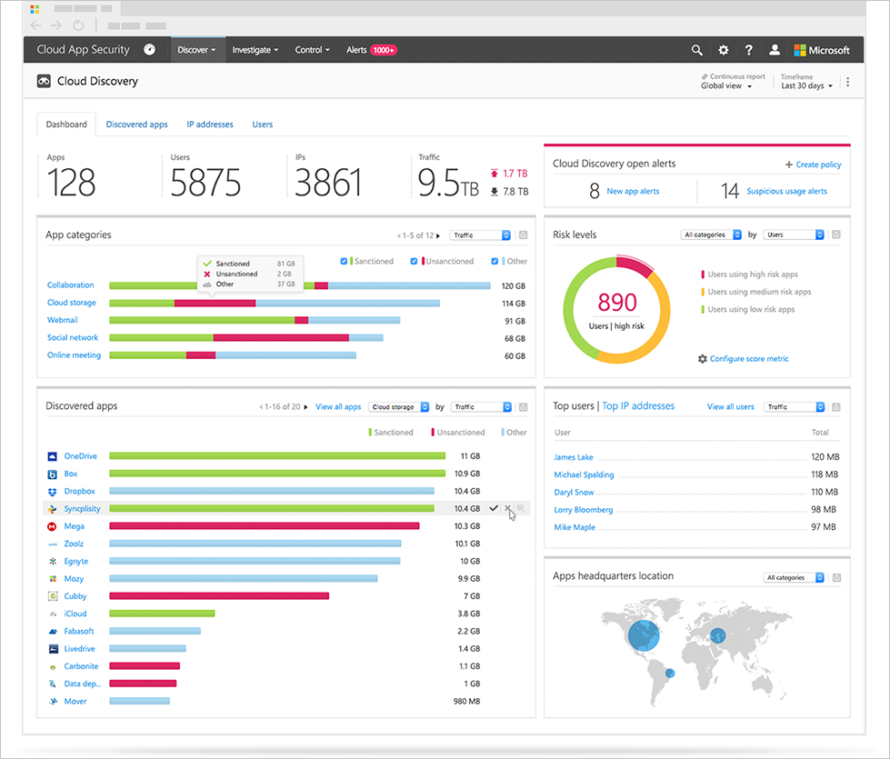

# Ontdekken

## Het Cloud Discovery-dashboard bekijken

Met het Cloud Discovery-dashboard hebt u meer inzicht in de manier waarop cloud-apps in uw organisatie worden gebruikt. Met het dashboard kunt u in één oogopslag een overzicht bekijken van de apps die worden gebruikt, uw openstaande waarschuwingen en de risiconiveaus van de apps in uw organisatie. Daarnaast kunt u zien wie de belangrijkste gebruikers in uw organisatie zijn en wordt een app-hoofdkantoorkaart weergegeven. Het Cloud Discovery-dashboard heeft verschillende opties voor het filteren van gegevens, zodat u specifieke weergaven kunt genereren (afhankelijk van de gegevens die het interessantst zijn voor u), en eenvoudig te begrijpen afbeeldingen zodat u in één oogopslag een volledig beeld krijgt.

Het eerste wat u moet doen als u een algemeen beeld wilt krijgen van uw Cloud Discovery-apps, is kijken naar het Cloud Discovery-dashboard en de volgende gegevens controleren:
 
1. Kijk eerst naar het totale gebruik van cloud-apps in uw organisatie in het gebruiksoverzicht op hoog niveau.

2. Vervolgens gaat u één niveau lager om te zien wat de belangrijkste categorieën zijn die in uw organisatie worden gebruikt voor de verschillende parameters voor gebruik en hoeveel van dit gebruik afkomstig is van goedgekeurde apps.

3. U kunt nog een niveau lager gaan en alle apps in een specifieke categorie in de widget Gedetecteerde apps bekijken.

4. U kunt de belangrijkste gebruikers en de bron-IP-adressen bekijken om de dominantste gebruikers van cloud-apps in uw organisatie te identificeren.
5. U kunt in de app-hoofdkantoorkaart controleren hoe de gedetecteerde apps zich verspreiden volgens geografische locatie (op basis van het hoofdkantoor).

6. Tot slot moet u niet vergeten de risicoscore van de gedetecteerde apps te beoordelen in het **risico-overzicht van apps** en de status van detectiewaarschuwingen te controleren om te zien hoeveel openstaande waarschuwingen u moet onderzoeken.
  
## Entiteiten uitsluiten  
Als u gebruikers of IP-adressen heeft die bijzonder veel ruis veroorzaken en oninteressant zijn of apps die niet relevant zijn, dan kunt u hun gegevens uitsluiten van de Cloud Discovery-gegevens die worden geanalyseerd. U zou bijvoorbeeld alle gegevens kunnen uitsluiten die afkomstig zijn van 127.0.0.1 of de lokale host.  
  
Een uitzondering aanmaken:  
  
1.  Selecteer in de portal onder het pictogram Instellingen **Instellingen voor Cloud Discovery**.  
  
2.  Klik op het tabblad **Entiteiten uitsluiten**.  
  
3.  Kies het tabblad **Uitgesloten gebruikers** of het tabblad **Uitgesloten IP-adressen** en klik op de knop **Gebruiker toevoegen** of **IP-adres toevoegen**.  
  
4.  Voeg een gebruikersalias of IP-adres toe. Het is raadzaam om informatie toe te voegen over waarom de gebruiker of het IP-adres is uitgesloten.  
  
       
  
## Doorlopende rapporten beheren  
Met aangepaste doorlopende rapporten beschikt u over meer details bij de controle van de Cloud Discovery-logboekgegevens van uw organisatie. Als u aangepaste rapporten maakt, kunt u filteren op specifieke geografische locaties, netwerken, sites of organisatie-eenheden. Standaard worden alleen de volgende rapporten in de Cloud Discovery-rapportkiezer weergegeven:  
  
-  Met het **algemene rapport** worden alle gegevens in de portal samengevoegd uit alle gegevensbronnen die u aan de logboeken hebt toegevoegd.  
  
- In het **specifieke gegevensbronrapport** worden alleen gegevens voor een specifieke gegevensbron weergegeven.  
  
Ga als volgt te werk om een nieuw doorlopend rapport te maken:  
  
1.  Selecteer in de portal onder het pictogram Instellingen **Instellingen voor Cloud Discovery**.  
  
2.  Klik op het tabblad **Doorlopend rapport beheren**.  
  
3.  Klik op de knop **Rapport maken**.  
  
4.  Voer een rapportnaam in.  
  
5.  Selecteer de gegevensbronnen die u wilt opnemen (alle of specifiek).  
  
6.  Stel de gewenste filters in voor gegevens (**Organisatie-eenheden**, **IP-adrestags** of **IP-adresbereiken**). Zie het Engelstalige artikel [Organize the data according to your needs](ip-tags.md) (De gegevens organiseren op basis van uw behoeften) voor meer informatie over het werken met IP-adrestags en IP-adresbereiken.  
  
     

## Cloud Discovery-gegevens verwijderen  
Er zijn een aantal redenen waarom u uw Cloud Discovery- gegevens zou willen verwijderen. In de volgende gevallen is het raadzaam de gegevens te verwijderen:  
  
-   Als u logboekbestanden handmatig heeft geüpload, er veel tijd is verstreken voordat u het systeem met nieuwe logboekbestanden heeft bijgewerkt en u niet wilt dat oude gegevens uw resultaten beïnvloeden.  
  
-   Wanneer u een nieuwe aangepaste gegevensweergave instelt, is deze alleen van toepassing op nieuwe gegevens vanaf dat moment. U zou oude gegevens dus kunnen wissen en vervolgens de logboekbestanden opnieuw uploaden, zodat de aangepaste gegevensweergave de gebeurtenissen uit de gegevens van het logboekbestand kan meenemen.  
  
-   Als onlangs veel gebruikers of IP-adressen weer zijn gaan werken, nadat ze een tijd offline waren, dan wordt hun activiteit aangeduid als afwijkend en krijgt u mogelijk veel fout-positieve schendingen.  
  
Cloud Discovery-gegevens verwijderen:  
  
1.  Selecteer in de portal onder het pictogram Instellingen **Instellingen voor Cloud Discovery**.  
  
2.  Klik op het tabblad **Gegevens verwijderen**.  
  
     Het is belangrijk om er zeker van te zijn dat u gegevens wilt verwijderen voordat u doorgaat; deze actie kan niet ongedaan worden gemaakt en hiermee worden **alle** Cloud Discovery-gegevens in het systeem verwijderd.  
  
3.  Klik op de knop **Verwijderen**.  
  
       
  
    > [!NOTE]  
    >  De verwijdering duurt een paar minuten en is niet direct.  

 
## Zie ook  
[Dagelijkse activiteiten ter bescherming van uw cloudomgeving](daily-activities-to-protect-your-cloud-environment.md)   
[Ga naar de ondersteuningspagina van Cloud App Security voor technische ondersteuning.](http://support.microsoft.com/oas/default.aspx?prid=16031)   
[Premier-klanten kunnen Cloud App Security ook rechtstreeks vanuit Premier Portal kiezen.](https://premier.microsoft.com/)  
  
  